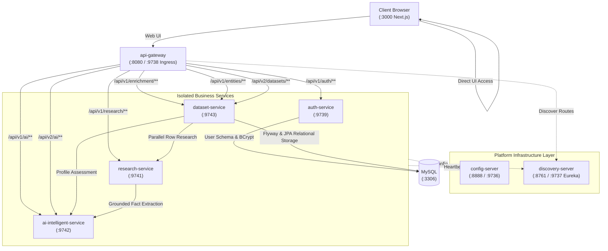

# Data Enrichment AI Intelligence Platform

A distributed, production-grade entity intelligence and data enrichment platform built on **Java 25 + Spring Boot 4 + Spring Cloud + Spring AI (Google GenAI) + Next.js 15 + MySQL 8.0**.

The platform transforms sparse, noisy tabular datasets (CSV/XLSX) into structured, verified, evidence-grounded intelligence profiles backed by verbatim quotes, multi-source corroboration, bounded concurrency, and real-time execution observability.

<table>
<tr>
<td>

## 🎬 Project Tutorial & Live Demo

### ▶️ [WATCH THE FULL PROJECT VIDEO](https://drive.google.com/file/d/1Beh_hAvLVhYD5Z6ywqTrQCHaZzWPKbfi/view?usp=sharing)

📁 **Uploaded on Google Drive**  
🎥 **End-to-End Tutorial & Live Demo**

See the platform in action — from **dataset ingestion and research** to **source discovery, evidence extraction, AI enrichment, and final results**.

**Recommended:** Watch the tutorial first for a quick understanding of the project before exploring the implementation.

</td>
</tr>
</table>


---

## 1. High-Level Architecture



### Services & Port Assignments

| Service | Port | Scope | Technology | Purpose |
| :--- | :--- | :--- | :--- | :--- |
| **`frontend`** | `3000` | **Public Host** | Next.js 15 / React / Tailwind | Interactive spreadsheet upload, live SSE execution dashboard, evidence modal, auth pages |
| **`api-gateway`** | `8080` / `9738` | **Public Host** | Spring Cloud Gateway WebMvc | Ingress point, reverse proxy, JWT Bearer auth, anti-spoofing header injection, CORS |
| **`config-server`** | `8888` / `9736` | Internal-only | Spring Cloud Config Server | Centralized file-based (`native`) YAML configurations from `config/` |
| **`discovery-server`** | `8761` / `9737` | Internal-only | Spring Cloud Eureka Server | Dynamic service registry and health awareness |
| **`auth-service`** | `9739` | Internal-only | Spring Boot 4.1.1 / Java 25 | User registration, authentication, BCrypt, HMAC-SHA256 JWT tokens |
| **`research-service`** | `9741` | Internal-only | Spring Boot 4.1.1 / Java 25 | Web research, scraper guardrails, verbatim extraction, multi-source corroboration |
| **`ai-intelligent-service`** | `9742` | Internal-only | Spring Boot 4.1.1 / Java 25 | Spring AI (Gemini), prompt templates, zero-hallucination validation, fallback |
| **`dataset-service`** | `9743` | Internal-only | Spring Boot 4.1.1 / Java 25 | Batch dataset ingestion, bounded async workers (3), SSE streaming, user-scoped JPA persistence |
| **`mysql`** | `3306` | Internal-only | MySQL 8.0+ | Relational schema persistence with Flyway migrations |

---

## 2. Quick Start

### 1. Environment Setup
Copy the template to create your local `.env`:
```bash
cp .env.example .env
```
*(Optional: Provide `GEMINI_API_KEY` or `SEARCH_PROVIDER_API_KEY`. If omitted, the system seamlessly operates in offline mode with deterministic fallbacks).*

### 2. Run Production Stack
Exposes only Port `3000` (Frontend) and Port `9738` (Gateway) to the host. All internal microservices run securely inside the private Docker bridge network:
```bash
docker compose -f infrastructure/docker/docker-compose.prod.yml up -d --build
```

### 3. Run Development Stack with Live Watch / Reload
Exposes all service ports and mounts source directories for rapid development hot-reloading:
```bash
docker compose -f infrastructure/docker/docker-compose-dev-all.yml up -d --build
```

### 4. Service Endpoints
* **Web UI**: [http://localhost:3000](http://localhost:3000)
* **Unified API Gateway**: [http://localhost:8080](http://localhost:8080) (or `:9738` in production)
* **API Gateway Health Probe**: [http://localhost:8080/actuator/health](http://localhost:8080/actuator/health)
* **Eureka Registry Dashboard (Dev)**: [http://localhost:8761](http://localhost:8761)

---

## 3. Authoritative Documentation Index

All platform documentation is centrally organized under `docs/` (see **[Documentation Hub](docs/README.md)**):

### 🏛️ System Architecture
* **[Architecture Overview](docs/architecture/overview.md)**: System topology, relational persistence, and design invariants.
* **[Service Boundaries](docs/architecture/service-boundaries.md)**: Explicit boundaries, capabilities, and responsibilities per microservice.
* **[Communication & Resiliency](docs/architecture/communication.md)**: Synchronous orchestration, dynamic Eureka resolution, distributed MDC tracing, and fallback contracts.
* **[End-to-End Data Flow](docs/architecture/data-flow.md)**: Ingestion lifecycle, sequence diagrams, bounded concurrency, and non-destructive export.

### 🔌 API Reference
* **[API Architecture & Ingress](docs/api/overview.md)**: Ingress routing, JWT authentication, anti-spoofing security, RFC 7807 problem details, and DTO segregation rules.
* **[API Endpoints Catalog](docs/api/endpoints.md)**: Complete request and response specifications for REST and SSE interfaces across all services.

### 📦 Services Documentation
* **[Dataset Service](docs/services/dataset-service/README.md)** ([Internals](docs/services/dataset-service/internals.md))
* **[AI Intelligent Service](docs/services/ai-intelligent-service/README.md)** ([Internals](docs/services/ai-intelligent-service/internals.md))
* **[Research Service](docs/services/research-service/README.md)** ([Internals](docs/services/research-service/internals.md))
* **[Auth Service](docs/services/auth-service/README.md)**
* **[API Gateway](docs/services/api-gateway/README.md)**
* **[Config Server](docs/services/config-server/README.md)**
* **[Discovery Server](docs/services/discovery-server/README.md)**
* **[Frontend Application](docs/services/frontend/README.md)**

### 🛠️ Development & Deployment
* **[Local Setup](docs/development/setup.md)**: Prerequisites, environment configuration, and startup instructions.
* **[Testing & QA](docs/development/testing.md)**: Unit tests, health probes, Postman/Newman collections, and regression flows.
* **[Codebase Conventions](docs/development/conventions.md)**: Feature-centric package philosophy, small service layers, and DTO segregation.
* **[Docker Topologies](docs/deployment/docker.md)**: Development watch hot-reload, volume isolation, and production Compose topologies.
* **[GCP VM Deployment](docs/deployment/gcp-vm-deployment.md)**: GCP Compute Engine provisioning, VPC firewall configuration, and automated CI/CD.

### 📜 Reference & Architecture Decisions
* **[Architecture Decisions (ADRs)](docs/decisions/README.md)**: ADRs 01 through 09, system evolution timeline, and strategic roadmap.
* **[Configuration Reference](docs/reference/configuration.md)**: Comprehensive environment variables and Spring properties matrix.
* **[Domain Glossary](docs/reference/glossary.md)**: Definitions of core domain terms and algorithmic concepts.
* **[Engineering Learning Series](docs/learning/README.md)**: 35 comprehensive engineering concepts covering microservices, evidence pipelines, Spring AI, concurrency, config server, Eureka, API Gateway, and security.
