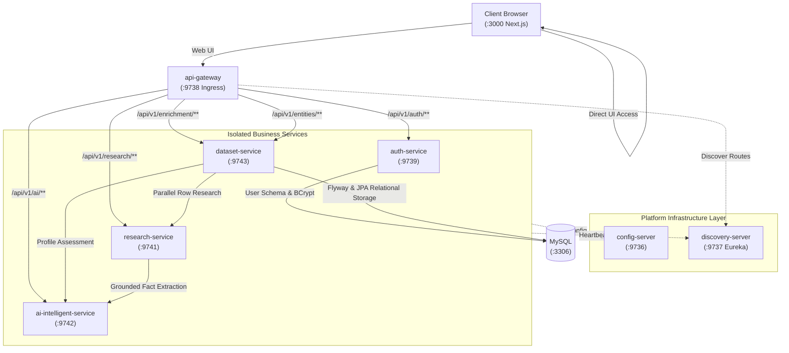

# Data Enrichment AI Intelligence Platform

A distributed, production-grade entity intelligence and data enrichment platform built on **Java 25 + Spring Boot 4 + Spring Cloud + Spring AI (Google GenAI) + Next.js 15 + MySQL 8.0**.

The platform transforms sparse, noisy tabular datasets (CSV/XLSX) into structured, verified, evidence-grounded intelligence profiles backed by verbatim quotes, multi-source corroboration, bounded concurrency, and real-time execution observability.

---

## 1. High-Level Architecture



### Services & Port Assignments

| Service | Port | Scope | Technology | Purpose |
| :--- | :--- | :--- | :--- | :--- |
| **`frontend`** | `3000` | **Public Host** | Next.js 15 / React / Tailwind | Interactive spreadsheet upload, live SSE execution dashboard, evidence modal, auth pages |
| **`api-gateway`** | `9738` | **Public Host** | Spring Cloud Gateway WebMvc | Ingress point, reverse proxy, JWT Bearer auth, anti-spoofing header injection, CORS |
| **`config-server`** | `9736` | Internal-only | Spring Cloud Config Server | Centralized file-based (`native`) YAML configurations from `config/` |
| **`discovery-server`** | `9737` | Internal-only | Spring Cloud Eureka Server | Dynamic service registry and health awareness |
| **`auth-service`** | `9739` | Internal-only | Spring Boot 4.1.1 / Java 25 | User registration, authentication, BCrypt, HMAC-SHA256 JWT tokens |
| **`research-service`** | `9741` | Internal-only | Spring Boot 4.1.1 / Java 25 | Web research, scraper guardrails, verbatim extraction, multi-source corroboration |
| **`ai-intelligent-service`** | `9742` | Internal-only | Spring Boot 4.1.1 / Java 25 | Spring AI (Gemini), prompt templates, zero-hallucination validation, fallback |
| **`dataset-service`** | `9743` | Internal-only | Spring Boot 4.1.1 / Java 25 | Batch dataset ingestion, bounded async workers (3), SSE streaming, user-scoped JPA persistence |
| **`mysql`** | `3306` | Internal-only | MySQL 8.0+ | Relational schema persistence with Flyway migrations |

---

## 2. Quick Start

### 1. Environment Setup
Copy the template to create your local `.env`:
```bash
cp .env.example .env
```
*(Optional: Provide `GEMINI_API_KEY` or `SEARCH_PROVIDER_API_KEY`. If omitted, the system seamlessly operates in offline mode with deterministic fallbacks).*

### 2. Run Production VM Stack (Recommended)
Exposes only Port `3000` (Frontend) and Port `9738` (Gateway) to the host. All internal microservices, Eureka, Config Server, and MySQL run securely inside the private Docker network:
```bash
docker compose up -d --build
```

### 3. Run Development Stack with Live Watch / Reload
Exposes all service ports and mounts source directories for rapid development hot-reloading:
```bash
docker compose -f infrastructure/docker/docker-compose-dev-all.yml up -d --build
```

### 4. Service Endpoints
* **Web UI**: [http://localhost:3000](http://localhost:3000)
* **Unified API Gateway**: [http://localhost:9738](http://localhost:9738)
* **API Gateway Health Check**: [http://localhost:9738/actuator/health](http://localhost:9738/actuator/health)
* **Config Server (Dev)**: [http://localhost:9736/research-service/default](http://localhost:9736/research-service/default)
* **Eureka Registry Dashboard (Dev)**: [http://localhost:9737](http://localhost:9737)

---

## 3. Authoritative Documentation Index

All platform documentation is centrally organized under `docs/` (see **[Documentation Hub](docs/README.md)**):

* 🏛️ **[System Architecture](docs/architecture.md)**: 3-microservice topology, platform infrastructure layer, boundaries, domain models, and MySQL schema.
* 🔄 **[Enrichment Flow](docs/enrichment-flow.md)**: Step-by-step dataset lifecycle through API Gateway, bounded concurrent execution, and export.
* 🔌 **[API Reference](docs/api.md)**: Comprehensive REST & SSE endpoint contracts, API Gateway routes, and RFC 7807 error models.
* 🛠️ **[Development & Operations Guide](docs/development.md)**: Local setup, Docker workflows, testing commands, and hot-reload mechanics.
* 📜 **[Architecture Decisions (ADRs) & Roadmap](docs/decisions.md)**: Foundational ADRs, system evolution history, and strategic roadmap.
* 🎓 **[Engineering Learning Series](docs/learning/README.md)**: 35 comprehensive engineering concepts covering microservices, evidence pipelines, Spring AI, concurrency, config server, Eureka, API Gateway, and security.
