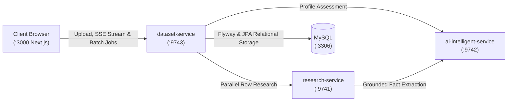

# Data Enrichment AI Intelligence Platform

A distributed, production-grade entity intelligence and data enrichment platform built on **Java 25 + Spring Boot 4 + Spring AI (Google GenAI) + Next.js 15 + MySQL 8.0**.

The platform transforms sparse, noisy tabular datasets (CSV/XLSX) into structured, verified, evidence-grounded intelligence profiles backed by verbatim quotes, multi-source corroboration, bounded concurrency, and real-time execution observability.

---

## 1. High-Level Architecture



* **`frontend` (Port 3000)**: Next.js 15 interactive application providing drag-and-drop spreadsheet upload, automated schema detection, natural language requirements, live execution dashboard with Server-Sent Events (SSE), and multi-tab grounded evidence inspector.
* **`dataset-service` (Port 9743)**: Bounded concurrent batch orchestration (`EnrichmentTaskExecutor`, 3 workers), real-time SSE progress streaming (`/events`), row-level error isolation, and MySQL relational persistence.
* **`research-service` (Port 9741)**: URL canonicalization, intent-driven query formulation, multi-source web discovery (Tavily + Mock fallback), polite HTML scraping, boilerplate removal, and multi-source corroboration.
* **`ai-intelligent-service` (Port 9742)**: Spring AI interactions with Google Gemini, externalized StringTemplate prompts, zero-hallucination verbatim quote verification, objective-driven profile assessments, and transparent deterministic fallback engine.
* **`MySQL` (Port 3306)**: Relational store with versioned Flyway migrations for entities, discovered sources, and attributes.

---

## 2. Quick Start

### 1. Environment Setup
Copy the template to create your local `.env`:
```bash
cp .env.example .env
```
*(Optional: Provide `GEMINI_API_KEY` or `SEARCH_PROVIDER_API_KEY`. If omitted, the system seamlessly operates in offline mode with deterministic fallbacks).*

### 2. Start Full Stack with Docker Compose
```bash
docker compose -f infrastructure/docker/docker-compose-dev-all.yml up -d --build
```

### 3. Service Endpoints
* **Web UI**: [http://localhost:3000](http://localhost:3000)
* **Research Service**: [http://localhost:9741](http://localhost:9741)
* **AI Intelligent Service**: [http://localhost:9742](http://localhost:9742)
* **Dataset Service**: [http://localhost:9743](http://localhost:9743)
* **MySQL Relational Database**: `localhost:3306` (database: `enrichment_db`)

---

## 3. Authoritative Documentation Index

All platform documentation is centrally organized under `docs/` (see **[Documentation Hub](docs/README.md)**):

* 🏛️ **[System Architecture](docs/architecture.md)**: 3-microservice topology, boundaries, domain models, and MySQL schema.
* 🔄 **[Enrichment Flow](docs/enrichment-flow.md)**: Step-by-step dataset lifecycle from spreadsheet profiling to bounded concurrent execution and export.
* 🔌 **[API Reference](docs/api.md)**: Comprehensive REST & SSE endpoint contracts, payloads, and RFC 7807 error models.
* 🛠️ **[Development & Operations Guide](docs/development.md)**: Local setup, Docker workflows, testing commands, and hot-reload mechanics.
* 📜 **[Architecture Decisions (ADRs) & Roadmap](docs/decisions.md)**: Foundational ADRs, system evolution history, and strategic roadmap.
* 🎓 **[Engineering Learning Series](docs/learning/README.md)**: 6 comprehensive engineering chapters on microservices, evidence pipelines, Spring AI, concurrency, database persistence, and 11 root-cause post-mortems.
