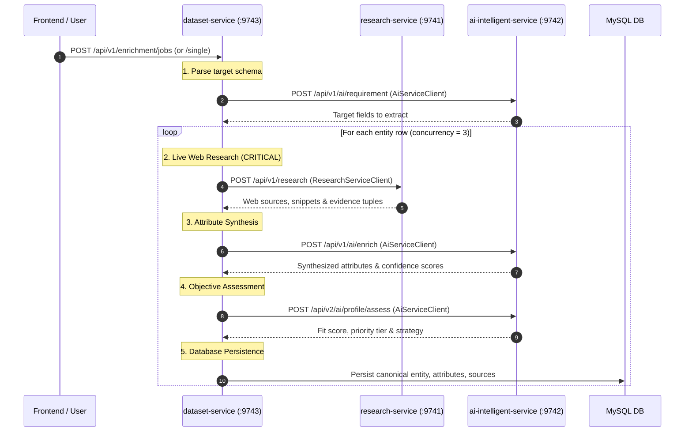

# Inter-Service Communication via RestClient

## Overview

`dataset-service` acts as an **orchestration and persistence engine**. It does not perform web scraping, search queries, or LLM synthesis directly. Instead, it coordinates external microservices via HTTP using Spring 6's synchronous **`RestClient`**.



---

## 1. RestClient Configuration & Distributed Tracing

Spring Boot 3 / Spring 6 introduced `RestClient`, a modern, fluent, synchronous HTTP client that succeeds `RestTemplate`.

### Configuration (`DatasetServiceConfiguration.java`)

```java
@Bean
public RestClient restClient(RestClient.Builder builder, CorrelationIdClientInterceptor interceptor) {
    return builder
            .requestInterceptor(interceptor)
            .build();
}

@Bean
public RestClient.Builder restClientBuilder() {
    return RestClient.builder();
}
```

### Distributed Tracing Interceptor (`CorrelationIdClientInterceptor.java`)

Every outbound request automatically attaches the `X-Correlation-ID` header from the logging MDC (or generates a fresh UUID). This ensures that log aggregators can correlate a dataset batch job across `dataset-service`, `research-service`, and `ai-intelligent-service`.

---

## 2. Downstream Integration Clients

Both clients reside in `com.subdual.dataset_service.enrichment.integration`.

### A. `ResearchServiceClient` (Hard Dependency)

- **Target**: `research-service` (default port `9741`)
- **Configuration Property**: `${services.research.url:${RESEARCH_SERVICE_URL:http://localhost:9741}}` (or `http://research-service:9741` in Docker)
- **Endpoint**: `POST /api/v1/research`
- **Behavior**:
  - Sends entity identity (`name`, `firstName`, `lastName`, `url`, `organization`, `role`, `location`) and target fields.
  - Queries web indexes (e.g., Tavily, Google, LinkedIn) and returns raw evidence snippets with corroborating URLs.
  - **No Mock Fallback**: If `research-service` fails or times out, the row enrichment fails with `FAILED` status (`"Research service error: ..."`). Real grounded data from the research service is mandatory.

### B. `AiServiceClient` (Soft Dependency / Resilient)

- **Target**: `ai-intelligent-service` (default port `9742`)
- **Configuration Property**: `${services.ai.url:${AI_INTELLIGENT_SERVICE_URL:http://localhost:9742}}` (or `http://ai-intelligent-service:9742` in Docker)
- **Endpoints**:
  1. `POST /api/v1/ai/requirement`: Interprets user prompt into concrete target fields.
     - *Fallback*: Default fields based on entity type (`ORGANIZATION` vs `PERSON`).
  2. `POST /api/v1/ai/clean`: Normalizes noisy input row fields.
  3. `POST /api/v1/ai/enrich`: Takes raw snippets from `research-service` and uses LLMs to extract clean attributes, compute confidence levels, and resolve conflicting values across sources.
     - *Fallback*: Populates attributes directly from raw research tuples and marks the row status as `AI_DEGRADED`.
  4. `POST /api/v2/ai/profile/assess`: Evaluates the profile fit against user research objectives (tier rating, objective score, recommended engagement approach).
     - *Fallback*: Deterministic heuristic assessment without failing the job.

---

## 3. Resilience and Status Mapping

The service tracks call outcomes through distinct row statuses:

| Status | Trigger Condition |
| :--- | :--- |
| `COMPLETED` | Both `research-service` and `ai-intelligent-service` succeeded and produced attributes. |
| `AI_DEGRADED` | `research-service` returned evidence, but AI service timed out or was unreachable; deterministic fallback used. |
| `PARTIAL` | Research succeeded, but one or more requested fields could not be found in public sources. |
| `INSUFFICIENT_EVIDENCE` | Research service found no relevant web sources or returned empty results. |
| `FAILED` | Connection failure to `research-service`, missing row identifier, or fatal runtime exception. |

---

## 4. Key Takeaway

`dataset-service` does not mock or fake microservice communication. The `RestClient` calls are directly wired into the row execution loop (`RowEnrichmentProcessor.processSingleRow`). While `research-service` is an essential dependency for discovering source data, `ai-intelligent-service` is wrapped in resilient fallbacks (`AI_DEGRADED`) to prevent expensive batch dataset jobs from aborting when LLM rate limits or transient outages occur.
