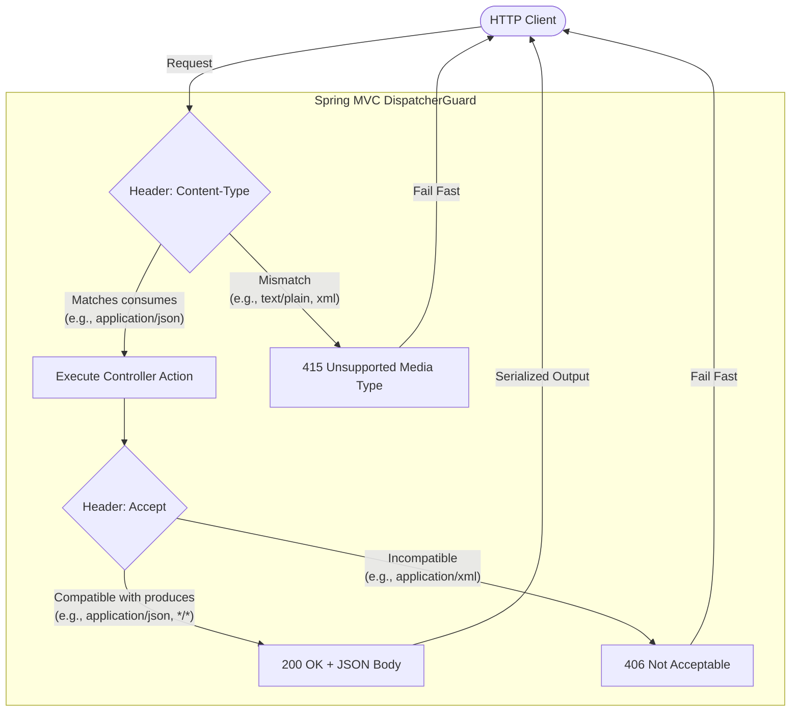

# HTTP Media Type Negotiation: `consumes` & `produces`

In Spring Boot REST controllers, the `consumes` and `produces` attributes serve as **HTTP header filters** and **content-negotiation guards**. They strictly enforce the expected media formats between clients and your API endpoints.

---

## Architecture Flow



---

## Core Attributes Comparison

| Feature | `consumes` (Incoming Request Body) | `produces` (Outgoing Response Body) |
| :--- | :--- | :--- |
| **HTTP Header Guarded** | `Content-Type` | `Accept` |
| **Media Type Value** | `MediaType.APPLICATION_JSON_VALUE` | `MediaType.APPLICATION_JSON_VALUE` |
| **Target Direction** | **Client &rarr; Server** (Inbound payload) | **Server &rarr; Client** (Outbound payload) |
| **Failure Status Code** | `415 Unsupported Media Type` | `406 Not Acceptable` |
| **Evaluation Stage** | Pre-execution (before body deserialization) | Post-execution (during response writing) |
| **Primary Purpose** | Prevent malicious or invalid formats from hitting handler logic | Ensure client can parse the returned response format |

---

## Attribute Breakdown

### 1. `consumes` — Content-Type Header Guard
* **Purpose**: Declares the exact MIME types the endpoint accepts from the incoming HTTP request body.
* **Mechanism**: Spring inspects the incoming `Content-Type` HTTP request header:
  * ✅ **Valid Match** (`Content-Type: application/json`): Spring routes the request to the handler method and deserializes the body via `HttpMessageConverter` (e.g., Jackson).
  * ❌ **Mismatch** (`application/xml`, `text/plain`, `multipart/form-data`): Spring aborts execution immediately and returns **`415 Unsupported Media Type`** before touching any service logic.

### 2. `produces` — Accept Header Guard
* **Purpose**: Declares the exact MIME types the server can serialize into the HTTP response.
* **Mechanism**: Spring inspects the incoming `Accept` HTTP request header and sets the response `Content-Type`:
  * ✅ **Compatible** (`Accept: application/json` or `*/*`): Spring serializes the return object into JSON and sets response header `Content-Type: application/json`.
  * ❌ **Incompatible** (`Accept: application/xml`): Spring refuses to serve the request and returns **`406 Not Acceptable`**.

---

## Code Example

```java
package com.subdual.research_service.controller;

import org.springframework.http.MediaType;
import org.springframework.http.ResponseEntity;
import org.springframework.web.bind.annotation.*;

@RestController
@RequestMapping("/api/v1/enrichment")
public class EnrichmentController {

    @PostMapping(
        value = "/process",
        consumes = MediaType.APPLICATION_JSON_VALUE, // Content-Type: application/json
        produces = MediaType.APPLICATION_JSON_VALUE  // Accept: application/json
    )
    public ResponseEntity<EnrichmentResponse> processData(
            @RequestBody EnrichmentRequest request
    ) {
        EnrichmentResponse response = new EnrichmentResponse("SUCCESS", request.query());
        return ResponseEntity.ok(response);
    }
}
```

---

## HTTP Request & Response Scenarios

### Scenario A: Successful Request
```http
POST /api/v1/enrichment/process HTTP/1.1
Host: localhost:9741
Content-Type: application/json
Accept: application/json

{"query": "machine learning"}
```
```http
HTTP/1.1 200 OK
Content-Type: application/json

{"status": "SUCCESS", "result": "machine learning"}
```

---

### Scenario B: Invalid Inbound Type (`415`)
```http
POST /api/v1/enrichment/process HTTP/1.1
Host: localhost:9741
Content-Type: text/plain

query=machine learning
```
```http
HTTP/1.1 415 Unsupported Media Type
Content-Type: application/json

{
  "status": 415,
  "error": "Unsupported Media Type",
  "message": "Content-Type 'text/plain;charset=UTF-8' is not supported."
}
```

---

### Scenario C: Incompatible Accept Header (`406`)
```http
POST /api/v1/enrichment/process HTTP/1.1
Host: localhost:9741
Content-Type: application/json
Accept: application/xml

{"query": "machine learning"}
```
```http
HTTP/1.1 406 Not Acceptable
Content-Type: application/json

{
  "status": 406,
  "error": "Not Acceptable",
  "message": "Acceptable representations: [application/json]."
}
```

---

## Best Practices & Evaluation

### Why Is This a Recommended Practice?

> [!TIP]
> **Explicit API Contracts**: Leaving media types implicit can lead to unexpected content negotiation behavior. Explicit attributes declare unambiguous contracts (`application/json` in, `application/json` out).

> [!IMPORTANT]
> **Standard RFC Error Handling**: If an incompatible client connects, Spring terminates the request early with standard RFC status codes (`415` or `406`) instead of throwing cryptic JSON parsing exceptions inside your business logic.

> [!NOTE]
> **Accurate OpenAPI & Swagger Documentation**: Documentation generators (e.g., SpringDoc OpenAPI, Swagger UI) use `consumes` and `produces` to render precise request and response schemas without guesswork.

---

### When Can It Be Omitted?

In a standard Spring Boot `@RestController`:
1. **Convention over Configuration**: If Jackson is on the classpath (standard in `spring-boot-starter-web` / `spring-boot-starter-webmvc`), Spring automatically defaults to JSON serialization for `@RequestBody` and return values.
2. **Simple Internal Services**: For simple microservices where only JSON is exchanged and client headers are strictly homogeneous, omitting them is common and safe.
3. **Recommendation**: For public or production APIs, explicitly specifying `consumes` and `produces` remains the industry best practice for fail-fast validation and robust API versioning.
