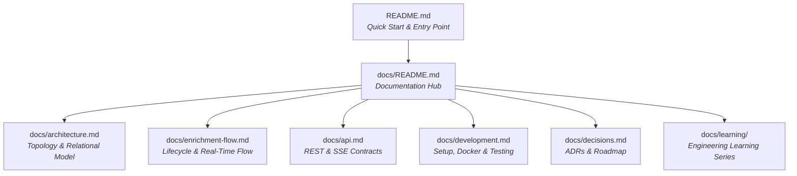

# Platform Documentation Hub

Welcome to the **Data Enrichment AI Intelligence Platform** documentation hub.

Every critical engineering concept, API contract, operational procedure, and architecture decision in this repository has **one clear, authoritative source of truth**.

---

## 1. System Documentation Map

---

## 2. Authoritative Document Ownership

| Domain / Concept | Authoritative Document | Description |
| :--- | :--- | :--- |
| **System Architecture & Data Models** | [System Architecture](architecture.md) | 3-microservice topology, boundaries, MySQL relational schema, and domain models. |
| **End-to-End Pipeline & Observability** | [Enrichment Flow](enrichment-flow.md) | Step-by-step dataset lifecycle: upload, schema profiling, bounded concurrency, SSE streaming, corroboration, and export. |
| **HTTP & Streaming API Contracts** | [API Reference](api.md) | Authoritative specifications for all REST endpoints, SSE streams, DTOs, and RFC 7807 error models across all services. |
| **Local Setup, Docker & Testing** | [Development Guide](development.md) | Environment setup, Docker Compose workflows (`docker-compose-dev-all.yml`), port mappings, and testing suites. |
| **Production & GCP VM Deployment** | [GCP VM Deployment Guide](../infrastructure/docker/GCP_VM_DEPLOYMENT.md) & [Docker Overview](../infrastructure/docker/README.md) | Full 9-container production deployment on GCP Compute Engine VM, networking, firewall, backup/restore, and troubleshooting. |
| **Decisions & Future Roadmap** | [Architecture Decisions (ADRs)](decisions.md) | Foundational ADRs (why microservices, bounded concurrency, zero-hallucination, SSE vs WebSockets) and strategic evolution roadmap. |
| **Engineering Concepts & Post-Mortems** | [Learning Series](learning/README.md) | 6 deep conceptual guides covering microservices, evidence pipelines, Spring AI, concurrency, database persistence, and 11 root-cause post-mortems. |

---

## 3. Microservice Packages

Each backend service and frontend app contains its own dedicated package README:
* **API Gateway**: [`apps/backend/api-gateway/README.md`](../apps/backend/api-gateway/README.md)
* **Auth Service**: [`apps/backend/auth-service/README.md`](../apps/backend/auth-service/README.md)
* **AI Intelligent Service**: [`apps/backend/ai-intelligent-service/README.md`](../apps/backend/ai-intelligent-service/README.md)
* **Dataset Service**: [`apps/backend/dataset-service/README.md`](../apps/backend/dataset-service/README.md)
* **Research Service**: [`apps/backend/research-service/README.md`](../apps/backend/research-service/README.md)
* **Config Server**: [`apps/backend/config-server/README.md`](../apps/backend/config-server/README.md)
* **Discovery Server**: [`apps/backend/discovery-server/README.md`](../apps/backend/discovery-server/README.md)
* **Frontend Application**: [`apps/frontend/README.md`](../apps/frontend/README.md)

---

## 4. Engineering Learning Curriculum

A curated 6-chapter masterclass on distributed systems and applied AI engineering:
1. 🌐 **[01. Microservices & API Contracts](learning/01-microservices-and-api-contracts.md)**: Boundaries, SOLID, Spring DI, and RFC 7807 problem details.
2. 🔍 **[02. Research & Evidence Pipeline](learning/02-research-and-evidence-pipeline.md)**: Search adapters, web scraping, verbatim quote grounding, and multi-source corroboration.
3. 🧠 **[03. Spring AI & Structured Intelligence](learning/03-spring-ai-and-structured-intelligence.md)**: ChatModel abstraction, prompt templates, deterministic fallback, and profile assessments.
4. ⚡ **[04. Concurrency & Real-Time Observability](learning/04-concurrency-and-realtime-observability.md)**: Thread pools, backpressure, Server-Sent Events (SSE), replay buffers, and MDC tracing.
5. 🗄️ **[05. Ingestion & Relational Persistence](learning/05-dataset-ingestion-and-relational-persistence.md)**: In-browser SheetJS parsing, schema detection, MySQL schema, Flyway migrations, and idempotent upserts.
6. 🚨 **[06. Production Reliability & Post-Mortems](learning/06-production-reliability-and-failure-modes.md)**: 11 real production post-mortems and cross-OS Docker volume shadowing.
