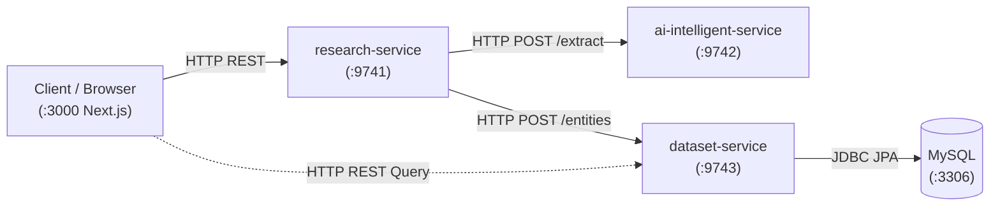

# Documentation Hub

Welcome to the **Data Enrichment & AI Intelligence** platform documentation.

> 📌 **Release Status**:
> * **[Frozen V1 Baseline (`v1.0.0`)](v1.md)**: Current working, frozen production prototype documentation.
> * **[Proposed V2 Blueprint](v2/README.md)**: Architectural evolution plan, data model, AI boundaries, reliability strategy, roadmap, and task backlog.

---

## 1. System Overview

The platform transforms sparse input records (e.g. a company name, a person's profile URL, or a repository link) into verified, structured, AI-enriched profiles backed by verbatim evidence quotes and confidence scores.

### Architecture at a Glance

---

## 2. Microservice Responsibilities & Ports

| Service | Port | Primary Responsibility | Key Technologies |
| :--- | :--- | :--- | :--- |
| **`frontend`** | `3000` | User interface for triggering research, polling async job progress, and inspecting enriched entity records. | Next.js 15, React, TypeScript, Tailwind CSS |
| **`research-service`** | `9741` | **Owns the research workflow**: Normalizes entity identifiers, queries search engines, fetches web pages, coordinates AI extraction, corroborates multi-source evidence, and dispatches snapshots. | Spring Boot 4, Java 25, ThreadPoolExecutor, RestClient |
| **`ai-intelligent-service`** | `9742` | **Owns AI extraction**: Interacts with Google Gemini via Spring AI to extract structured facts with exact quotes from raw text; provides deterministic heuristic fallback. | Spring AI, Google GenAI, Regex Heuristic Engine |
| **`dataset-service`** | `9743` | **Owns persistence and database access**: Manages relational schema, Flyway migrations, ACID transactions, and paginated catalog queries for saved entities. | Spring Data JPA, Hibernate, Flyway, MySQL Driver |
| **`MySQL`** | `3306` | Relational store for canonical entities, source URLs, and extracted attributes. | MySQL 8.0+ |

---

## 3. Core Architectural Concepts & Post-Mortems

* 📘 **[Complete 31 Engineering Concepts Reference (7 Sections Each)](learning/concepts.md)**: Exhaustive production-grade guide across 31 system design, distributed systems, and applied AI concepts.
* 🚨 **[Production Failure Modes & 11 Root-Cause Post-Mortems](learning/failure-modes.md)**: Real-world post-mortems documenting Gemini 404, LinkedIn HTTP 999 blocking, snippet fallbacks, SSE starvation, and silent degradation avoidance.

### Individual Concept Deep Dives:

1. 🌐 **[01. HTTP REST API Design & Media Type Contracts](learning/01-http-api-design-and-media-types.md)**  
   *Explicit media types (`consumes`/`produces`), status codes (`200` vs `202` vs `400`), and RFC 7807 `ProblemDetail` error responses.*

2. 🧩 **[02. Layered Architecture & Dependency Injection](learning/02-spring-dependency-injection-and-boundaries.md)**  
   *Constructor injection, thin controllers, thick domain services, and decoupling business logic from web/DB frameworks.*

3. 📐 **[03. Service Abstraction & SOLID Principles](learning/03-service-abstraction-and-solid.md)**  
   *Single Responsibility decomposition of the pipeline, Open/Closed extension, and interface segregation.*

4. 🔌 **[04. Strategy & Adapter Patterns for External Integrations](learning/04-strategy-and-adapter-patterns-in-provider-integrations.md)**  
   *Pluggable search engines (`TavilySearchProvider` vs `MockSearchProvider`) and zero-overhead local development.*

5. ⏱️ **[05. Async Job Lifecycle, Bounded Thread Pools & Backpressure](learning/05-async-job-lifecycle-and-thread-pooling.md)**  
   *Non-blocking `202 Accepted` async jobs, bounded `ThreadPoolExecutor`, `CallerRunsPolicy` backpressure, and MDC correlation.*

6. 🧠 **[06. Evidence-Grounded AI Extraction & Zero-Hallucination Guardrails](learning/06-evidence-grounded-ai-extraction.md)**  
   *Strict prompt schema enforcement, verbatim quote substring verification in raw text, and offline heuristic fallback.*

7. 🗄️ **[07. Transactional Persistence, Flyway & Idempotent Upsert](learning/07-transactional-persistence-and-idempotency.md)**  
   *Versioned SQL migrations, Hibernate `validate`, atomic orphan removal (`clear()` & append), tracking removal, and SHA-256 idempotency (consolidates Concept 08).*

8. 🏗️ **[09. Multi-Service Architecture, Isolation & Cross-Service Orchestration](learning/09-multi-service-architecture-and-orchestration.md)**  
   *Service boundaries (`dataset-service`, `research-service`, `ai-intelligent-service`), private DTO contracts via `RestClient`, zero shared-domain coupling, and resilient downstream fallback.*

9. 🤖 **[10. Spring AI Model Abstraction, Prompt Engineering & Deterministic Fallbacks](learning/10-spring-ai-model-abstraction-and-prompt-engineering.md)**  
   *Spring AI `ChatModel` decoupling, prompt schemas with JSON markdown fence cleaning, anti-hallucination guardrails, and dual-mode deterministic offline fallback.*

10. 📊 **[11. Dataset Ingestion, Schema Detection & Multi-Tier Entity Normalization](learning/11-dataset-ingestion-schema-detection-and-normalization.md)**  
    *Browser-side SheetJS ingestion, regex heuristic identity anchor detection, and the 6 distinct data representations along the pipeline.*

11. 🎯 **[12. User-Directed Requirements vs. Default Enrichment & Adaptive Scoping](learning/12-user-directed-requirements-and-adaptive-enrichment.md)**  
    *Treating user requirements as dynamic runtime data, natural language intent interpretation, authoritative entity-type default scopes, and adaptive early stopping.*

12. 🔬 **[13. Modular Evidence Extraction, Domain Extractor Decomposition & Entity Resolution](learning/13-modular-evidence-extraction-and-entity-resolution.md)**  
    *Eliminating extractor God classes, subpackage decomposition (`document`, `extractor`, `support`, `ai`), Jsoup noise stripping, and `EntityResolver` false-positive filtering.*

13. 📡 **[14. Observability, MDC Correlation Tracing & ProblemDetail Diagnostics](learning/14-observability-mdc-tracing-and-diagnostics.md)**  
    *Thread-safe SLF4J MDC correlation tokens (`entityId`, `jobId`), milestone pipeline logging, in-flight warnings accumulator (`ResearchDiagnostics`), and RFC 7807 `ProblemDetail` error responses.*

14. 📥 **[15. Dataset Ingestion & Raw Data Boundaries](learning/15-dataset-ingestion-and-raw-data-boundaries.md)**  
    *Preserving raw user input immutably, client-side SheetJS boundaries, schema-agnostic ingestion, and isolating parsing errors.*

15. 🔍 **[16. Dataset Schema Detection & Data Profiling](learning/16-dataset-schema-detection-and-profiling.md)**  
    *Regex-based heuristic column detection (`PERSON_NAME`, `DOMAIN_OR_URL`, `COMPANY_NAME`), data profiling, readiness checking, and user confirmation.*

16. 🧭 **[17. User-Directed Enrichment & Adaptive Research](learning/17-user-directed-enrichment-and-adaptive-research.md)**  
    *Natural language requirement interpretation via `RequirementInterpretationResponse`, targeted query generation, and early stopping when findings are satisfied.*

17. 🎼 **[18. Dataset Enrichment Orchestration](learning/18-dataset-enrichment-orchestration.md)**  
    *Dataset row iteration, entity normalization, research triggering, multi-source evidence merging, persistence, and state tracking via `RowEnrichmentResult`.*

18. ⚙️ **[19. Spring AI Abstraction & Structured AI Workflows](learning/19-spring-ai-abstraction-and-structured-ai-workflows.md)**  
    *Decoupled `ChatModel` interface, system/user prompt engineering, strict JSON schema extraction, markdown fence cleaning, and type-safe DTO mapping.*

19. ⚖️ **[20. Deterministic & AI Hybrid Pipelines](learning/20-deterministic-and-ai-hybrid-pipelines.md)**  
    *Combining deterministic HTML sanitization, URL normalization, and regex heuristics with LLM synthesis; cost control and offline fallback.*

20. 🌐 **[21. Microservice Boundaries & Orchestration](learning/21-microservice-boundaries-and-orchestration.md)**  
    *Bounded contexts across `dataset-service`, `research-service`, and `ai-service`; private DTO evolution, HTTP REST orchestration, and fault isolation.*

21. 📜 **[22. Contract-First API Evolution](learning/22-contract-first-api-evolution.md)**  
    *Explicit JSON media types, RFC 7807 error handling, DTO/entity separation, and safe multi-service contract evolution without breaking clients.*

22. 📈 **[23. Observability for Distributed AI Workflows](learning/23-observability-for-distributed-ai-workflows.md)**  
    *End-to-end tracing via SLF4J MDC (`jobId`, `entityId`), `ResearchDiagnostics` warning accumulators, execution timers, and structured logging.*

23. 🏛️ **[24. Versioned Architecture & V1 to V2 Evolution](learning/24-versioned-architecture-and-v1-to-v2-evolution.md)**  
    *Baseline prototype (V1) freeze vs production roadmap (V2): migrating from in-memory maps to database-backed tasks, decoupled representations, and token pre-filtering.*

24. 🚀 **[25. Scalable Dataset Enrichment & Bounded Concurrency](learning/25-scalable-dataset-enrichment.md)**  
    *Thread pool management (`ThreadPoolExecutor`), backpressure handling (`CallerRunsPolicy`), external rate-limiting mitigation, and batch scaling.*

25. 🛡️ **[26. Evidence-Grounded Data Quality & Auditability](learning/26-evidence-grounded-data-quality.md)**  
    *Verbatim quote verification, domain-level corroboration, confidence score calculation, and zero-hallucination citation trails for enterprise trust.*

26. 🖥️ **[27. Frontend Workflow for Data Enrichment](learning/27-frontend-workflow-for-data-enrichment.md)**  
    *The 7-stage interactive workflow: Ingestion $\rightarrow$ Schema Mapping $\rightarrow$ Requirements $\rightarrow$ Execution $\rightarrow$ Inspection $\rightarrow$ Provenance $\rightarrow$ Export.*

27. ⚡ **[28. Bounded Concurrency and Rich Profile Synthesis](learning/28-bounded-concurrency-and-rich-profile-synthesis.md)**  
    *Bounded thread pools (`EnrichmentTaskExecutor`), row failure isolation, job cancellation, deep dimension extraction (`ExperienceFieldExtractor`, `EducationFieldExtractor`, `SkillFieldExtractor`, `ProjectFieldExtractor`, `ActivityFieldExtractor`), and multi-tab frontend inspection.*

---

## 4. Setup & System Specifications

* **[Architecture Blueprint](initial/architecture.md)**: System design and communication boundaries.
* **[Problem Statement & Constraints](initial/problem.md)**: Problem analysis, scope, and zero-hallucination rules.
* **[Enrichment Engine Design](initial/enrichment.md)**: Evidence tuple structures and research limitations.
* **[Directory & Service Structure](setup/project-structure.md)**: Repository layout, code conventions, and Docker files.
* **[API Design Reference](setup/api-design.md)**: Endpoint catalog with sample JSON requests/responses.
* **[Entity Domain Model](setup/entity-model.md)**: Domain objects, data structures, and relational schema.
