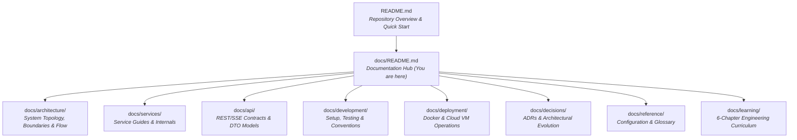

# Platform Documentation Hub

Welcome to the **Data Enrichment AI Intelligence Platform** documentation hub.

This directory is the single authoritative home for all platform documentation: system-level architecture, service guides, API references, development standards, deployment topologies, architectural decisions, and the engineering learning curriculum.

---

## 1. Documentation Map & Navigation

---

## 2. Directory Index

### 🏛️ [Architecture](architecture/overview.md)
Foundational system-wide architectural specifications, boundaries, and communication patterns:
* **[System Overview](architecture/overview.md)**: Multi-service topology, host ingress, port assignments, MySQL relational schema, and core design principles.
* **[Service Boundaries](architecture/service-boundaries.md)**: Detailed bounded contexts and responsibilities for all 7 backend services and the frontend client.
* **[Inter-Service Communication](architecture/communication.md)**: Synchronous `RestClient` orchestration, dynamic Eureka resolution, distributed MDC tracing, and security header propagation.
* **[End-to-End Data Flow](architecture/data-flow.md)**: Complete dataset lifecycle sequence, bounded worker concurrency, and Server-Sent Events (SSE) streaming.

### ⚙️ [Services](services/dataset-service/README.md)
Dedicated guides and internal implementation details for each platform service:
* **Core Business Services**:
  * **[Dataset Service](services/dataset-service/README.md)**: Ingestion, bounded async batch workers, SSE stream provider, and MySQL persistence ([Internals](services/dataset-service/internals.md)).
  * **[AI Intelligent Service](services/ai-intelligent-service/README.md)**: Spring AI Gemini integration, zero-hallucination quote guardrails, and deterministic fallbacks ([Internals](services/ai-intelligent-service/internals.md)).
  * **[Research Service](services/research-service/README.md)**: Multi-query discovery, web scraping guardrails, and evidence extraction ([Internals](services/research-service/internals.md)).
* **Platform Infrastructure Services**:
  * **[API Gateway](services/api-gateway/README.md)**: Spring Cloud Gateway, ingress routing, JWT validation, anti-spoofing header normalization, and CORS.
  * **[Auth Service](services/auth-service/README.md)**: User accounts, BCrypt passwords, and HMAC-SHA256 JWT lifecycle.
  * **[Config Server](services/config-server/README.md)**: Spring Cloud Config Server native profile and local YAML fallback semantics.
  * **[Discovery Server](services/discovery-server/README.md)**: Spring Cloud Netflix Eureka registry, heartbeat tuning, and dynamic resolution.
* **Frontend Client**:
  * **[Frontend Client](services/frontend/README.md)**: Next.js 15, in-browser SheetJS parsing, live SSE dashboard, and non-destructive export.

### 🔌 [API Contracts](api/overview.md)
Authoritative catalog of all external HTTP and streaming contracts:
* **[API Overview & DTO Segregation](api/overview.md)**: Ingress routing, authentication formats, RFC 7807 error schema, and the fundamental architectural distinction between **Public API DTOs** and **Internal Inter-Service DTOs**.
* **[Endpoints Catalog](api/endpoints.md)**: Exhaustive request and response specifications across auth, dataset, research, and AI services.

### 💻 [Development](development/setup.md)
Developer setup, test execution, and code standards:
* **[Local Setup & Startup](development/setup.md)**: Prerequisites (JDK 25, Node 22), Docker Compose workflows, `.env` configuration, and IDE debugging.
* **[Testing Strategy](development/testing.md)**: Unit tests, integration suites, Postman/Newman collections, and the V1 regression dataset.
* **[Coding Conventions](development/conventions.md)**: Feature-centric packaging, small service layers, interface/impl/helper patterns, and lightweight intent comments.

### 🚀 [Deployment](deployment/docker.md)
Containerization and infrastructure operations:
* **[Docker Infrastructure](deployment/docker.md)**: Multi-container Compose topologies (dev-all, db-only, prod), port bindings, and networking.
* **[GCP VM Deployment](deployment/gcp-vm-deployment.md)**: Provisioning Google Cloud Compute Engine VMs, firewall rules, automated GitHub Actions CI/CD, swap configuration, and backups.

### 📋 [Decisions & Roadmap](decisions/README.md)
Architecture Decision Records (ADRs) and long-term technical direction:
* **[ADRs 01–09](decisions/README.md)**: Documented decisions on microservice boundaries, verbatim evidence grounding, deterministic fallbacks, bounded concurrency, SSE streaming, MySQL schema, Gemini model selection, URL normalization, and DTO segregation.
* **[Evolution & Roadmap](decisions/README.md#system-evolution-history)**: Platform milestone timeline and future capabilities.

### 📖 [Reference](reference/configuration.md)
Cross-cutting configuration tables and terminology:
* **[Configuration & Environment](reference/configuration.md)**: Consolidated environment variables, port mappings, and application property keys.
* **[Glossary](reference/glossary.md)**: Authoritative definitions of platform domain terms (Evidence Tuple, Corroboration, Confidence Tier, etc.).

### 🎓 [Engineering Learning Curriculum](learning/README.md)
A 6-chapter deep-dive masterclass into the platform's distributed systems patterns:
1. [01. Microservices & API Contracts](learning/01-microservices-and-api-contracts.md)
2. [02. Research & Evidence Pipeline](learning/02-research-and-evidence-pipeline.md)
3. [03. Spring AI & Structured Intelligence](learning/03-spring-ai-and-structured-intelligence.md)
4. [04. Concurrency & Real-Time Observability](learning/04-concurrency-and-realtime-observability.md)
5. [05. Ingestion & Relational Persistence](learning/05-dataset-ingestion-and-relational-persistence.md)
6. [06. Production Reliability & Post-Mortems](learning/06-production-reliability-and-failure-modes.md)
