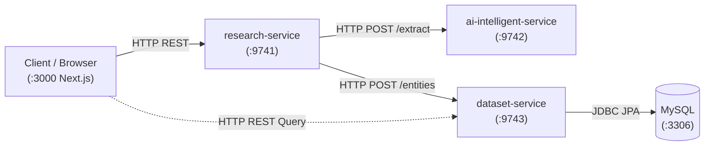

# Documentation Hub

Welcome to the **Data Enrichment & AI Intelligence** platform documentation.

---

## 1. System Overview

The platform transforms sparse input records (e.g. a company name, a person's profile URL, or a repository link) into verified, structured, AI-enriched profiles backed by verbatim evidence quotes and confidence scores.

### Architecture at a Glance

---

## 2. Microservice Responsibilities & Ports

| Service | Port | Primary Responsibility | Key Technologies |
| :--- | :--- | :--- | :--- |
| **`frontend`** | `3000` | User interface for triggering research, polling async job progress, and inspecting enriched entity records. | Next.js 15, React, TypeScript, Tailwind CSS |
| **`research-service`** | `9741` | **Owns the research workflow**: Normalizes entity identifiers, queries search engines, fetches web pages, coordinates AI extraction, corroborates multi-source evidence, and dispatches snapshots. | Spring Boot 4, Java 25, ThreadPoolExecutor, RestClient |
| **`ai-intelligent-service`** | `9742` | **Owns AI extraction**: Interacts with Google Gemini via Spring AI to extract structured facts with exact quotes from raw text; provides deterministic heuristic fallback. | Spring AI, Google GenAI, Regex Heuristic Engine |
| **`dataset-service`** | `9743` | **Owns persistence and database access**: Manages relational schema, Flyway migrations, ACID transactions, and paginated catalog queries for saved entities. | Spring Data JPA, Hibernate, Flyway, MySQL Driver |
| **`MySQL`** | `3306` | Relational store for canonical entities, source URLs, and extracted attributes. | MySQL 8.0+ |

---

## 3. Core Architectural Concepts (Learning Series)

Deep dives into the engineering decisions and production patterns implemented in this codebase:

1. 🌐 **[01. HTTP REST API Design & Media Type Contracts](learning/01-http-api-design-and-media-types.md)**  
   *Explicit media types (`consumes`/`produces`), status codes (`200` vs `202` vs `400`), and RFC 7807 `ProblemDetail` error responses.*

2. 🧩 **[02. Layered Architecture & Dependency Injection](learning/02-spring-dependency-injection-and-boundaries.md)**  
   *Constructor injection, thin controllers, thick domain services, and decoupling business logic from web/DB frameworks.*

3. 📐 **[03. Service Abstraction & SOLID Principles](learning/03-service-abstraction-and-solid.md)**  
   *Single Responsibility decomposition of the pipeline, Open/Closed extension, and interface segregation.*

4. 🔌 **[04. Strategy & Adapter Patterns for External Integrations](learning/04-strategy-and-adapter-patterns-in-provider-integrations.md)**  
   *Pluggable search engines (`TavilySearchProvider` vs `MockSearchProvider`) and zero-overhead local development.*

5. ⏱️ **[05. Async Job Lifecycle, Bounded Thread Pools & Backpressure](learning/05-async-job-lifecycle-and-thread-pooling.md)**  
   *Non-blocking `202 Accepted` async jobs, bounded `ThreadPoolExecutor`, `CallerRunsPolicy` backpressure, and MDC correlation.*

6. 🧠 **[06. Evidence-Grounded AI Extraction & Zero-Hallucination Guardrails](learning/06-evidence-grounded-ai-extraction.md)**  
   *Strict prompt schema enforcement, verbatim quote substring verification in raw text, and offline heuristic fallback.*

7. 🗄️ **[07. Transactional Persistence, Flyway & Idempotent Upsert](learning/07-transactional-persistence-and-idempotency.md)**  
   *Versioned SQL migrations, Hibernate `validate`, atomic orphan removal (`clear()` & append), tracking removal, and SHA-256 idempotency.*

---

## 4. Setup & System Specifications

* **[Architecture Blueprint](initial/architecture.md)**: System design and communication boundaries.
* **[Problem Statement & Constraints](initial/problem.md)**: Problem analysis, scope, and zero-hallucination rules.
* **[Enrichment Engine Design](initial/enrichment.md)**: Evidence tuple structures and research limitations.
* **[Directory & Service Structure](setup/project-structure.md)**: Repository layout, code conventions, and Docker files.
* **[API Design Reference](setup/api-design.md)**: Endpoint catalog with sample JSON requests/responses.
* **[Entity Domain Model](setup/entity-model.md)**: Domain objects, data structures, and relational schema.
