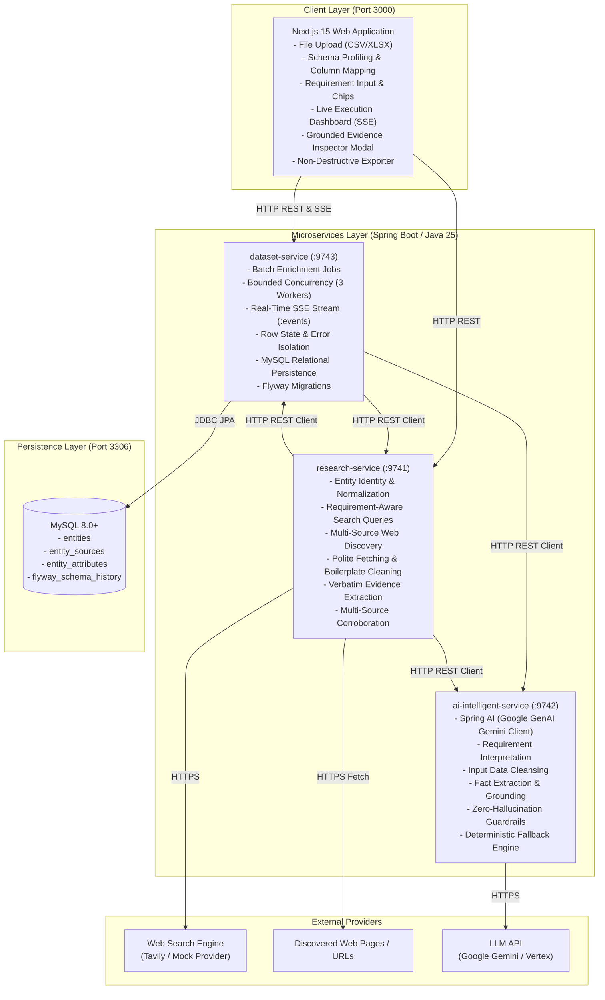

# System Architecture

The **Data Enrichment AI Intelligence Platform** is a distributed, production-grade enrichment engine that transforms sparse, noisy, or unstructured entity inputs into verified, structured, requirement-aware profiles backed by verbatim evidence quotes and multi-source confidence tiers.

---

## 1. High-Level Topology



---

## 2. Microservice Responsibilities & Boundaries

The platform enforces strict separation of concerns across its three backend services:

### A. `research-service` (Port 9741)
* **Core Principle**: *"Research produces evidence."*
* **Primary Responsibilities**:
  1. **Seed Input Identification & Normalization**: Canonicalizes raw URLs, removes tracking parameters (`utm_*`, `ref`), and handles sparse seeds across entity types (`PERSON`, `ORGANIZATION`, `PRODUCT`, `REPOSITORY`, `WEBSITE`, `OTHER`).
  2. **Requirement-Aware Search Query Formulation**: Combines entity identifiers and target field requirements into optimized search queries via `QueryBuilder` and strategy adapters.
  3. **Multi-Source Discovery & Primary Source Ranking**: Queries search providers (Tavily with graceful `MockSearchProvider` fallback) and prioritizes authoritative primary domains (official domains, GitHub, LinkedIn, official documentation).
  4. **Web Content Fetching & Boilerplate Cleaning**: Fetches HTML/JSON/Markdown content, strips noise, navigation links, and ads, extracting core text sections with size and timeout guardrails.
  5. **Evidence Extraction**: Dual-strategy extraction using specialized field extractors (`ExperienceFieldExtractor`, `EducationFieldExtractor`, `SkillFieldExtractor`, `ProjectFieldExtractor`, `ActivityFieldExtractor`, `RoleFieldExtractor`, `OrganizationFieldExtractor`) alongside delegation to `ai-intelligent-service`.
  6. **Multi-Source Corroboration & Conflict Resolution**: Merges overlapping evidence, flags conflicting claims across sources, and computes confidence tiers (`HIGH`, `MEDIUM`, `LOW`).

### B. `ai-intelligent-service` (Port 9742)
* **Core Principle**: *"AI produces clean, structured, requirement-aware enrichment without hallucination."*
* **Primary Responsibilities**:
  1. **Requirement Interpretation (`/api/v1/ai/requirement`)**: Parses free-form natural language requirements (e.g. *"Find tech stack, founders, and latest funding"*) into structured target fields and priority search keywords.
  2. **Input Cleansing (`/api/v1/ai/clean`)**: Cleans noisy names, strips emojis, parses compound roles and titles, and normalizes URLs.
  3. **Fact Extraction & Grounding (`/api/v1/ai/enrich`)**: Extracts structured factual tuples from raw text. Every extracted attribute **must** be grounded in an exact verbatim quote. If evidence is missing, the value is marked `UNKNOWN`.
  4. **Profile Assessment (`/api/v1/ai/profile/assess`)**: Evaluates multi-dimensional alignment against objective targets (scoring relevance, experience depth, skill matches).
  5. **Transparent Deterministic Fallback**: When external LLM APIs are unreachable, rate-limited, or return invalid JSON, a deterministic heuristic engine provides continuous operation without halting the pipeline.

### C. `dataset-service` (Port 9743)
* **Core Principle**: *"Dataset Service owns dataset ingestion, job execution, and relational persistence."*
* **Primary Responsibilities**:
  1. **Batch Enrichment Job Execution (`/api/v1/enrichment/jobs`)**: Orchestrates parallel row processing over a bounded `ThreadPoolTaskExecutor` (default: 3 workers, configurable).
  2. **Real-Time Observability (`/api/v1/enrichment/jobs/{jobId}/events`)**: Streams discrete row lifecycle events (`STARTED`, `RESEARCH`, `AI_EXTRACTION`, `PERSISTENCE`, `COMPLETED`, `FAILED`) via Server-Sent Events (SSE) with a bounded replay buffer.
  3. **Row-Level Error Isolation**: Network timeouts, missing web pages, or parsing errors on an individual row are isolated—the failing row is marked `FAILED` while remaining rows continue unhindered.
  4. **Job Cancellation Lifecycle (`/api/v1/enrichment/jobs/{jobId}/cancel`)**: Allows operators to cancel queued jobs instantly while in-flight workers complete gracefully.
  5. **Relational Entity Persistence (`/api/v1/entities`)**: Persists canonical entity records, discovered sources, and attribute evidence into MySQL via Spring Data JPA and Flyway migrations.

### D. `frontend` (Port 3000)
* **Core Principle**: *"Frontend guides the user through progressive enrichment and transparently displays grounded evidence."*
* **Primary Responsibilities**:
  1. **Progressive 5-Stage Workflow**: Upload $\rightarrow$ Preview & Profile $\rightarrow$ Column Mapping $\rightarrow$ Live Processing Dashboard $\rightarrow$ Results & Export.
  2. **Live Execution Dashboard**: Real-time worker cards, progress metrics, active stages, activity log, and immediate modal inspection of finished rows.
  3. **Evidence Transparency**: Attribute confidence badges, conflict indicators, and detailed multi-tab evidence inspection modal showing exact quotes and provenance URLs.
  4. **Non-Destructive Export**: Appends new `Enriched_*` attributes, canonical URLs, and confidence metadata while strictly preserving all original spreadsheet columns.

---

## 3. Domain & Relational Data Model

### Domain Concepts
* **Entity**: The logical subject being enriched (Person, Organization, Product, Repository, Website). Identified by a deterministic SHA-256 hash of its canonical URL.
* **Source**: A web document discovered during research, categorized by `sourceType` (`PRIMARY`, `SOCIAL_PROFILE`, `SEARCH_DISCOVERY`, `ACADEMIC`, `REGISTRY`) and tracked with domain, provider, and relevance score.
* **Evidence Tuple**: An atomic verifiable claim: `(attributeName, value, exactQuote, sourceUrl, confidence)`.
* **Corroborated Attribute**: An attribute consolidated across multiple sources, noting corroborating URLs, confidence tier (`HIGH`, `MEDIUM`, `LOW`), and any detected conflicts.

### Relational Schema (MySQL 8.0+)
Managed via versioned Flyway migrations in `dataset-service`:

```sql
-- Core Entity Table
CREATE TABLE entities (
    entity_id VARCHAR(64) PRIMARY KEY,
    entity_type VARCHAR(32) NOT NULL,
    display_name VARCHAR(255) NOT NULL,
    canonical_url VARCHAR(1024) NOT NULL,
    created_at TIMESTAMP DEFAULT CURRENT_TIMESTAMP,
    updated_at TIMESTAMP DEFAULT CURRENT_TIMESTAMP ON UPDATE CURRENT_TIMESTAMP,
    INDEX idx_entities_type (entity_type),
    INDEX idx_entities_updated (updated_at)
);

-- Discovered Sources
CREATE TABLE entity_sources (
    id BIGINT AUTO_INCREMENT PRIMARY KEY,
    entity_id VARCHAR(64) NOT NULL,
    url VARCHAR(1024) NOT NULL,
    title VARCHAR(512),
    snippet TEXT,
    source_type VARCHAR(32) NOT NULL,
    domain VARCHAR(255),
    provider VARCHAR(64),
    relevance DOUBLE,
    retrieved_at TIMESTAMP,
    CONSTRAINT fk_source_entity FOREIGN KEY (entity_id) REFERENCES entities(entity_id) ON DELETE CASCADE,
    INDEX idx_sources_entity (entity_id)
);

-- Grounded Attributes & Evidence
CREATE TABLE entity_attributes (
    id BIGINT AUTO_INCREMENT PRIMARY KEY,
    entity_id VARCHAR(64) NOT NULL,
    attribute_key VARCHAR(128) NOT NULL,
    attribute_value TEXT NOT NULL,
    source_url VARCHAR(1024),
    evidence_snippet TEXT,
    confidence VARCHAR(32) NOT NULL,
    CONSTRAINT fk_attribute_entity FOREIGN KEY (entity_id) REFERENCES entities(entity_id) ON DELETE CASCADE,
    INDEX idx_attributes_entity (entity_id),
    INDEX idx_attributes_key (attribute_key)
);
```

---

## 4. Communication & Cross-Cutting Concerns

* **Protocols**: Synchronous HTTP/1.1 REST using JSON (`application/json`) contracts; Server-Sent Events (`text/event-stream`) for real-time progress.
* **Error Representation**: Standardized RFC 7807 `application/problem+json` emitted on all `4xx`/`5xx` failures.
* **Distributed Tracing**: Logback MDC tracking carries `correlationId`, `jobId`, and `rowId` through worker executions.
* **CORS**: Configured across all microservices to allow origins `http://localhost:3000` and internal Docker service names.

For architectural decisions, trade-offs, and future roadmap, see [Architecture Decisions & System Evolution](decisions.md).  
For the end-to-end data processing walkthrough, see [Enrichment Flow](enrichment-flow.md).  
For complete REST and SSE endpoint documentation, see [API Reference](api.md).  
For local development and Docker orchestration, see [Development Guide](development.md).
