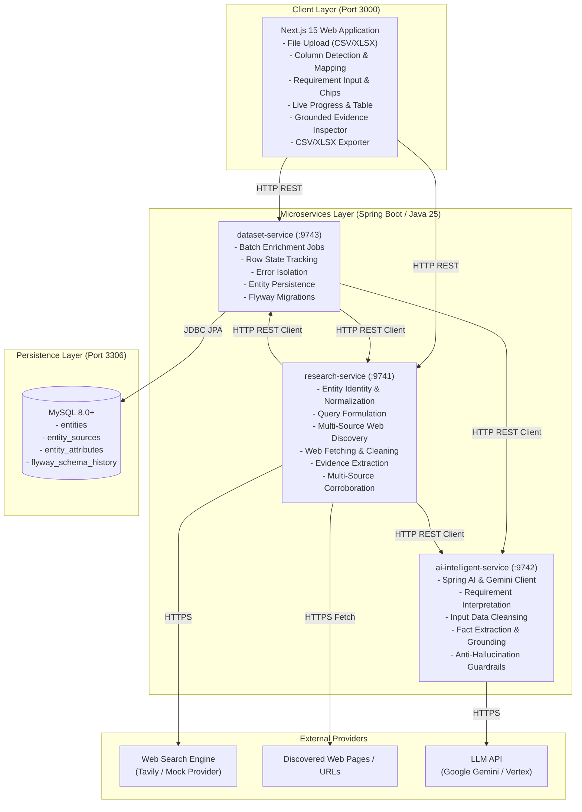

# System Architecture

The **Data Enrichment AI Intelligence Platform** is a distributed, production-grade enrichment engine that transforms sparse, noisy, or unstructured entity inputs into verified, structured, requirement-aware profiles backed by verbatim evidence quotes and multi-source confidence tiers.

---

## 1. High-Level Topology

---

## 2. Microservice Responsibilities & Core Principles

The platform is strictly organized around clear separation of concerns:

### A. `research-service` (Port 9741)
* **Core Principle**: *"Research produces evidence."*
* **Primary Responsibilities**:
  1. **Seed Input Identification & Normalization**: Canonicalizes raw URLs and handles sparse seeds across entity types (`PERSON`, `ORGANIZATION`, `PRODUCT`, `REPOSITORY`, `WEBSITE`, `OTHER`).
  2. **Requirement-Aware Search Query Formulation**: Combines entity identifiers and target field requirements into optimized boolean/quoted search queries.
  3. **Multi-Source Discovery & Primary Source Ranking**: Queries search providers (Tavily with graceful Mock fallback) and prioritizes authoritative primary domains (official domains, GitHub, LinkedIn, Docs).
  4. **Web Content Fetching & Boilerplate Cleaning**: Fetches HTML/JSON/Markdown content, cleans noise, navigation links, and ads, extracting core text sections.
  5. **Evidence Extraction**: Performs dual-strategy extraction:
     - Specialized deterministic extractors for known patterns.
     - Delegation to `ai-intelligent-service` for nuanced context.
  6. **Multi-Source Corroboration & Conflict Resolution**: Merges overlapping evidence, flags conflicting claims across sources, and computes confidence tiers (`HIGH`, `MEDIUM`, `LOW`).

### B. `ai-intelligent-service` (Port 9742)
* **Core Principle**: *"AI produces clean, structured, requirement-aware enrichment without hallucination."*
* **Primary Responsibilities**:
  1. **Requirement Interpretation (`/api/v1/ai/requirement`)**: Parses free-form natural language requirements (e.g., *"Find tech stack, founders, and latest funding"*) into structured target fields, focus areas, and priority search keywords.
  2. **Input Cleansing (`/api/v1/ai/clean`)**: Cleans messy names, strips emojis, parses compound roles and titles, and normalizes URLs.
  3. **Fact Extraction & Grounding (`/api/v1/ai/enrich`)**: Extracts structured factual tuples from raw scraped text. Every extracted attribute **must** be grounded in an exact, verbatim text quote. If evidence is missing, the value must be left empty or marked `UNKNOWN`.
  4. **Resilient Heuristic Fallback**: When external LLM APIs are unreachable or rate-limited, an offline deterministic heuristic engine provides continuous operation.

### C. `dataset-service` (Port 9743)
* **Core Principle**: *"Dataset Service owns dataset, job, and persistence concerns."*
* **Primary Responsibilities**:
  1. **Batch Enrichment Job Execution (`/api/v1/enrichment/jobs`)**: Orchestrates row-by-row asynchronous processing over bounded thread pools (`enrichmentJobExecutor`).
  2. **Row-Level Error Isolation**: Network timeouts, missing web pages, or parsing errors on an individual row are isolated—the row is marked `FAILED` with diagnostic messages while the remaining batch continues unhindered.
  3. **Direct Single-Record Enrichment (`/api/v1/enrichment/single`)**: Provides synchronous row enrichment bridging client mapping, research, and persistence.
  4. **Relational Entity Persistence (`/api/v1/entities`)**: Persists canonical entity summaries, discovered source URLs, and multi-source attributes into MySQL with Flyway migration versioning.

### D. `frontend` (Port 3000)
* **Core Principle**: *"Frontend guides the user through progressive enrichment and transparently displays grounded evidence."*
* **Primary Responsibilities**:
  1. **Progressive 5-Stage Workflow**: Upload $\rightarrow$ Preview $\rightarrow$ Column Mapping $\rightarrow$ Live Processing $\rightarrow$ Results & Export.
  2. **Requirement Guidance**: Suggestion chips and flexible requirement input for domain-targeted enrichment.
  3. **Evidence Transparency**: Attribute confidence badges, conflict indicators, and detailed evidence inspection modal showing exact quotes and provenance URLs.
  4. **Non-Destructive Export**: Combines original spreadsheet columns with `Enriched_*` attributes, status, and canonical URLs into clean CSV/XLSX files.

---

## 3. Communication Contracts & Security

* **Communication Protocol**: Synchronous HTTP/1.1 REST using JSON (`application/json`) contracts.
* **CORS**: Configured uniformly across all 3 backend services allowing origins `http://localhost:3000`, `http://127.0.0.1:3000`, and Docker internal network hostnames.
* **Security Model**: Zero Spring Security overhead for rapid, frictionless local development and containerized orchestration.
