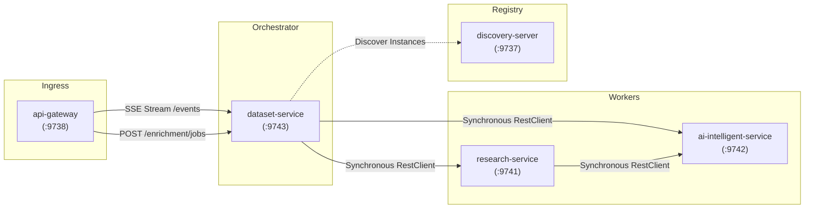
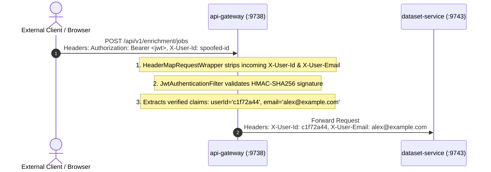

# Inter-Service Communication & Tracing

This document details how microservices communicate across the platform, how distributed requests are traced, how service discovery functions, and how resilience is enforced during failures.

---

## 1. Communication Paradigm & Topology

The platform uses a hybrid communication model tailored to each operation's latency and durability characteristics:
* **Synchronous HTTP via Spring 6 `RestClient`**: Used for immediate row-level research orchestration, evidence extraction, and requirement interpretation.
* **Bounded Asynchronous Execution**: Used for multi-row batch dataset processing (`dataset-service`) and background research jobs (`research-service`).
* **Unidirectional Streaming via Server-Sent Events (SSE)**: Used for pushing real-time worker states, stage transitions, and row completion metadata to the client browser.



---

## 2. Synchronous Orchestration via `RestClient`

Spring 6's modern, fluent, synchronous `RestClient` is used exclusively for internal HTTP calls across all services.

### Configuration & Interceptors
In `dataset-service` (`DatasetServiceConfiguration.java`):

```java
@Bean
public RestClient restClient(RestClient.Builder builder, CorrelationIdClientInterceptor interceptor) {
    return builder
            .requestInterceptor(interceptor)
            .build();
}

@Bean
public RestClient.Builder restClientBuilder() {
    return RestClient.builder();
}
```

### Distributed Tracing Interceptor
Every outbound HTTP request mediated through `RestClient` automatically passes through `CorrelationIdClientInterceptor`:
1. Inspects the logging MDC context for an existing `correlationId` (or `X-Correlation-ID`).
2. If absent, generates a fresh `UUID.randomUUID().toString()`.
3. Injects the `X-Correlation-ID` header into the outbound HTTP request headers.
4. Ensures log aggregators can reconstruct the end-to-end trace spanning `dataset-service`, `research-service`, and `ai-intelligent-service`.

---

## 3. Downstream Service Dependencies & Resilience

In `dataset-service`, downstream clients are separated into **Hard Dependencies** and **Soft Dependencies**:

### A. `ResearchServiceClient` (Hard Dependency)
* **Target**: `research-service` (default port `9741`)
* **Endpoint**: `POST /api/v1/research`
* **Configuration Property**: `${services.research.url:${RESEARCH_SERVICE_URL:http://localhost:9741}}`
* **Failure Semantics**: **No Mock Fallback**. Real web research is mandatory for data enrichment. If `research-service` is unreachable or times out, the individual row is marked `FAILED` with a descriptive message (`"Research service error: ..."`). Other rows continue processing.

### B. `AiServiceClient` (Soft Dependency / Resilient Fallback)
* **Target**: `ai-intelligent-service` (default port `9742`)
* **Endpoints**:
  * `POST /api/v1/ai/requirement` (translates prompt to fields; fallback to entity defaults if offline)
  * `POST /api/v1/ai/clean` (cleans seeds; fallback to identity if offline)
  * `POST /api/v1/ai/enrich` (synthesizes facts; fallback to raw research snippets if offline)
  * `POST /api/v2/ai/profile/assess` (evaluates objectives; fallback to deterministic scoring)
* **Failure Semantics**: **Transparent Fallback**. If `ai-intelligent-service` encounters rate limits (HTTP 429), timeouts, or provider outages, `dataset-service` catches the exception, uses raw evidence snippets, and marks the row status as `AI_DEGRADED` rather than failing the job.

---

## 4. Row Execution Status Mapping

Each row processed during batch enrichment transitions through clear operational states:

| Status | Trigger Condition | System Behavior |
| :--- | :--- | :--- |
| **`COMPLETED`** | Both `research-service` and `ai-intelligent-service` succeeded and produced attributes. | Full evidence, confidence scores, and profile assessments populated. |
| **`AI_DEGRADED`** | `research-service` returned evidence, but AI service timed out or was unreachable. | Raw research tuples populated directly; row marked degraded for operator audit. |
| **`PARTIAL`** | Research succeeded, but one or more requested fields could not be found in public sources. | Found fields populated; missing fields marked `UNKNOWN`. |
| **`INSUFFICIENT_EVIDENCE`** | Research service found no relevant web sources or returned empty results. | Entity created with basic seed data; attributes set to `UNKNOWN`. |
| **`FAILED`** | Connection failure to `research-service`, missing entity identifier, or fatal runtime exception. | Error logged to row state and emitted via SSE; remaining rows continue. |

---

## 5. Gateway Ingress & Anti-Spoofing Security

The API Gateway (`api-gateway`) enforces identity integrity before forwarding requests into the internal network:



### Anti-Spoofing Architecture
External clients cannot impersonate other users by injecting custom headers:
1. `HeaderMapRequestWrapper` intercepts all incoming requests at the Gateway boundary and automatically removes any client-provided `X-User-Id` or `X-User-Email` headers.
2. `JwtAuthenticationFilter` cryptographically verifies the incoming `Authorization: Bearer <jwt>` token using `jwt.secret`.
3. Only after verification are trusted `X-User-Id` and `X-User-Email` headers injected downstream.
4. Downstream services read user identity exclusively from these verified headers.

---

## 6. Service Discovery & Dynamic Resolution

* **Engine**: Spring Cloud Netflix Eureka Server (`discovery-server` on `:9737`).
* **Heartbeat Tuning**:
  * Lease renewal interval: 10 seconds.
  * Lease expiration duration: 30 seconds.
  * Self-preservation mode: Tuned for container environments.
* **Dual Resolution**:
  * In containerized environments, services can resolve via Eureka service IDs (`lb://RESEARCH-SERVICE`) or via Docker's internal DNS (`http://research-service:9741`).
  * If Eureka is unreachable during startup, internal clients fall back to Docker DNS hostnames without failing.
