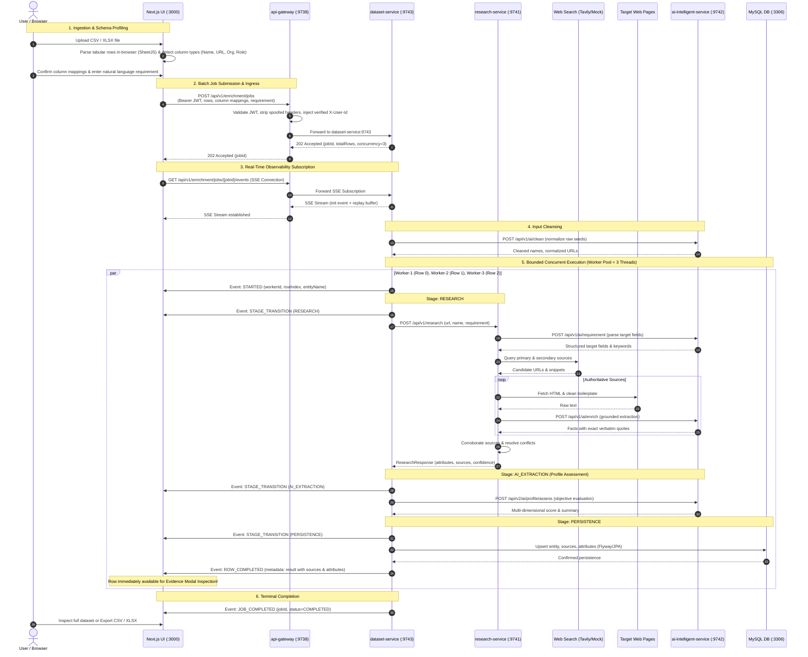

# End-to-End Data & Execution Flow

This document details the complete lifecycle of tabular datasets through the **Data Enrichment AI Intelligence Platform**, tracing how raw spreadsheet inputs are transformed into verified, evidence-grounded attributes under bounded concurrent execution and real-time observability.

---

## 1. End-to-End Sequence Diagram

---

## 2. Stage-by-Stage Operational Breakdown

### Stage 1: Tabular Dataset Ingestion & Profiling
* **Client-Side Parsing**: Next.js parses CSV or Excel (`.xlsx`) files directly in the browser via SheetJS (`xlsx`). The server never handles raw file uploads or ephemeral file storage.
* **Automatic Schema Detection**: Analyzes column headers and sample row values using regex heuristics to classify columns into `NAME`, `URL`, `ORGANIZATION`, `ROLE`, and `LOCATION`.
* **Requirement Input**: Users select prompt suggestions (e.g. *"Extract current role, organization, key skills, and recent projects"*) or type custom instructions.

### Stage 2: Batch Job Submission & Ingress
* **Endpoint**: `POST /api/v1/enrichment/jobs`
* **Security**: Mediated by `api-gateway`. External clients supply an `Authorization: Bearer <jwt>` header. The gateway cryptographically validates the token and injects a verified `X-User-Id` downstream.
* **Job Registration**: `dataset-service` registers an in-memory job tracker, assigns a UUID `jobId`, creates an in-memory event buffer, and submits tasks to `enrichmentTaskExecutor`. Returns `202 Accepted`.

### Stage 3: Real-Time Observability via Server-Sent Events (SSE)
* **Endpoint**: `GET /api/v1/enrichment/jobs/{jobId}/events`
* **Event Taxonomy**:
  * `init`: Handshake event transmitting `jobId`, `totalRows`, and active concurrency (`3`).
  * `execution-event`: Emitted on every state transition, containing `workerId`, `rowIndex`, `stage` (`STARTED`, `RESEARCH`, `AI_EXTRACTION`, `PERSISTENCE`), and message.
  * `row-completed`: Transmits the full enriched entity payload (attributes, sources, confidence) as soon as an individual row completes.
  * `job-completed`: Terminal event signaling the batch is complete (`COMPLETED` or `FAILED`).
* **Replay Buffer**: Holds the last 500 events per job in a thread-safe circular buffer. If the client browser reconnects or refreshes, it immediately replays historical events to restore active worker cards.

### Stage 4: Input Cleansing
* Before executing research, `dataset-service` invokes `ai-intelligent-service` (`POST /api/v1/ai/clean`) to normalize noisy inputs:
  * Strips emojis, honorifics, and irrelevant social handles from names.
  * Parses compound titles (`"VP Engineering & Co-Founder"` $\rightarrow$ primary role: `"VP Engineering"`).
  * Normalizes and unwraps URLs.

### Stage 5: Bounded Concurrent Execution
* **Managed Thread Pool**: Rows are executed concurrently via `enrichmentTaskExecutor` with a bounded worker pool (default: 3 threads) and a 500-item queue.
* **Row-Level Error Isolation**: Each row execution is wrapped in an isolated `CompletableFuture`. If row 2 experiences an upstream timeout or 403 scraping error, only row 2 is marked `FAILED`. Workers processing rows 0, 1, and 3 proceed unaffected.
* **Subsystem Delegation**:
  1. `research-service` discovers candidate URLs, scrapes pages, and extracts evidence.
  2. `ai-intelligent-service` extracts verbatim quotes and scores profiles.
  3. `dataset-service` persists the canonical entity snapshot into MySQL.

### Stage 6: Job Cancellation Lifecycle
* **Endpoint**: `POST /api/v1/enrichment/jobs/{jobId}/cancel`
* **Authorization**: The gateway-injected `X-User-Id` must match the job's creator. Cross-tenant cancellations return `403 Forbidden`.
* **Semantics**: Sets the job state to `CANCELLED`. In-flight worker threads finish their current row gracefully, while all pending rows in the queue are dropped without starting.

### Stage 7: Evidence Inspection & Non-Destructive Export
* **Live Inspection**: Completed rows are immediately viewable in the frontend table and "Recently Completed" drawer while remaining rows are still running.
* **Non-Destructive Export**: Users can export the enriched dataset to CSV or XLSX at any time. The export preserves all original columns and order, appending new `Enriched_<attribute>`, `Canonical_Url`, and `Enrichment_Status` columns.
