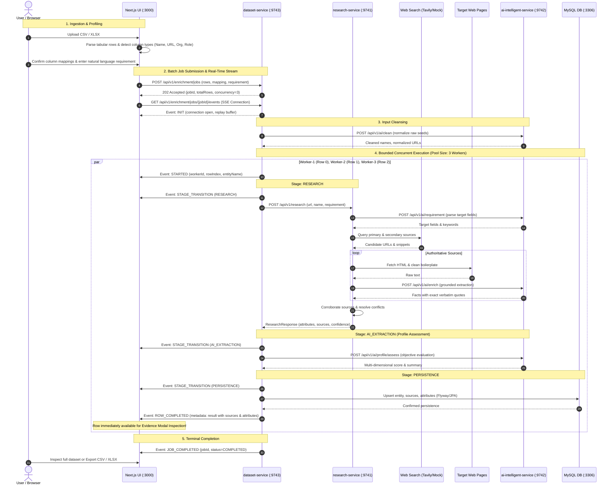

# End-to-End Enrichment Flow

This document details the complete lifecycle of a dataset through the **Data Enrichment AI Intelligence Platform**, tracing how raw spreadsheet inputs are transformed into verified, evidence-grounded attributes under bounded concurrent execution and real-time observability.

---

## 1. End-to-End Flow Sequence

---

## 2. Stage-by-Stage Breakdown

### Stage 1: Tabular Dataset Ingestion & Profiling
* **Client-Side Parsing**: Next.js parses CSV or Excel (`.xlsx`) files in-browser via SheetJS (`xlsx`), never uploading raw files to ephemeral temporary storage.
* **Automatic Schema Detection**: Analyzes column names and row sample values using regex heuristics to detect entity names, URLs (LinkedIn, GitHub, websites), organizations, and job titles.
* **Requirement Input**: Users select prompt suggestions (e.g. *"Identify current role, tech stack, open-source projects, and education"*) or enter custom natural-language requirements.

### Stage 2: Bounded Concurrent Batch Orchestration
* **Job Creation**: `dataset-service` generates a unique `jobId`, registers an in-memory job state tracker, and schedules row tasks onto `enrichmentTaskExecutor`.
* **Dynamic Concurrency**: Operates over a bounded `ThreadPoolTaskExecutor` (default: 3 workers). Threads are named `dataset-enrichment-worker-N`.
* **Row-Level Error Isolation**: Each row runs inside its own `CompletableFuture`. If row 2 encounters a scraping 403 or network timeout, it is marked `FAILED` with diagnostic logs; rows 0, 1, and 3 continue to completion uninterrupted.

### Stage 3: Real-Time Observability via Server-Sent Events (SSE)
* **Live Connection**: The frontend opens `GET /api/v1/enrichment/jobs/{jobId}/events` using native `EventSource`.
* **Event Taxonomy**: Emits discrete transitions:
  - `init`: Handshake event with current concurrency and total rows.
  - `execution-event`: Granular progress carrying `workerId`, `rowIndex`, `stage` (`STARTED`, `RESEARCH`, `AI_EXTRACTION`, `PERSISTENCE`), and message.
  - `row-completed`: Carries the complete `RowEnrichmentResult` inside event metadata, allowing the frontend to hydrate rows incrementally.
  - `job-completed`: Terminal event signaling the entire batch has concluded.
* **Bounded Replay Buffer**: The backend retains the last 500 events per job so newly connected or reconnected clients immediately reconstruct the in-flight worker cards.
* **Graceful Fallback**: If SSE disconnects or is blocked by an intermediate proxy, the frontend automatically falls back to periodic interval polling (`GET /api/v1/enrichment/jobs/{jobId}`).

### Stage 4: Autonomous Web Discovery & Retrieval (`research-service`)
* **URL Canonicalization**: Strips tracking query parameters (`utm_source`, `utm_medium`, `ref`, `fbclid`) and sorts functional parameters.
* **Intent-Driven Queries**: Formulates targeted search queries combining the canonical entity identifier with requirement keywords.
* **Provider Abstraction**: Dispatches search queries through `SearchProvider` (Tavily with graceful `MockSearchProvider` fallback).
* **Source Ranking**: Prioritizes primary sources (official organization domains, GitHub, LinkedIn, technical docs) over low-reliability scrapers.
* **Polite Web Scraping**: Fetches target HTML pages with strict timeouts (5000ms), caps response size, and strips HTML boilerplate, scripts, styling, and navigation headers.

### Stage 5: Grounded Fact Extraction (`ai-intelligent-service`)
* **Prompt Construction**: Uses externalized StringTemplate files (`src/main/resources/prompts/*.st`) enforcing strict JSON schema output.
* **Zero-Hallucination Programmatic Guard**: Every extracted attribute **must** supply an `exactQuote`. The service validates that `exactQuote` appears verbatim inside the scraped text before accepting the fact. Ungrounded claims are discarded immediately.
* **Deterministic Fallback**: If the external LLM is rate-limited (HTTP 429) or unavailable, extraction seamlessly degrades to deterministic regex heuristics, guaranteeing the batch never halts.

### Stage 6: Multi-Source Corroboration & Relational Persistence
* **Agreement Boosting**: When multiple independent sources assert the same attribute, confidence is upgraded from `LOW` to `MEDIUM` or `MEDIUM` to `HIGH`.
* **Conflict Flagging**: When sources assert contradictory facts, `conflictDetected` is set to `true`, preserving all conflicting claims for human audit.
* **Idempotent Upsert**: `dataset-service` saves entities, sources, and attributes in MySQL within an atomic transaction using JPA `orphanRemoval = true`.

### Stage 7: Real-Time Inspection & Non-Destructive Export
* **Instant Evidence Modal**: Finished rows populate in the UI immediately. Users can click **"Inspect Evidence"** to view discovered sources, attribute confidence badges, and exact quotes *while remaining rows are still being processed*.
* **Non-Destructive Export**: Exports the enriched dataset to CSV or XLSX, appending `Enriched_<attribute>`, `Enrichment_Status`, and `Canonical_Url` columns while strictly preserving all original user columns.

---

For architecture diagrams and service boundaries, see [System Architecture](architecture.md).  
For the complete REST and SSE API contract, see [API Reference](api.md).  
For architectural decisions, see [Architecture Decisions](decisions.md).
