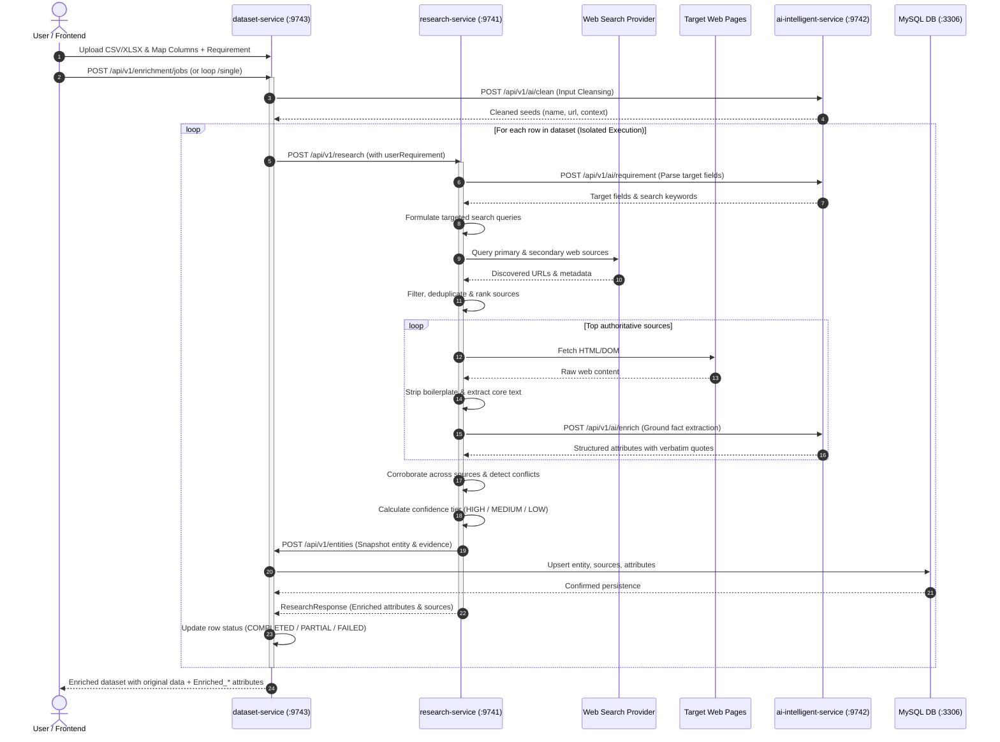

# End-to-End Enrichment Flow

This document details the lifecycle of an entity through the **Data Enrichment AI Intelligence Platform**, tracing how raw, sparse inputs are transformed into verified, evidence-grounded attributes.

---

## 1. Flow Diagram



---

## 2. Detailed Pipeline Stages

### Stage 1: Input Cleansing & Identification
* **Objective**: Remove formatting anomalies and determine the entity category (`PERSON`, `ORGANIZATION`, `PRODUCT`, `REPOSITORY`, `WEBSITE`, `OTHER`).
* **Actions**:
  - Strip emojis, honorifics, corporate suffixes (e.g., `Inc.`, `LLC`), and query parameters from profile URLs.
  - Normalization extracts canonical handles (e.g., `linkedin.com/in/johndoe` $\rightarrow$ `johndoe`).

### Stage 2: Requirement Interpretation
* **Objective**: Transform user natural language intent into structured search priorities.
* **Actions**:
  - Free-form text like `"Find funding rounds, founders, and headquarters"` is parsed by `ai-intelligent-service` into:
    ```json
    {
      "targetFields": ["funding_rounds", "founders", "headquarters"],
      "focusAreas": ["Investment", "Leadership", "Location"],
      "searchKeywords": ["funding series", "seed", "founder", "HQ address"]
    }
    ```

### Stage 3: Query Generation & Source Discovery
* **Objective**: Retrieve candidate web documents while minimizing search noise.
* **Actions**:
  - Generates specialized boolean queries:
    - `"Acme Corp" (funding OR series OR investment OR "round")`
    - `"Acme Corp" (founders OR "founded by" OR "co-founder")`
  - Fetches results via Tavily / Mock Search Provider.
  - Ranks primary and official sources higher than aggregated syndication sites.

### Stage 4: Web Fetching & Boilerplate Cleaning
* **Objective**: Convert raw web documents into clean, dense text.
* **Actions**:
  - Strips HTML navigation headers, footers, cookie notices, and advertisements.
  - Extracts title, meta descriptions, and core body segments preserving paragraph structures.

### Stage 5: Grounded AI Fact Extraction (Zero-Hallucination)
* **Objective**: Extract structured field values grounded in verifiable facts.
* **Core Rule**: **Every extracted attribute MUST include an exact verbatim substring quote from the scraped text.**
* **Actions**:
  - Prompt enforces structured JSON schema output.
  - If information is not explicitly mentioned in the text, the model returns `UNKNOWN` or omits the field. The model is forbidden from extrapolating or guessing.

### Stage 6: Multi-Source Corroboration & Confidence Tiers
* **Objective**: Merge facts from independent sources and compute trustworthiness.
* **Confidence Criteria**:
  - `HIGH`: Confirmed by multiple independent sources OR sourced from an authoritative primary domain with direct verbatim quote.
  - `MEDIUM`: Sourced from a single reputable secondary source with clear evidence.
  - `LOW`: Inferred with weak snippet context or ambiguous entity match.
  - `Conflict Flag`: When two sources assert contradictory facts (e.g., different founding dates), the attribute is marked `conflictDetected = true` with both sources preserved.

### Stage 7: Persistence & Non-Destructive Export
* **Objective**: Save audit trail and provide exportable data.
* **Actions**:
  - Entities, sources, and attributes are persisted into MySQL.
  - Client can download CSV/XLSX where original uploaded columns are completely untouched, with new `Enriched_<attribute>` and `Enrichment_Status` columns added.
