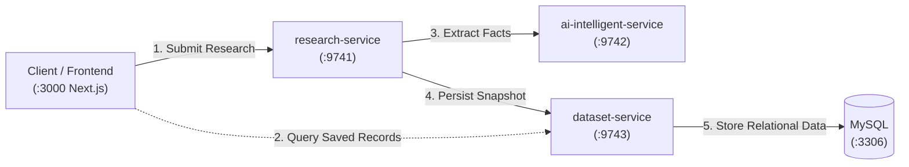
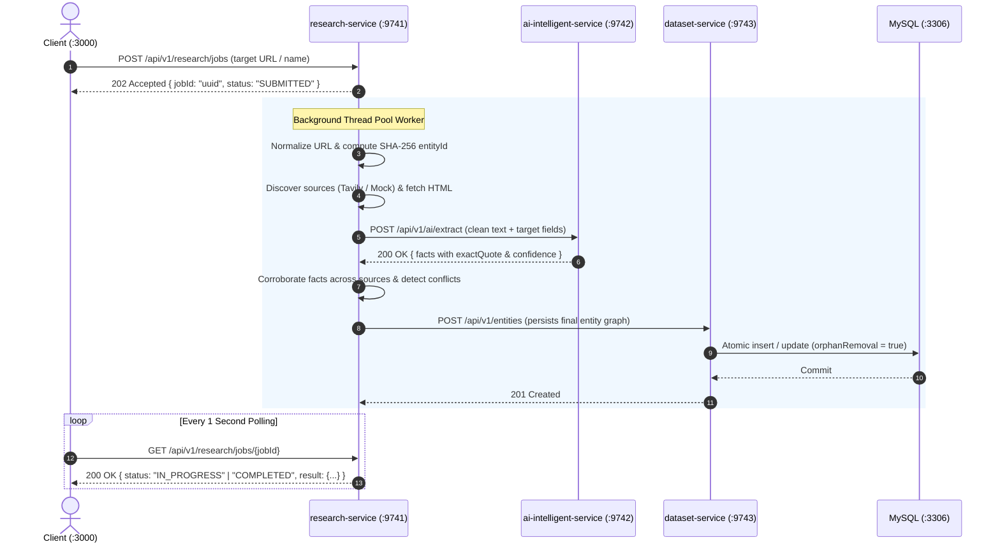

# System Architecture

The **Data Enrichment & AI Intelligence** platform is built as a lightweight microservice system designed for modularity, resilience, and testability.

---

## 1. High-Level Microservice Architecture

---

## 2. Microservice Responsibilities

Each service owns a single bounded context:

### `research-service` (Port 9741)
* **Owns the research workflow**.
* Coordinates the multi-step enrichment pipeline:
  1. Validates inbound targets (URL or entity name).
  2. Normalizes URLs (strips tracking tags like `utm_*`, computes deterministic SHA-256 ID).
  3. Discovers candidate web sources via search engines (Tavily or offline mock).
  4. Scrapes and cleans web pages into plain text with strict size and timeout limits.
  5. Calls `ai-intelligent-service` to extract verifiable facts.
  6. Corroborates facts across multiple sources (boosts confidence on agreement, flags conflicts).
  7. Sends the final snapshot to `dataset-service`.
* Provides both synchronous (`POST /api/v1/research`) and asynchronous (`POST /api/v1/research/jobs`) execution.

### `ai-intelligent-service` (Port 9742)
* **Owns AI extraction**.
* Interacts with Google Gemini (via Spring AI) to extract structured key-value facts from raw text.
* Enforces strict zero-hallucination verification: ensures every quoted excerpt actually exists in the raw source text.
* Provides deterministic rule-based fallback if the AI API is unavailable, unconfigured, or rate-limited.

### `dataset-service` (Port 9743)
* **Owns persistence and database access**.
* Manages the relational schema using versioned Flyway migrations.
* Executes atomic idempotent upserts: clears and re-inserts sources and attributes for an entity within a single transaction using JPA orphan removal.
* Exposes read APIs for catalog exploration, detail lookup, and paginated browsing.

### `MySQL` (Port 3306)
* Stores relational tables: `entities`, `entity_sources`, and `entity_attributes`.
* Uses indexes on `entity_id`, `entity_type`, and `updated_at` for high-performance lookups and sorting.

### `frontend` (Port 3000)
* Next.js 15 client providing an interactive research dashboard.
* Supports live async job polling (progress bar, timer, status badges) and direct catalog browsing.

---

## 3. Communication Flows

### A. Asynchronous Research Workflow (Background Execution)

---

## 4. Key Architectural Decisions

1. **Decoupled AI Layer**:
   LLMs have high latency and variable failure modes (rate limits, context window limits). Putting AI in `ai-intelligent-service` ensures failures or slow responses never lock database transactions or break the core API contracts of `dataset-service`.

2. **Deterministic Entity IDs for Idempotency**:
   Entities are keyed by a 64-character SHA-256 hash of their canonical URL or URN. Re-running research for the same URL automatically routes to the existing record without creating duplicate entries.

3. **Grounded Fact Verification**:
   Attributes must have an associated source URL, an exact verbatim quote, and a confidence score (`HIGH`, `MEDIUM`, `LOW`). Ungrounded assertions are filtered out.

4. **Bounded Thread Concurrency**:
   Asynchronous jobs run on a bounded `ThreadPoolExecutor` (core: 4, max: 16, queue: 500, `CallerRunsPolicy`). If the queue fills up, the submitting thread executes the task, applying natural backpressure to prevent OutOfMemory crashes.
