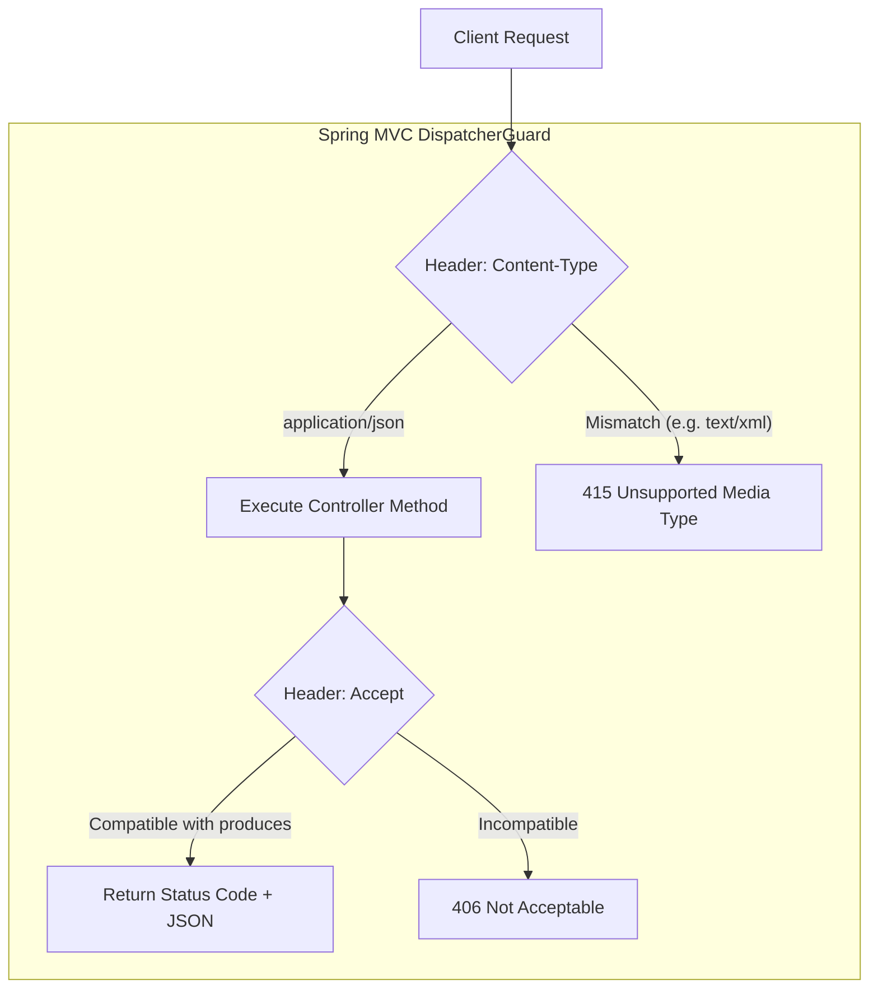

# Concept 01: HTTP REST API Design & Explicit Media Type Contracts

In a microservice system, HTTP APIs are the contractual boundary between services. When contracts are vague, systems fail unpredictably.

This guide explains how content negotiation, status code semantics, and standardized error handling are enforced in this project.

---

## 1. What Is It?

HTTP REST API design specifies:
* **Media Types**: How the client and server agree on the payload format (`application/json`).
* **HTTP Status Codes**: Meaningful numbers communicating whether a request succeeded (`200`), was queued for later (`202`), or failed (`400`, `404`, `502`).
* **Error Representation**: Standardized machine-readable error responses (RFC 7807 `ProblemDetail`) instead of raw stack traces.

---

## 2. Why Do We Use It Here?

Our platform has four communicating components:
`frontend` (:3000) $\rightarrow$ `research-service` (:9741) $\rightarrow$ `ai-intelligent-service` (:9742) and `dataset-service` (:9743).

Without strict HTTP contracts:
1. A client could send XML or plain text, causing silent null deserialization or internal crashes.
2. Long-running web scraping and AI extraction (5–15 seconds) would block HTTP connections and trigger browser timeouts if treated as synchronous `200 OK` requests.
3. Errors would leak Java stack traces to clients, revealing internal class names and database schemas.

---

## 3. How Does It Work in THIS Project?



1. **Content Negotiation Guards**: Controllers declare `consumes` and `produces` using `MediaType.APPLICATION_JSON_VALUE`. Spring MVC automatically rejects mismatched requests before touching any service logic.
2. **Synchronous vs. Asynchronous Status Codes**:
   - Quick operations (e.g. looking up an entity) return `200 OK`.
   - Long-running research tasks return `202 Accepted` immediately with a `jobId` so the frontend can poll progress without timing out.
3. **RFC 7807 Error Bodies**: Unhandled exceptions are converted by [`GlobalExceptionHandler`](file:///P:/Agentic%20AI/Enrichment%20Platform/data-enrichment-ai-intelligence/apps/backend/research-service/src/main/java/com/subdual/research_service/exception/GlobalExceptionHandler.java) into standard `ProblemDetail` JSON objects.

---

## 4. Relevant Architecture & Code

### A. Strict Media Type Enforcement in [`EntityController.java`](file:///P:/Agentic%20AI/Enrichment%20Platform/data-enrichment-ai-intelligence/apps/backend/dataset-service/src/main/java/com/subdual/dataset_service/controller/EntityController.java#L29-L33)

```java
@PostMapping(consumes = MediaType.APPLICATION_JSON_VALUE, produces = MediaType.APPLICATION_JSON_VALUE)
public ResponseEntity<EntityDetailResponse> persistEntity(@Valid @RequestBody PersistEntityRequest request) {
    EntityDetailResponse response = persistenceService.persistOrUpdate(request);
    return ResponseEntity.status(HttpStatus.CREATED).body(response);
}
```
* **Why this code**: `consumes` prevents clients from sending malformed or unsupported payloads. `produces` guarantees the client receives JSON.

### B. Long-Running Task Contract in [`ResearchController.java`](file:///P:/Agentic%20AI/Enrichment%20Platform/data-enrichment-ai-intelligence/apps/backend/research-service/src/main/java/com/subdual/research_service/controller/ResearchController.java#L40-L45)

```java
@PostMapping(value = "/jobs", consumes = MediaType.APPLICATION_JSON_VALUE, produces = MediaType.APPLICATION_JSON_VALUE)
@ResponseStatus(HttpStatus.ACCEPTED)
public ResponseEntity<ResearchJobResponse> submitJob(@Valid @RequestBody ResearchRequest request) {
    ResearchJobResponse response = researchJobService.submitJob(request);
    return ResponseEntity.status(HttpStatus.ACCEPTED).body(response);
}
```
* **Why this code**: Scraping multiple websites and invoking LLMs takes several seconds. Returning `202 Accepted` immediately frees the HTTP thread and gives the client a tracking `jobId`.

### C. RFC 7807 Error Response

When validation fails (e.g., neither URL nor name is provided), the API returns:

```json
{
  "type": "about:blank",
  "title": "Bad Request",
  "status": 400,
  "detail": "Either 'url' or 'name' must be provided for research",
  "instance": "/api/v1/research"
}
```

---

## 5. Production & Interview Lessons

1. **Never use GET with `consumes`**:
   `GET` requests do not have request bodies. Adding `consumes = "application/json"` to a `GET` endpoint causes Spring to reject normal browser or curl requests that omit the `Content-Type` header with a `415 Unsupported Media Type` or `404 Not Found`.
2. **`200 OK` vs `202 Accepted` in System Design**:
   In interview questions involving background workers (e.g., video processing, document indexing, web scraping), never propose a synchronous `200 OK` endpoint. Always return `202 Accepted` with a status polling URL or webhook.
3. **RFC 7807 as the Microservice Standard**:
   Modern APIs avoid bespoke error payloads (`{"err": "message"}`). Standardizing on RFC 7807 allows API gateways, client libraries, and monitoring tools to automatically parse errors across all services.
