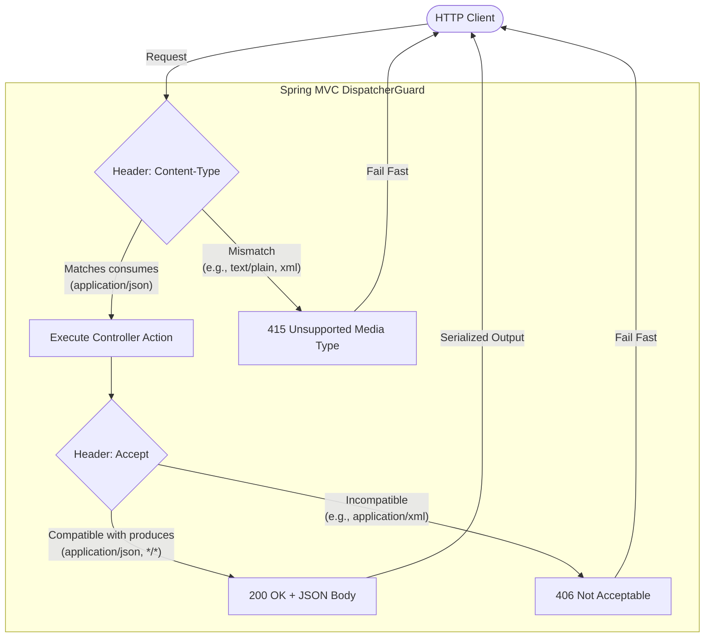

# Concept 01: HTTP API Design, Media Types, and Content Negotiation

In modern microservice architectures, HTTP APIs serve as the primary contract between clients and backend services. This guide explains how media types, content negotiation, status code semantics, and RFC 7807 ProblemDetail structures are designed and enforced across our platform.

---

## 1. Content Negotiation: `consumes` and `produces`

In Spring Boot REST controllers, the `consumes` and `produces` attributes serve as **HTTP header filters** and **content-negotiation guards**.



### When to Use (and When to Omit) `consumes`
- **GET endpoints without request body**: Endpoints like `GET /api/v1/entities` or `GET /api/v1/research/jobs/{jobId}` do not receive a request body. Specifying `consumes = MediaType.APPLICATION_JSON_VALUE` on GET endpoints can inadvertently cause Spring MVC to reject requests that do not specify a redundant `Content-Type` header with a `404 Not Found` or `415 Unsupported Media Type`.
- **POST/PUT endpoints**: Endpoints that accept JSON payloads explicitly specify `consumes = MediaType.APPLICATION_JSON_VALUE` or allow Spring's default `@RequestBody` mapping to bind incoming JSON payloads.

---

## 2. HTTP Status Code Semantics

Our platform adheres to strict REST semantics:

| HTTP Status | Meaning in Our Services |
| :--- | :--- |
| `200 OK` | Synchronous request succeeded with payload returned (`executeResearch`, `listEntities`, `pollJob`). |
| `202 Accepted` | Asynchronous task accepted for background execution (`submitJob`). Returns `jobId` and `status: SUBMITTED`. |
| `400 Bad Request` | Client request validation failed (e.g., both `url` and `name` missing, malformed URL). Returns RFC 7807 `ProblemDetail`. |
| `404 Not Found` | Target resource does not exist (e.g. unknown `jobId` or non-existent `entityId`). |
| `502 Bad Gateway` | Upstream third-party integration failure (e.g., Tavily search provider returned HTTP 502/503). |
| `504 Gateway Timeout`| Upstream third-party integration timed out beyond SLA (e.g. search exceeded 4000ms). |

---

## 3. Standardized Error Handling via RFC 7807 (`ProblemDetail`)

Spring Boot native RFC 7807 `ProblemDetail` is used across all services via `@ControllerAdvice`:

```json
{
  "type": "about:blank",
  "title": "Bad Request",
  "status": 400,
  "detail": "Either 'url' or 'name' must be provided for research",
  "instance": "/api/v1/research"
}
```

This prevents leaking internal stack traces and provides machine-readable error context.
