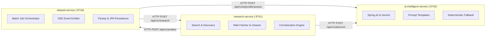

# Chapter 1: Microservices, Domain Boundaries, and API Contracts

This guide explores the architectural principles behind decomposing the Data Enrichment AI Intelligence Platform into three Spring Boot microservices, enforcing clean domain boundaries, implementing Dependency Injection, standardizing RFC 7807 problem details, and practicing contract-first API evolution.

---

## 1. Microservice Decomposition & Boundary Isolation

### Why Three Microservices?
In data enrichment platforms, workloads fall into three distinct operational profiles:
1. **Web Research & Retrieval (`research-service`)**: High network I/O, variable response times, rate limits, HTML parsing, and external search latency.
2. **AI & LLM Reasoning (`ai-intelligent-service`)**: High compute latency, external token costs, strict prompt formatting, and quota throttling.
3. **Relational Data & Job State (`dataset-service`)**: ACID transactions, relational integrity, schema migrations, and batch lifecycle tracking.

Coupling all three into a monolithic application creates severe operational risks: a slow LLM call holds open database connection pools; an aggressive web scrape triggers memory spikes that crash user job management; a database migration failure halts AI extraction.



### Architectural Benefits
* **Independent Failure Domains**: If Google Gemini is rate-limited (HTTP 429), `dataset-service` continues serving entity queries and recording job statuses.
* **Granular Resource Tuning**: `research-service` configures aggressive HTTP connection pools for web crawling; `ai-intelligent-service` configures long read timeouts (30s) for LLM generation; `dataset-service` configures HikariCP for optimal MySQL connection reuse.

---

## 2. Spring Dependency Injection & SOLID Principles

### Inversion of Control (IoC) via Constructor Injection
Field injection (`@Autowired` on private fields) obscures dependencies and hinders unit testability. The platform strictly enforces **constructor injection** with immutable `final` references across all services:

```java
@Service
@RequiredArgsConstructor
public class DefaultDatasetEnrichmentService implements DatasetEnrichmentService {

    private final ResearchServiceClient researchServiceClient;
    private final AiServiceClient aiServiceClient;
    private final EntityRepository entityRepository;
    private final EnrichmentTaskExecutor enrichmentTaskExecutor;
    // All dependencies explicitly injected and immutable
}
```

### SOLID in Practice
* **Single Responsibility Principle (SRP)**: Rather than letting a single class crawl, parse, and score, `research-service` delegates to distinct components:
  - `QueryBuilder`: Formulates targeted search queries.
  - `SearchProvider`: Executes web searches.
  - `DefaultWebContentFetcher`: Retrieves and strips HTML.
  - `EvidenceMerger`: Corroborates facts across sources.
* **Open/Closed Principle (OCP)**: New field extractors (e.g. `EducationFieldExtractor`, `SkillFieldExtractor`) implement the common `FieldExtractor` interface and register automatically via Spring's collection injection without modifying the research pipeline coordinator.
* **Dependency Inversion Principle (DIP)**: High-level orchestrators depend on abstractions (`SearchProvider`), never on concrete third-party SDKs (`TavilySearchProvider`).

---

## 3. RFC 7807 Problem Details & Content Negotiation

### Standardized Error Payloads
Heterogeneous clients (Next.js Node runtime, frontend React components, external API consumers) require predictable error shapes. The platform implements **RFC 7807 Problem Details** (`application/problem+json`) using Spring Boot's `ProblemDetail`:

```json
{
  "type": "about:blank",
  "title": "Resource Not Found",
  "status": 404,
  "detail": "Enrichment job 'c1125b27-c69f-4b3e-9a30-e9dea02e07c8' was not found",
  "instance": "/api/v1/enrichment/jobs/c1125b27-c69f-4b3e-9a30-e9dea02e07c8"
}
```

### Content Negotiation & HTTP Client Interception
When invoking peer services via Spring's `RestClient`, clients must explicitly declare acceptance of both standard JSON and Problem Details, intercepting error status codes before Jackson attempts deserialization:

```java
public EntityDetailResponse getEntity(String entityId) {
    return restClient.get()
        .uri("/api/v1/entities/{id}", entityId)
        .accept(MediaType.APPLICATION_JSON, MediaType.APPLICATION_PROBLEM_JSON)
        .retrieve()
        .onStatus(HttpStatusCode::is4xxClientError, (req, resp) -> {
            ProblemDetail problem = resp.body(ProblemDetail.class);
            throw new EntityNotFoundException(problem != null ? problem.getDetail() : "Entity not found");
        })
        .body(EntityDetailResponse.class);
}
```

---

## 4. Contract-First API Evolution & DTO Boundaries

### The Anti-Corruption Layer (ACL)
Internal JPA entities (`EntityRecord`, `SourceRecord`, `AttributeRecord`) are **never** returned directly through REST controllers. Exposing database entities leads to:
1. Accidental leaking of internal database primary keys or audit columns.
2. Lazy-loading exceptions (`LazyInitializationException`) outside the transaction boundary.
3. Breaking changes to external API clients whenever a database column is renamed.

Each service maintains dedicated Data Transfer Objects (DTOs) with clear ownership:
* `PersistEntityRequest`: Inbound command DTO sent from `research-service` to `dataset-service`.
* `EntityDetailResponse`: Outbound projection DTO returned to frontend consumers.
* `ExecutionEvent`: Normalized streaming DTO for real-time progress.

---

For how research workflows utilize these boundaries, see [Chapter 2: Research & Evidence Pipeline](02-research-and-evidence-pipeline.md).  
For AI service implementation, see [Chapter 3: Spring AI & Structured Intelligence](03-spring-ai-and-structured-intelligence.md).
