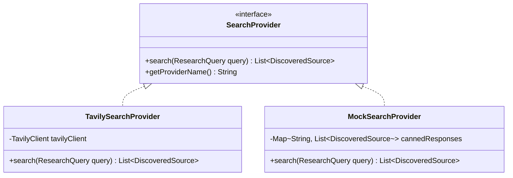
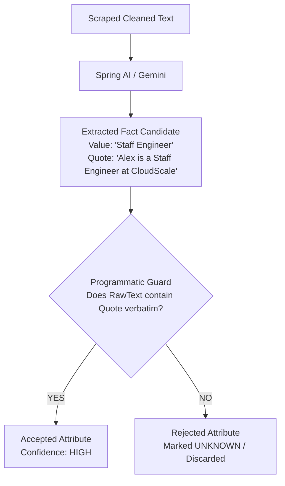

# Chapter 2: The Research & Evidence Pipeline

This guide explores how the platform autonomously discovers public web sources, extracts grounded evidence with zero hallucination, corroborates facts across independent domains, and resolves contradictory claims.

---

## 1. Provider Abstraction: Strategy & Adapter Patterns

### The SearchProvider Contract
In a production web research system, external search engines may experience outages, rate limits (HTTP 429), or require expensive API credits. The research pipeline must operate seamlessly whether running against live internet search engines or offline test environments.



### Dynamic Strategy Selection
Spring's `@ConditionalOnProperty` dynamically injects the appropriate search provider based on environment configuration:
* If `search.provider.tavily.api-key` is present, `TavilySearchProvider` is active.
* If the key is omitted or `search.provider.mock.enabled=true`, `MockSearchProvider` activates automatically, returning realistic benchmark search results.

---

## 2. Source Discovery, Canonicalization, and Primary Source Ranking

### URL Canonicalization
Raw web inputs contain tracking query strings (`utm_source`, `utm_medium`, `fbclid`, `ref`), hash anchors (`#about`), and inconsistent protocols (`http` vs `https`). Without normalization, the same web page could be fetched and analyzed multiple times.

`SourceDeduplicator` normalizes URLs before storage or fetching:
1. Strips all tracking and session parameters.
2. Alphabetically sorts remaining functional parameters.
3. Removes trailing slashes and default ports (`:80`, `:443`).
4. Generates a deterministic SHA-256 hash for database indexing.

### Multi-Factor Source Ranking
Not all web pages are equally credible. `SourceRanker` computes an authoritative priority score based on:
1. **Source Type Weight**:
   - `PRIMARY` (official domain, GitHub repository, official documentation): Weight `1.0`.
   - `SOCIAL_PROFILE` (LinkedIn, X / Twitter verified profile): Weight `0.85`.
   - `SEARCH_DISCOVERY` (news articles, tech blogs): Weight `0.60`.
   - `GENERAL_WEB` (unverified third-party scrapers): Weight `0.30`.
2. **Entity Name Match**: Boosts pages whose title or URL contains exact entity name tokens.
3. **Search Engine Relevance**: Combines provider-reported relevance scores (`0.0` to `1.0`).

---

## 3. Polite Web Scraping & Context Window Management

### Guardrails for Web Retrieval
Web scraping in production microservices requires defensive engineering against denial-of-service and memory exhaustion:
* **Strict Socket Timeouts**: Bounded connect and read timeouts (default: 5,000ms) prevent hanging TCP sockets.
* **Content Size Caps**: Maximum download buffer capped at 500KB.
* **Boilerplate Stripping**: Uses Jsoup to remove script tags, styling, SVG elements, navigation headers, footers, cookie banners, and advertisement blocks.
* **Context Truncation**: Truncates cleaned text to the first 6,000 characters before submitting to LLMs, ensuring fast processing and predictable token costs.

---

## 4. Zero-Hallucination Evidence Grounding

### The Verbatim Quote Requirement
Large Language Models frequently produce fluent, believable, yet completely fabricated claims. In enterprise data enrichment, **unverifiable data is worse than missing data**.

The platform enforces a strict architectural guarantee:
> **Every extracted attribute value MUST be accompanied by an exact verbatim quote from the source text.**



### The Programmatic Guard
In `SpringAiExtractionService`:
```java
String quote = fact.exactQuote();
if (quote != null && !quote.isBlank()) {
    // Zero-hallucination verification guard
    if (request.textContent().toLowerCase(Locale.ROOT).contains(quote.toLowerCase(Locale.ROOT).trim())) {
        facts.put(entry.getKey(), new ExtractedFact(fact.value(), quote, fact.confidence()));
    } else {
        log.warn("Hallucination detected for field '{}'! Quote was not found in source text: '{}'", 
                 entry.getKey(), quote);
    }
}
```

---

## 5. Multi-Source Corroboration & Conflict Resolution

### Agreement Confidence Boosting
When researching an entity across multiple web pages (e.g. LinkedIn, GitHub, and a company team page), facts can either reinforce or contradict each other:

| Agreement Condition | Resulting Confidence | Example |
| :--- | :--- | :--- |
| **Single Source** | `LOW` / `MEDIUM` | Only one personal blog mentions the current role. |
| **Two Independent Sources Agree** | `HIGH` | Both LinkedIn profile and company team page report "CTO". |
| **Three or More Sources Agree** | `HIGH` (Boosted) | Multiple independent news outlets verify company acquisition. |

### Handling Contradictory Claims
If Source A claims *"Software Engineer at Company X"* while Source B claims *"Product Manager at Company Y"*, the engine does not arbitrarily guess or overwrite:
1. Both facts are recorded in the attribute audit history.
2. The attribute is flagged with `conflictDetected = true`.
3. A detailed `conflictDescription` is attached for human review in the frontend evidence inspection modal.

---

For LLM prompt engineering, see [Chapter 3: Spring AI & Structured Intelligence](03-spring-ai-and-structured-intelligence.md).  
For parallel execution, see [Chapter 4: Concurrency & Real-Time Observability](04-concurrency-and-realtime-observability.md).
