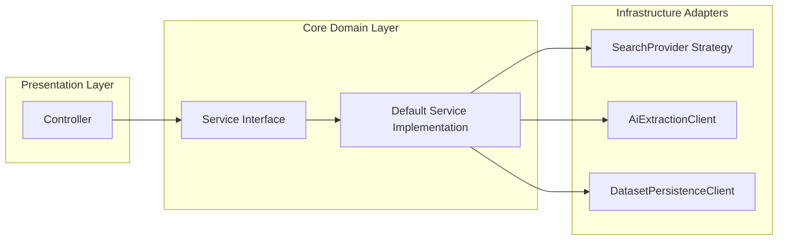

# Concept 02: Spring Dependency Injection and Service Boundaries

Clean dependency injection (DI) prevents tight coupling, simplifies unit testing, and establishes clear architectural boundaries between controllers, domain services, infrastructure clients, and persistence layers.

---

## 1. Constructor Injection vs. Field Injection

Our platform strictly enforces **constructor-based dependency injection**:

```java
// ✅ Recommended: Explicit, testable, immutable
@Service
public class DefaultResearchService implements ResearchService {

    private final ResearchDiscoveryService discoveryService;
    private final EntityNormalizer entityNormalizer;
    private final SourceProcessor sourceProcessor;

    @Autowired
    public DefaultResearchService(
            ResearchDiscoveryService discoveryService,
            EntityNormalizer entityNormalizer,
            SourceProcessor sourceProcessor
    ) {
        this.discoveryService = discoveryService;
        this.entityNormalizer = entityNormalizer;
        this.sourceProcessor = sourceProcessor;
    }
}
```

### Why Field Injection (`@Autowired private X x;`) is Prohibited:
1. **Hidden Dependencies**: Classes hide their prerequisites; callers cannot instantiate them cleanly in unit tests without Spring reflection.
2. **Mutability**: Field injection prevents dependencies from being declared `final`.
3. **Circular Dependencies**: Field injection masks circular dependencies until runtime rather than failing fast at bean initialization.

---

## 2. Thin Controllers and Thick Services

Controllers are strictly restricted to:
1. Receiving HTTP requests and validating payload constraints (`@Valid`).
2. Translating DTOs to domain target parameters.
3. Delegating to domain service interfaces (`ResearchService`, `ExtractionService`, `EntityPersistenceService`).
4. Mapping domain results to HTTP response codes (`200`, `202`, `404`).

Controllers **never** execute business validation, HTTP client calls, or database operations directly.

---

## 3. Separation of Domain and Infrastructure



- Domain services depend on **interfaces** (e.g., `SearchProvider`), not concrete implementations (e.g. `TavilySearchProvider`).
- Infrastructure details (HTTP timeouts, WebClient retries, JSON parsing) remain encapsulated within infrastructure adapters.
