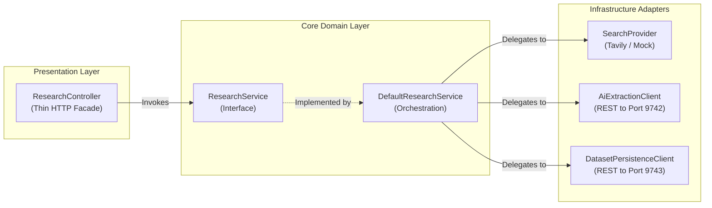

# Concept 02: Layered Architecture & Dependency Injection

Software architectures degrade when boundaries blur. When a controller queries a database directly or an AI service imports an HTTP request object, the system becomes brittle and difficult to test.

This guide explains how layered boundaries and constructor-based dependency injection are enforced across our Spring Boot microservices.

---

## 1. What Is It?

* **Layered Architecture**: Structuring a service into distinct, isolated tiers where each layer has a single concern:
  - **Controller Layer**: Handles HTTP, serialization, and status codes.
  - **Domain / Service Layer**: Contains business rules, orchestration, and validation.
  - **Infrastructure / Client Layer**: Communicates with external networks, databases, and APIs.
* **Constructor Injection**: Supplying all required dependencies through a class constructor rather than injecting them reflectively into private fields (`@Autowired private Foo foo;`).

---

## 2. Why Do We Use It Here?

`research-service` coordinates complex operations: scraping web pages, calling Google Gemini, and persisting to MySQL.

If these boundaries were mixed:
1. Writing a unit test for research logic would require spinning up a fake web server and a MySQL database.
2. Changing the database library or HTTP client would break domain business rules.
3. Hidden circular dependencies would emerge, causing Spring to crash unexpectedly during startup.

---

## 3. How Does It Work in THIS Project?



1. **Thin Controllers**: [`ResearchController`](file:///P:/Agentic%20AI/Enrichment%20Platform/data-enrichment-ai-intelligence/apps/backend/research-service/src/main/java/com/subdual/research_service/controller/ResearchController.java) contains zero business logic. It validates the inbound DTO, passes it to `ResearchService`, and returns a status code.
2. **Interface Contracts**: The controller only knows about the `ResearchService` interface, never the implementation details.
3. **Immutable Constructor Injection**: All service fields are marked `final` and passed through the constructor.

---

## 4. Relevant Architecture & Code

### A. Constructor Injection in [`DefaultResearchService.java`](file:///P:/Agentic%20AI/Enrichment%20Platform/data-enrichment-ai-intelligence/apps/backend/research-service/src/main/java/com/subdual/research_service/service/DefaultResearchService.java#L16-L31)

```java
@Service
@RequiredArgsConstructor
public class DefaultResearchService implements ResearchService {

    private final ResearchContextFactory contextFactory;
    private final ResearchPipeline researchPipeline;

    @Override
    public ResearchResponse executeResearch(ResearchRequest request) {
        ResearchContext context = contextFactory.create(request);
        return researchPipeline.execute(context);
    }
}
```

* **Why this code**: 
  - The dependencies (`contextFactory`, `researchPipeline`) are `final`. They cannot be altered after instantiation.
  - In a unit test, you can instantiate this class with two lines: `new DefaultResearchService(mockFactory, mockPipeline)`—no Spring context or reflection required.

### B. Thin Controller Delegation in [`EntityController.java`](file:///P:/Agentic%20AI/Enrichment%20Platform/data-enrichment-ai-intelligence/apps/backend/dataset-service/src/main/java/com/subdual/dataset_service/controller/EntityController.java#L22-L40)

```java
@RestController
@RequestMapping("/api/v1/entities")
@RequiredArgsConstructor
public class EntityController {

    private final EntityPersistenceService persistenceService;

    @GetMapping("/{entityId}")
    public ResponseEntity<EntityDetailResponse> getEntity(@PathVariable String entityId) {
        return persistenceService.findById(entityId)
                .map(ResponseEntity::ok)
                .orElse(ResponseEntity.notFound().build());
    }
}
```

* **Why this code**: The controller doesn't know about MySQL, JPA, or SQL tables. It only queries the persistence interface and maps the resulting `Optional` to `200 OK` or `404 Not Found`.

---

## 5. Production & Interview Lessons

1. **Why Field Injection (`@Autowired`) Is an Anti-Pattern**:
   - **Hidden Dependencies**: A class with 5 `@Autowired` private fields hides what it needs to function. You only discover what is missing when you get a `NullPointerException` at runtime.
   - **Mutability**: You cannot declare `@Autowired private final Foo foo;`. Constructor injection guarantees object immutability.
   - **Unit Testing Friction**: Testing a class with field injection requires either booting Spring, using Mockito reflection runners, or adding package-private setters.
2. **The "Thin Controller, Rich Service" Rule**:
   In backend system design interviews, never write database queries, HTTP calls, or business validation inside controllers. Controllers should only handle protocol transformation (HTTP $\leftrightarrow$ Java DTOs).

---

**Previous:** [Concept 01: HTTP REST API Design & Explicit Media Type Contracts](01-http-api-design-and-media-types.md) | **Next:** [Concept 03: Service Abstraction & Pragmatic SOLID Principles](03-service-abstraction-and-solid.md)
