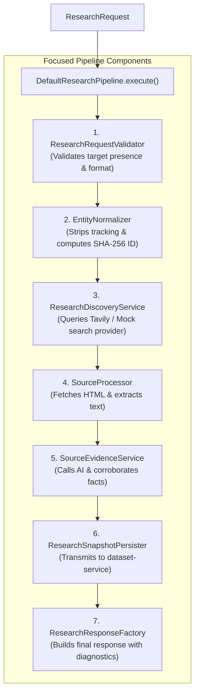

# Concept 03: Service Abstraction & Pragmatic SOLID Principles

Complex workflows tend to attract massive "God classes"—single 1,000-line services that handle validation, network calls, data parsing, and database transactions all at once.

This guide explains how we decompose the research pipeline into focused, single-responsibility components using pragmatic SOLID principles.

---

## 1. What Is It?

* **Single Responsibility Principle (SRP)**: Each class should have only one reason to change.
* **Pipeline Pattern with Context**: Breaking a multi-step workflow into discrete, sequential stages that operate on a shared context object (`ResearchContext`).
* **Dependency Inversion**: High-level orchestration depends on abstractions (interfaces), not concrete implementations.

---

## 2. Why Do We Use It Here?

Researching an entity involves at least 7 distinct steps:
1. Validating input data.
2. Canonicalizing URLs and stripping marketing tags.
3. Querying search engines for candidate pages.
4. Scraping HTML and converting it into readable text.
5. Invoking LLMs to extract facts.
6. Corroborating claims across sources to detect contradictions.
7. Persisting snapshots to MySQL.

If all 7 steps lived in a single class:
* Modifying search engine parameters would risk breaking database persistence.
* Adding unit tests for URL parsing would require mocking AI models and search providers.
* Debugging would require tracing through hundreds of lines of interleaved logic.

---

## 3. How Does It Work in THIS Project?

[`DefaultResearchPipeline`](file:///P:/Agentic%20AI/Enrichment%20Platform/data-enrichment-ai-intelligence/apps/backend/research-service/src/main/java/com/subdual/research_service/orchestration/DefaultResearchPipeline.java#L32-L114) coordinates the workflow. It does not execute the work directly; it delegates to specialized components:



---

## 4. Relevant Architecture & Code

### A. Pipeline Orchestration in [`DefaultResearchPipeline.java`](file:///P:/Agentic%20AI/Enrichment%20Platform/data-enrichment-ai-intelligence/apps/backend/research-service/src/main/java/com/subdual/research_service/orchestration/DefaultResearchPipeline.java#L45-L59)

```java
@Override
public ResearchResponse execute(ResearchContext context) {
    validate(context);
    normalize(context);

    MDC.put("entityId", context.target().entityId());
    try {
        discover(context);
        processSources(context);
        extractEvidence(context);
        persistSnapshot(context);
        return assembleResponse(context);
    } finally {
        MDC.remove("entityId");
    }
}
```

* **Why this code**:
  - The pipeline method is under 15 lines. Anyone reading the code understands the entire business flow in 10 seconds.
  - Each stage takes the [`ResearchContext`](file:///P:/Agentic%20AI/Enrichment%20Platform/data-enrichment-ai-intelligence/apps/backend/research-service/src/main/java/com/subdual/research_service/orchestration/ResearchContext.java), reads what it needs, and attaches its output for the next stage.

### B. Single Responsibility Decomposition

| Component | Single Responsibility | Why It Changes |
| :--- | :--- | :--- |
| `ResearchRequestValidator` | Validates target constraints. | When input rules change (e.g., minimum name length). |
| `DefaultEntityNormalizer` | Normalizes URLs & hashes SHA-256 IDs. | When new tracking query parameters emerge. |
| `SearchProvider` | Queries external search engines. | When swapping or adding search providers (Tavily, Bing). |
| `WebContentFetcher` | Executes HTTP requests against websites. | When adjusting timeouts, proxies, or max response sizes. |
| `EvidenceExtractor` | Merges facts & resolves conflicts. | When tuning confidence scoring thresholds. |
| `ResearchSnapshotPersister` | Dispatches snapshots to `dataset-service`. | When persistence payloads or retry logic changes. |

---

## 5. Production & Interview Lessons

1. **Context Objects Prevent Parameter Bloat**:
   Passing 10 parameters across 7 methods (`method(url, name, entityId, sources, docs, ...)`) is brittle. Wrapping stage inputs and outputs in a mutable or progressive `Context` object keeps method signatures clean and maintainable.
2. **Open/Closed in Action**:
   When you need to add a new search provider (e.g., Google Custom Search), you implement the `SearchProvider` interface and register the bean. You do **not** edit `DefaultResearchPipeline` or any existing service classes.
3. **Testability Without Integration Friction**:
   Because `EntityNormalizer` has no database or network dependencies, its unit tests run in less than 5 milliseconds without mocks.
