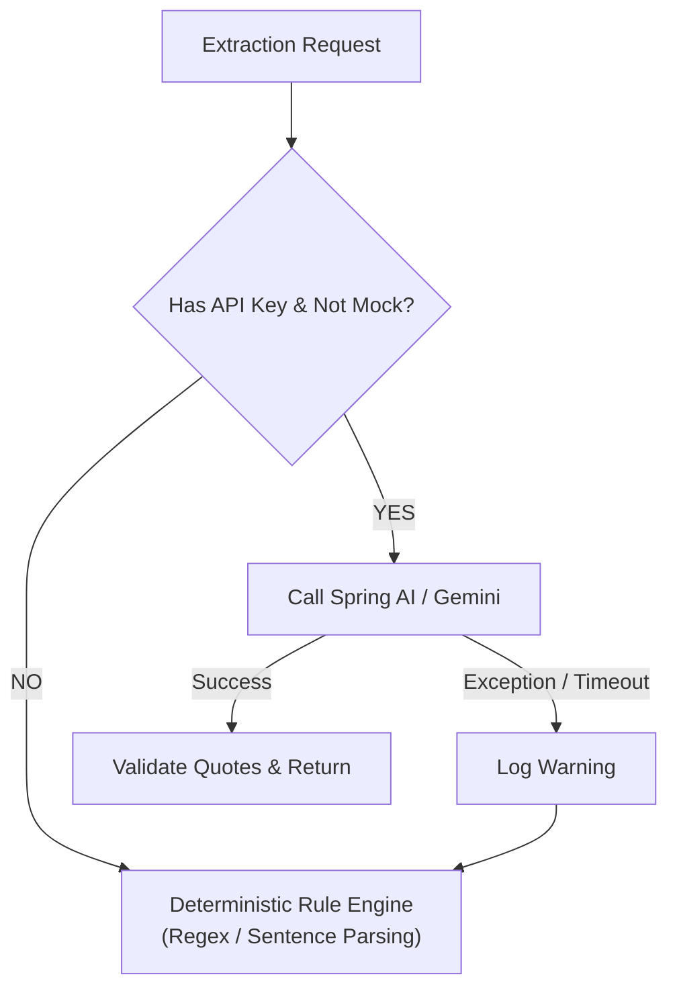

# Chapter 3: Spring AI & Structured Intelligence

This guide explores how the platform integrates **Spring AI**, formats prompt templates using **StringTemplate**, enforces structured JSON extraction, maintains a **transparent deterministic fallback engine**, and performs objective-driven profile assessments.

---

## 1. Spring AI Abstraction & Model Decoupling

### Why Spring AI?
Directly coupling application code to vendor-specific SDKs (e.g. Google Vertex AI SDK, OpenAI Python SDK) causes lock-in and impedes portability. 

**Spring AI** provides a unified portable abstraction (`ChatModel`) for conversational and generative models:
```java
@Service
@RequiredArgsConstructor
public class SpringAiExtractionService implements AiExtractionService {

    private final ChatModel chatModel;
    private final AiProperties properties;
    private final ObjectMapper objectMapper;

    // Model invocation is decoupled from vendor nuances
}
```

By programming against `ChatModel`, switching between Google Gemini (`gemini-2.5-flash`), Anthropic Claude, OpenAI GPT-4, or local Ollama instances requires changing only configuration properties without touching business logic.

---

## 2. Externalized Prompt Engineering & StringTemplate

### Separating Prompts from Java Code
Hardcoding prompt strings in Java files leads to messy string concatenation, escaping issues, and redeployment cycles for minor prompt tweaks. 

The platform stores all prompts externally in `src/main/resources/prompts/*.st` using **StringTemplate**:
* `extraction-prompt.st`: Structured fact extraction with verbatim quotes.
* `requirement-prompt.st`: Natural language requirement parsing.
* `research-profile-assessment.st`: Multi-dimensional candidate and profile scoring.

### Enforcing Strict JSON Schemas
Prompts instruct the LLM to output valid, unadorned JSON without markdown code fences (` ```json `):

```text
You are an expert entity intelligence extraction engine.
Target Entity: <entityName> (<entityType>)
Target Fields: <targetFields>

Source Text:
<textContent>

Output a valid JSON object matching this schema:
{
  "facts": {
    "<fieldName>": {
      "value": "Extracted factual value",
      "exactQuote": "Exact sentence or excerpt from the text verbatim",
      "confidenceScore": 0.95
    }
  }
}
Do NOT output markdown fences or commentary. Return only the raw JSON.
```

The service cleans stray markdown blocks if the LLM includes them before Jackson parsing:
```java
private String cleanJsonOutput(String response) {
    String clean = response.trim();
    if (clean.startsWith("```json")) {
        clean = clean.substring(7);
    } else if (clean.startsWith("```")) {
        clean = clean.substring(3);
    }
    if (clean.endsWith("```")) {
        clean = clean.substring(0, clean.length() - 3);
    }
    return clean.trim();
}
```

---

## 3. Transparent Deterministic Fallback Engine

### High-Availability AI
Third-party AI APIs can fail due to:
1. Rate limits (HTTP 429 Too Many Requests).
2. Transient 5xx internal server errors.
3. Invalid or unparseable JSON output.
4. Missing API keys in local development or CI/CD pipelines.

The platform implements a **transparent deterministic fallback**:



In `SpringAiExtractionService`:
```java
try {
    facts = extractViaSpringAi(request);
    modelUsed = properties.model();
} catch (Exception ex) {
    log.warn("Spring AI extraction failed ({}), falling back to deterministic extraction", ex.getMessage());
    facts = extractDeterministically(request);
    modelUsed = "deterministic-fallback";
}
```

The deterministic engine scans for key patterns (e.g. `"at <Company>"`, `"holds a degree from <University>"`) using regex and NLP heuristics, ensuring that the research pipeline continues uninterrupted.

---

## 4. Objective-Driven Research Profiles & Multi-Dimensional Scoring

### Moving Beyond Surface Attributes
Simple keyword extraction (e.g. name, current role) does not answer complex business questions like:
* *"Does this profile match our target senior architect requirements?"*
* *"What are their core technical strengths and missing domain proficiencies?"*

The platform introduces the **Profile Assessment Engine** (`/api/v2/ai/profile/assess`):

```json
{
  "displayName": "Linus Torvalds",
  "overallMatchScore": 0.98,
  "fitCategory": "STRONG_MATCH",
  "dimensionalScores": {
    "roleAlignment": 1.0,
    "skillOverlap": 0.96,
    "domainRelevance": 1.0
  },
  "executiveSummary": "World-leading systems architect and creator of Linux kernel and Git.",
  "highlightedStrengths": ["Kernel development", "Distributed version control", "C programming"],
  "potentialGaps": [],
  "confidenceTier": "HIGH"
}
```

This multi-dimensional assessment evaluates:
1. **Role Alignment**: Seniority, functional area, and current trajectory.
2. **Skill Overlap**: Verified proficiencies matching requirement goals.
3. **Domain Relevance**: Direct industry or technology focus.

---

For thread pool concurrency and live event streaming, see [Chapter 4: Concurrency & Real-Time Observability](04-concurrency-and-realtime-observability.md).  
For relational persistence, see [Chapter 5: Dataset Ingestion & Relational Persistence](05-dataset-ingestion-and-relational-persistence.md).
