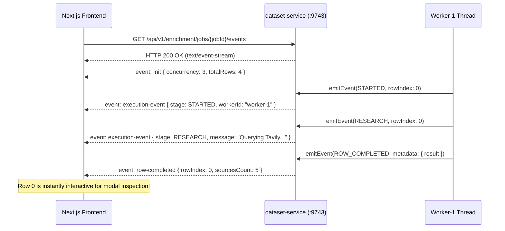

# Chapter 4: Concurrency, Bounded Execution, and Real-Time Observability

This guide explores how the platform processes tabular datasets concurrently without thread starvation, streams real-time execution events via **Server-Sent Events (SSE)**, maintains replay buffers for reconnection, and enforces distributed MDC tracing.

---

## 1. Thread Pool Architecture & Backpressure

### The Pitfalls of Unbounded Concurrency
When executing dataset enrichment jobs (e.g. 50 or 500 rows), naive implementations make one of two fatal mistakes:
1. **Sequential execution (`for` loop)**: One row at a time. Extremely slow (4 rows taking 2+ minutes).
2. **Unbounded concurrency (`new Thread()` or default `CompletableFuture.runAsync()`)**: Spawning 100 concurrent threads instantly exhausts CPU cores, saturates database connection pools, triggers web scraper HTTP 429 rate limits, and leads to `OutOfMemoryError`.

### Bounded Concurrency via `EnrichmentTaskExecutor`
The platform implements a dedicated, bounded `ThreadPoolTaskExecutor`:
```java
@Configuration
public class EnrichmentTaskExecutorConfig {

    @Bean(name = "enrichmentTaskExecutor")
    public ThreadPoolTaskExecutor enrichmentTaskExecutor(
            @Value("${enrichment.concurrency.workers:3}") int workers) {
        ThreadPoolTaskExecutor executor = new ThreadPoolTaskExecutor();
        executor.setCorePoolSize(workers);
        executor.setMaxPoolSize(workers);
        executor.setQueueCapacity(500);
        executor.setThreadNamePrefix("dataset-enrichment-worker-");
        executor.setRejectedExecutionHandler(new ThreadPoolExecutor.CallerRunsPolicy());
        executor.initialize();
        return executor;
    }
}
```

### Architectural Guarantees
* **Bounded Parallelism**: At most `N` rows (default: 3) execute simultaneously.
* **Deterministic Thread Naming**: Worker threads are named `dataset-enrichment-worker-1`, `worker-2`, `worker-3`, allowing dynamic extraction of human-readable worker IDs without hardcoding.
* **Caller-Runs Backpressure**: If the 500-capacity queue fills, `CallerRunsPolicy` forces the submitting thread to execute tasks directly, throttling submission and preventing memory leaks.

---

## 2. Real-Time Observability: Server-Sent Events (SSE)

### Why SSE Over WebSockets?
Progress updates during batch enrichment are **unidirectional** (server to client). 
* **WebSockets**: Full-duplex protocol requiring custom handshake negotiation, ping/pong heartbeats, and complex proxy routing.
* **Server-Sent Events (SSE)**: Standard HTTP/1.1 or HTTP/2 unidirectional streaming (`text/event-stream`). Native browser support via `EventSource`, automatic reconnection, and zero protocol overhead.



---

## 3. The Bounded Replay Buffer for Reconnection

### Preventing Client Blindness
If a user refreshes their browser tab mid-job, or if a network blip momentarily drops the SSE connection, standard event streams lose all past state. The newly connected client would have no knowledge of which workers are currently busy or which rows have already finished.

`DefaultDatasetEnrichmentService` maintains an in-memory **Bounded Replay Buffer**:
```java
// Thread-safe historical buffer per job
private final ConcurrentHashMap<String, List<ExecutionEvent>> jobEventHistory = new ConcurrentHashMap<>();

public SseEmitter subscribeJobEvents(String jobId) {
    SseEmitter emitter = new SseEmitter(600_000L); // 10 minute timeout
    
    // 1. Replay historical events to hydrate in-flight worker cards
    List<ExecutionEvent> history = jobEventHistory.get(jobId);
    if (history != null) {
        synchronized (history) {
            for (ExecutionEvent event : history) {
                emitter.send(SseEmitter.event()
                    .name("execution-event")
                    .data(event));
            }
        }
    }
    
    // 2. Register for live streaming
    jobEmitters.computeIfAbsent(jobId, k -> new CopyOnWriteArrayList<>()).add(emitter);
    return emitter;
}
```

The buffer is capped at the last 500 events to guarantee bounded memory consumption, and is cleared upon job completion.

---

## 4. Distributed Tracing with MDC Logging

### Correlating Asynchronous Work
In a multi-threaded microservice pipeline, logs from different rows interleave in the console:
```text
2026-09-06 14:22:58 [worker-1] INFO: Fetching URL https://github.com/torvalds
2026-09-06 14:22:59 [worker-2] INFO: Fetching URL https://linkedin.com/in/satya
```
Debugging errors across workers requires Logback **Mapped Diagnostic Context (MDC)**:
```java
try {
    MDC.put("jobId", jobId);
    MDC.put("rowIndex", String.valueOf(rowIndex));
    MDC.put("workerId", workerId);
    log.info("Starting enrichment stage RESEARCH for entity '{}'", entityName);
    // Work execution...
} finally {
    MDC.clear();
}
```
Every log statement carries `[jobId=c1125b27, rowIndex=0, workerId=worker-1]`, allowing instant log filtering across distributed services.

---

For relational storage of completed rows, see [Chapter 5: Dataset Ingestion & Relational Persistence](05-dataset-ingestion-and-relational-persistence.md).  
For real-world post-mortems and failure handling, see [Chapter 6: Production Reliability & Failure Modes](06-production-reliability-and-failure-modes.md).
