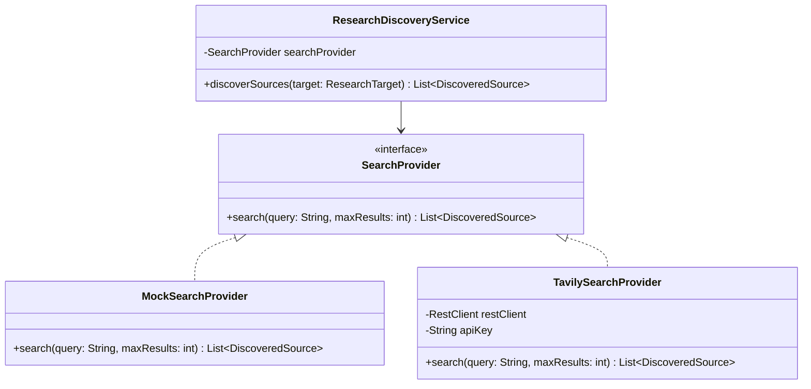

# Concept 04: Strategy and Adapter Patterns in External Integrations

Integrating third-party APIs (such as Tavily search, Gemini LLMs, or external persistence services) introduces external volatility into a system. We use the **Strategy** and **Adapter** design patterns to isolate our core business logic from these volatile boundaries.

---

## 1. Strategy Pattern for Web Discovery

The `SearchProvider` interface establishes a formal strategy for candidate source discovery:

```java
public interface SearchProvider {
    /**
     * Executes a search query and returns candidate discovered sources.
     *
     * @param query      the structured discovery query
     * @param maxResults maximum candidate sources to retrieve
     * @return list of discovered sources
     */
    List<DiscoveredSource> search(String query, int maxResults);
}
```



### Implementations:
1. **`MockSearchProvider`**:
   - Deterministic, fast, offline results without API keys or network traffic.
   - Built-in simulation hooks for testing failure (`simulate-failure`) and timeouts (`simulate-timeout`).
   - Ideal for unit testing, CI/CD pipelines, and local offline development.
2. **`TavilySearchProvider`**:
   - Production search engine integration using Spring's `RestClient`.
   - Enforces configurable connect timeouts (3000ms) and read timeouts (4000ms).
   - Maps upstream HTTP 4xx/5xx errors and timeouts into domain `ExternalServiceException`s.

---

## 2. Dynamic Bean Selection via Configuration

Spring Boot chooses the active strategy bean based on `search.discovery.provider`:

```java
@Configuration(proxyBeanMethods = false)
public class ResearchDiscoveryConfiguration {

    @Bean
    @Primary
    public SearchProvider searchProvider(ResearchDiscoveryProperties properties, RestClient.Builder restClientBuilder) {
        if ("tavily".equalsIgnoreCase(properties.provider())) {
            return new TavilySearchProvider(properties, restClientBuilder);
        }
        return new MockSearchProvider();
    }
}
```

---

## 3. Adapter Pattern for Backward Compatibility

When refactoring legacy interfaces without breaking existing clients or tests, an adapter interface maintains backwards compatibility:

```java
@Deprecated
@FunctionalInterface
public interface ResearchSourceClient extends SearchProvider {

    @Override
    default List<DiscoveredSource> search(String query, int maxResults) {
        return discoverSources(query, maxResults);
    }

    @Override
    List<DiscoveredSource> discoverSources(String query, int maxResults);
}
```
Existing consumers invoking `discoverSources(...)` continue to work without modification while the codebase migrates to the standard `search(...)` method.
