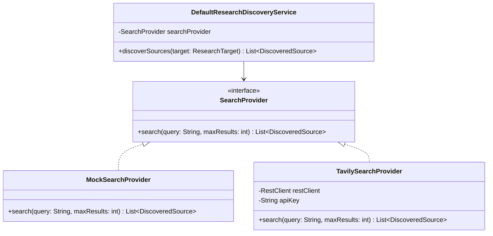

# Concept 04: Strategy & Adapter Patterns for External Integrations

Third-party APIs (such as Tavily search or Google Gemini) introduce external dependencies, billing costs, rate limits, and network latency into a system.

This guide explains how we use the **Strategy** and **Adapter** design patterns to isolate external providers, enabling seamless local offline development and zero-cost automated testing.

---

## 1. What Is It?

* **Strategy Pattern**: Defining a common interface for a capability (e.g. web search) and implementing multiple interchangeable strategies (e.g. live API vs. deterministic mock) that can be swapped without modifying business logic.
* **Adapter Pattern**: Wrapping an external library or legacy interface to match the signature expected by your application.

---

## 2. Why Do We Use It Here?

Our platform queries Tavily Search to discover public web sources for target entities.

If our services directly invoked the Tavily HTTP API:
1. Running automated unit or integration tests in CI/CD would require paid API keys and a reliable internet connection.
2. If Tavily went down or hit rate limits, developers would be blocked from running the application locally.
3. Swapping to another search engine (e.g. Bing or Google) would require rewriting the discovery service.

---

## 3. How Does It Work in THIS Project?



1. **Common Strategy Interface**: [`SearchProvider`](file:///P:/Agentic%20AI/Enrichment%20Platform/data-enrichment-ai-intelligence/apps/backend/research-service/src/main/java/com/subdual/research_service/discovery/SearchProvider.java) defines a single method: `search(query, maxResults)`.
2. **Two Strategy Implementations**:
   - `TavilySearchProvider`: Real HTTP client calling Tavily's REST API with timeouts and JSON parsing.
   - `MockSearchProvider`: Instant, offline, deterministic mock data generator.
3. **Dynamic Configuration Switch**: Spring Boot registers either the live or mock bean based on `research.discovery.provider` in `application.yaml`.

---

## 4. Relevant Architecture & Code

### A. The Strategy Interface in [`SearchProvider.java`](file:///P:/Agentic%20AI/Enrichment%20Platform/data-enrichment-ai-intelligence/apps/backend/research-service/src/main/java/com/subdual/research_service/discovery/SearchProvider.java#L10-L15)

```java
public interface SearchProvider {
    List<DiscoveredSource> search(String query, int maxResults);
}
```

### B. Dynamic Bean Injection in [`ResearchDiscoveryConfiguration.java`](file:///P:/Agentic%20AI/Enrichment%20Platform/data-enrichment-ai-intelligence/apps/backend/research-service/src/main/java/com/subdual/research_service/configuration/ResearchDiscoveryConfiguration.java#L16-L27)

```java
@Configuration(proxyBeanMethods = false)
public class ResearchDiscoveryConfiguration {

    @Bean
    @Primary
    public SearchProvider searchProvider(ResearchDiscoveryProperties properties, RestClient.Builder restClientBuilder) {
        if ("tavily".equalsIgnoreCase(properties.provider())) {
            return new TavilySearchProvider(properties, restClientBuilder);
        }
        return new MockSearchProvider();
    }
}
```

* **Why this code**: If a developer starts the project without configuring `SEARCH_PROVIDER_API_KEY`, the application automatically falls back to `MockSearchProvider`. The system boots and works out-of-the-box.

### C. Configuration Toggle in `application.yaml`

```yaml
research:
  discovery:
    provider: ${SEARCH_PROVIDER_NAME:mock} # 'tavily' for production, 'mock' for local/tests
    api-key: ${SEARCH_PROVIDER_API_KEY:}
    timeout-ms: 4000
```

---

## 5. Production & Interview Lessons

1. **Design for Offline-First Development**:
   A codebase that requires 5 third-party cloud API keys just to boot locally creates friction for onboarding and CI pipelines. Abstracting external APIs behind mockable strategies allows tests to run instantly, cheaply, and reliably.
2. **Avoid Vendor Lock-In**:
   By depending on `SearchProvider` rather than Tavily's SDK, our core domain logic remains 100% agnostic to the underlying search provider.
3. **Graceful Degraded States**:
   The same pattern is used for persistence and AI extraction (`NoOpAiExtractionClient`, `NoOpDatasetPersistenceClient`), allowing individual services to run even when dependent microservices are stopped.

---

**Previous:** [Concept 03: Service Abstraction & Pragmatic SOLID Principles](03-service-abstraction-and-solid.md) | **Next:** [Concept 05: Async Job Lifecycle, Bounded Thread Pools & Backpressure](05-async-job-lifecycle-and-thread-pooling.md)
