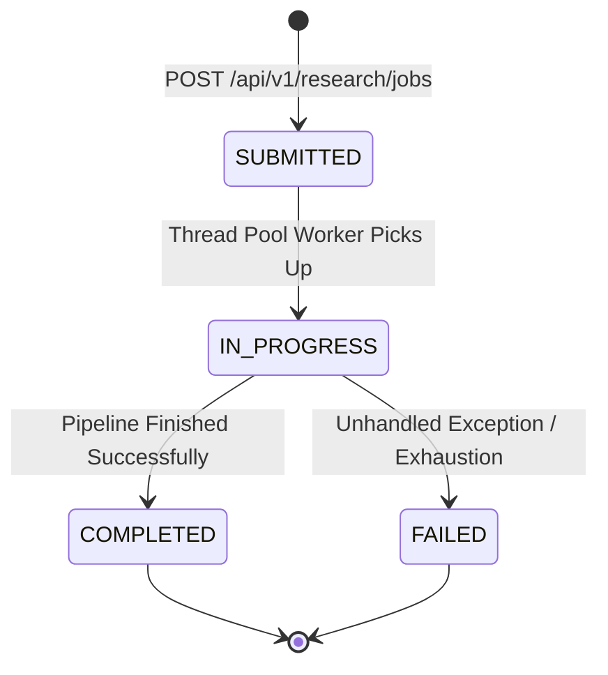

# Concept 05: Asynchronous Job Lifecycle, Thread Pooling, and Polling

Deep web discovery, page fetching, content extraction, and AI analysis can take several seconds or minutes. Blocking an inbound HTTP thread for the entire duration risks thread starvation and client timeouts. We implement an asynchronous job model with stateful tracking and bounded thread pools.

---

## 1. Async Job Lifecycle State Machine



### Job States:
1. **`SUBMITTED` (Progress: 0%)**: The job request has been validated, assigned a UUID `jobId`, stored in state, and dispatched to the worker queue. HTTP response `202 Accepted` is returned immediately.
2. **`IN_PROGRESS` (Progress: 10% - 90%)**: A worker thread from the dedicated pool begins executing normalization, discovery, and extraction.
3. **`COMPLETED` (Progress: 100%)**: Execution completed. Full `ResearchResponse` payload is attached to the job record.
4. **`FAILED`**: An unrecoverable error occurred. Error message is attached for inspection.

---

## 2. Bounded Thread Pool Configuration

Unbounded thread pools (`Executors.newCachedThreadPool()`) can crash the JVM by spawning thousands of threads during traffic spikes. Instead, we use a bounded, pre-configured `ThreadPoolExecutor`:

```java
ThreadPoolExecutor executor = new ThreadPoolExecutor(
        corePoolSize,       // e.g. 4 worker threads
        maxPoolSize,        // e.g. 8 peak threads
        keepAliveSeconds,   // 60 seconds
        TimeUnit.SECONDS,
        new LinkedBlockingQueue<>(queueCapacity), // e.g. 200 buffered tasks
        new ThreadPoolExecutor.CallerRunsPolicy() // Backpressure: caller executes if full
);
```

### Observability & Traceability via MDC
To correlate logs across threads, each background job sets Mapped Diagnostic Context (MDC):
```java
MDC.put("jobId", jobId);
try {
    // execute pipeline
} finally {
    MDC.remove("jobId");
}
```
All log entries emitted during job processing will automatically include the `jobId`.
