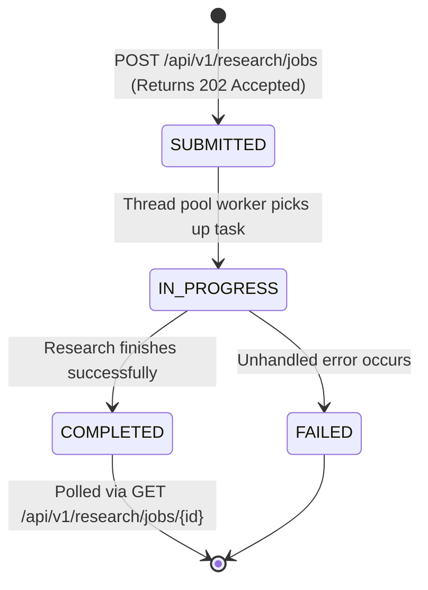

# Concept 05: Async Job Lifecycle, Bounded Thread Pools & Backpressure

Executing web scrapers and Large Language Models takes between 5 and 20 seconds per target entity. Blocking an incoming HTTP connection for that entire duration invites gateway timeouts, browser freezes, and thread starvation.

This guide explains how we implement an asynchronous, stateful background job pipeline with bounded thread concurrency and automatic backpressure.

---

## 1. What Is It?

* **Asynchronous Job Processing**: Decoupling the initiation of a long-running task from its execution. The client receives an immediate tracking identifier (`jobId`), and the task runs on a dedicated background worker thread.
* **Bounded Thread Pool**: A thread pool with fixed maximum threads and a bounded task queue, preventing uncontrolled memory consumption.
* **Backpressure**: A mechanism that slows down incoming task producers when worker consumers are saturated.

---

## 2. Why Do We Use It Here?

In `research-service`, each research task performs multiple HTTP requests:
1. Search queries to Tavily.
2. Web page scraping across up to 5 external domains.
3. Structured AI extraction via `ai-intelligent-service`.

If handled synchronously on the web server's Tomcat thread pool:
* 100 concurrent research requests would tie up 100 Tomcat threads for 15 seconds each, crashing the web server.
* If we used an unbounded thread pool (`Executors.newCachedThreadPool()`), a burst of 1,000 requests would spawn 1,000 threads, causing a JVM `OutOfMemoryError: unable to create native thread`.

---

## 3. How Does It Work in THIS Project?



1. **Submission**: [`InMemoryResearchJobService.submitJob`](file:///P:/Agentic%20AI/Enrichment%20Platform/data-enrichment-ai-intelligence/apps/backend/research-service/src/main/java/com/subdual/research_service/research/job/InMemoryResearchJobService.java#L66-L76) generates a UUID `jobId`, saves a `ResearchJob` with `status: SUBMITTED` in a thread-safe `ConcurrentHashMap`, and returns `202 Accepted` to the client.
2. **Execution**: The task is enqueued to a custom `ThreadPoolExecutor`.
3. **MDC Logging**: The worker thread sets SLF4J MDC (`jobId`) so all log lines across the pipeline are correlated to that job.
4. **Polling**: The frontend polls `GET /api/v1/research/jobs/{jobId}` every second to update its progress bar until the job reaches `COMPLETED` or `FAILED`.

---

## 4. Relevant Architecture & Code

### A. Bounded Thread Pool Configuration in [`InMemoryResearchJobService.java`](file:///P:/Agentic%20AI/Enrichment%20Platform/data-enrichment-ai-intelligence/apps/backend/research-service/src/main/java/com/subdual/research_service/research/job/InMemoryResearchJobService.java#L48-L58)

```java
// Bounded executor to prevent uncontrolled thread explosion and OutOfMemoryError
this.executor = new ThreadPoolExecutor(
        4,                                      // Core pool size: minimum active workers
        16,                                     // Maximum pool size: peak worker capacity
        60L, TimeUnit.SECONDS,                  // Idle keep-alive duration
        new LinkedBlockingQueue<>(500),         // Bounded queue: max 500 buffered tasks
        threadFactory,                          // Named daemon threads ("research-worker-X")
        new ThreadPoolExecutor.CallerRunsPolicy() // Backpressure handler
);
```

### B. Why `CallerRunsPolicy` Matters
* Default rejection policy (`AbortPolicy`) throws `RejectedExecutionException`, dropping the request.
* `CallerRunsPolicy` does something clever: **if the 500-task queue is full, the thread that called `submitJob` (the HTTP request thread) executes the research task itself**.
* This naturally throttles incoming traffic: the client's HTTP request blocks until execution finishes, preventing more requests from flooding the server.

### C. MDC Log Correlation in [`InMemoryResearchJobService.java`](file:///P:/Agentic%20AI/Enrichment%20Platform/data-enrichment-ai-intelligence/apps/backend/research-service/src/main/java/com/subdual/research_service/research/job/InMemoryResearchJobService.java#L84-L100)

```java
private void processJob(String jobId, ResearchRequest request) {
    MDC.put("jobId", jobId);
    try {
        updateJob(jobId, job -> job.withStatus(ResearchJobStatus.IN_PROGRESS, 25));
        ResearchResponse response = researchService.executeResearch(request);
        updateJob(jobId, job -> job.withCompleted(response));
    } catch (Exception ex) {
        updateJob(jobId, job -> job.withFailed(ex.getMessage()));
    } finally {
        MDC.remove("jobId"); // Always clean up thread-local context
    }
}
```

---

## 5. Production & Interview Lessons

1. **The Danger of Default Spring `@Async`**:
   Spring's default `@Async` uses `SimpleAsyncTaskExecutor`, which does not reuse threads—it creates a new thread for every task! Always provide a configured `ThreadPoolExecutor` bean.
2. **Never Use Unbounded Queues (`new LinkedBlockingQueue<>()`)**:
   `new LinkedBlockingQueue<>()` defaults to `Integer.MAX_VALUE` (2.1 billion items). Under load, the queue grows infinitely until the JVM crashes with an OOM before the pool ever spawns threads beyond `corePoolSize`.
3. **MDC Cleanup Is Mandatory**:
   Worker threads in a thread pool are reused. If you forget to call `MDC.remove("jobId")` in a `finally` block, the next task executed on that thread will inherit the previous job's ID in its logs.
