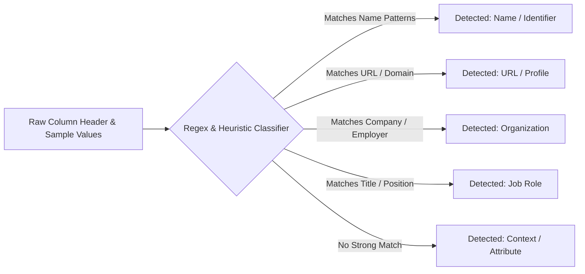

# Chapter 5: Dataset Ingestion, Schema Profiling, and Relational Persistence

This guide explores how the platform ingests heterogeneous spreadsheets without memory leaks, performs dynamic schema profiling, models entities and evidence in MySQL, executes versioned Flyway migrations, and guarantees idempotent upserts with JPA orphan removal.

---

## 1. Tabular Ingestion & In-Browser Parsing

### Client-Side Parsing via SheetJS
Uploading large multi-megabyte Excel files (`.xlsx`) or CSVs directly to backend servers creates several architectural problems:
1. **Server Heap Saturation**: Reading large binary spreadsheets with Apache POI consumes significant heap memory ($10\times$ to $50\times$ the file size).
2. **Ephemeral Disk Clutter**: Saving multipart uploads to `/tmp` requires scheduled cleanup jobs to avoid filling disk volumes.
3. **Security Vulnerabilities**: File uploads expose servers to ZIP bombs, XML Entity Expansion (XXE) attacks, and buffer exploits.

The platform delegates initial file parsing entirely to the **Next.js client using SheetJS (`xlsx`)**:
* Files are parsed directly in the user's browser thread or Web Worker.
* Only clean, validated JSON row records are transmitted to `dataset-service`.
* The server never handles binary file uploads, reducing attack surface and preserving server heap for concurrent workers.

---

## 2. Dynamic Schema Detection & Profiling

### Automated Column Classification
Uploaded datasets rarely follow a uniform naming convention. A column containing entity names might be labeled `Name`, `Full Name`, `Contact`, `Lead`, or `Person`:



The frontend inspection heuristics scan both header tokens and the first 10 rows of values:
* **URL Detection**: Validates URL schemas (`http://`, `https://`) and social domains (`linkedin.com`, `github.com`).
* **Column Confidence Scoring**: Pre-selects the highest-confidence column for entity name and entry URL, while presenting an interactive column-mapping review screen to the user.

---

## 3. Relational Data Modeling & Flyway Migrations

### Schema Design in MySQL
The persistence model enforces strict relational integrity between canonical entities, their discovered web sources, and extracted attribute facts:

```sql
-- V1__initial_schema.sql
CREATE TABLE entities (
    entity_id VARCHAR(64) PRIMARY KEY,
    entity_type VARCHAR(32) NOT NULL,
    display_name VARCHAR(255) NOT NULL,
    canonical_url VARCHAR(1024) NOT NULL,
    created_at TIMESTAMP DEFAULT CURRENT_TIMESTAMP,
    updated_at TIMESTAMP DEFAULT CURRENT_TIMESTAMP ON UPDATE CURRENT_TIMESTAMP,
    INDEX idx_entities_type (entity_type),
    INDEX idx_entities_updated (updated_at)
);

CREATE TABLE entity_sources (
    id BIGINT AUTO_INCREMENT PRIMARY KEY,
    entity_id VARCHAR(64) NOT NULL,
    url VARCHAR(1024) NOT NULL,
    title VARCHAR(512),
    snippet TEXT,
    source_type VARCHAR(32) NOT NULL,
    domain VARCHAR(255),
    provider VARCHAR(64),
    relevance DOUBLE,
    retrieved_at TIMESTAMP,
    CONSTRAINT fk_source_entity FOREIGN KEY (entity_id) REFERENCES entities(entity_id) ON DELETE CASCADE,
    INDEX idx_sources_entity (entity_id)
);

CREATE TABLE entity_attributes (
    id BIGINT AUTO_INCREMENT PRIMARY KEY,
    entity_id VARCHAR(64) NOT NULL,
    attribute_key VARCHAR(128) NOT NULL,
    attribute_value TEXT NOT NULL,
    source_url VARCHAR(1024),
    evidence_snippet TEXT,
    confidence VARCHAR(32) NOT NULL,
    CONSTRAINT fk_attribute_entity FOREIGN KEY (entity_id) REFERENCES entities(entity_id) ON DELETE CASCADE,
    INDEX idx_attributes_entity (entity_id),
    INDEX idx_attributes_key (attribute_key)
);
```

### Flyway Versioning
Database schemas are strictly versioned using **Flyway** under `src/main/resources/db/migration/`. 
* Hibernate's `ddl-auto` is set to `validate` in production, preventing dangerous runtime schema mutations.
* Migrations execute deterministically upon container startup before the Spring context accepts HTTP traffic.

---

## 4. Transactional Idempotency & JPA Orphan Removal

### The Problem of Repeated Enrichment
When a user re-enriches an entity, or when a batch job re-runs after a failure, the entity's sources and attributes must update cleanly without creating duplicate rows or orphaned historical records.

### Atomic Snapshot Replacement via `orphanRemoval`
In `EntityRecord`:
```java
@OneToMany(mappedBy = "entity", cascade = CascadeType.ALL, orphanRemoval = true)
private List<SourceRecord> sources = new ArrayList<>();

@OneToMany(mappedBy = "entity", cascade = CascadeType.ALL, orphanRemoval = true)
private List<AttributeRecord> attributes = new ArrayList<>();
```

In `DefaultDatasetEnrichmentService`:
```java
@Transactional
public EntityDetailResponse persistEntity(PersistEntityRequest request) {
    EntityRecord entity = entityRepository.findById(request.entityId())
        .orElseGet(() -> new EntityRecord(request.entityId()));

    entity.setDisplayName(request.displayName());
    entity.setCanonicalUrl(request.canonicalUrl());
    entity.setEntityType(request.entityType());

    // Clear existing collections within the transaction
    entity.getSources().clear();
    entity.getAttributes().clear();

    // Re-populate new sources and attributes
    request.sources().forEach(s -> entity.addSource(toSourceRecord(s)));
    request.attributes().forEach((k, v) -> entity.addAttribute(toAttributeRecord(k, v)));

    entityRepository.save(entity);
    return EntityDetailResponse.from(entity);
}
```

By leveraging `@Transactional` and `orphanRemoval = true`, Hibernate executes `DELETE` statements for old child rows and `INSERT` statements for new child rows within a single ACID transaction. If any database constraint fails, the transaction rolls back cleanly, leaving the previous entity state intact.

---

For real-world post-mortems and production reliability, see [Chapter 6: Production Reliability & Failure Modes](06-production-reliability-and-failure-modes.md).
