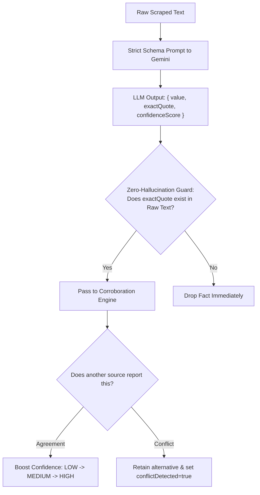

# Concept 06: Evidence-Grounded AI Extraction & Zero-Hallucination Guardrails

Large Language Models (LLMs) are notorious for "hallucinating"—confidently generating plausible-sounding facts, dates, titles, or affiliations that have zero basis in reality. In an enterprise data platform, a single hallucinated fact invalidates the integrity of the entire dataset.

This guide explains how we enforce **evidence grounding**, **verbatim quote verification**, and **multi-source corroboration** across `ai-intelligent-service` and `research-service`.

---

## 1. What Is It?

* **Evidence Grounding**: Restricting AI extraction so that every fact output by the model must be anchored to an explicit, cited passage in the retrieved text.
* **Zero-Hallucination Guard**: A programmatic filter that independently verifies whether the quote cited by the model actually exists in the source document.
* **Multi-Source Corroboration**: Comparing facts extracted from multiple independent URLs to boost confidence when sources agree and flag explicit conflicts when they disagree.

---

## 2. Why Do We Use It Here?

When scraping a personal portfolio or corporate website:
* A generic prompt ("Tell me what company John works for") might cause the model to guess or draw from its stale pre-training data.
* If a model returns `"Role: Principal Engineer"`, our consumers need proof. Who stated that? Which URL? What was the exact sentence?

---

## 3. How Does It Work in THIS Project?



---

## 4. Relevant Architecture & Code

### A. The Strict Extraction Prompt in [`SpringAiExtractionService.java`](file:///P:/Agentic%20AI/Enrichment%20Platform/data-enrichment-ai-intelligence/apps/backend/ai-intelligent-service/src/main/java/com/subdual/ai_intelligent_service/service/SpringAiExtractionService.java#L87-L108)

```java
String promptText = String.format("""
    You are a strict data extraction system. Extract verified facts about '%s' from the text below.
    
    TARGET FIELDS TO LOOK FOR: %s
    
    RULES:
    1. Extract ONLY facts explicitly and verbatim asserted in the text.
    2. DO NOT hallucinate, infer, assume, or extrapolate.
    3. If a fact is not present in the text, DO NOT return that field.
    4. For each fact, return a JSON object with:
       - "value": the extracted fact value (e.g. "Principal Engineer")
       - "exactQuote": the verbatim sentence from the text that proves this fact
       - "confidenceScore": a number between 0.0 and 1.0 representing directness of proof
    """, entityName, targetFields);
```

### B. The Zero-Hallucination Guard in [`SpringAiExtractionService.java`](file:///P:/Agentic%20AI/Enrichment%20Platform/data-enrichment-ai-intelligence/apps/backend/ai-intelligent-service/src/main/java/com/subdual/ai_intelligent_service/service/SpringAiExtractionService.java#L128-L132)

```java
// Zero-hallucination guard: quote must actually appear in the text
if (request.textContent().toLowerCase(Locale.ROOT).contains(quote.toLowerCase(Locale.ROOT).trim())) {
    facts.put(entry.getKey(), new ExtractedFact(val, quote, score));
} else {
    log.warn("Rejected hallucinated quote for key '{}': quote not found in document", entry.getKey());
}
```

* **Why this code**: Even if the prompt says "do not hallucinate", LLMs occasionally make up quotes. This programmatic substring check guarantees that no fact enters the system unless its evidence quote literally exists in the raw HTML text.

### C. Multi-Source Corroboration in [`EvidenceMerger.java`](file:///P:/Agentic%20AI/Enrichment%20Platform/data-enrichment-ai-intelligence/apps/backend/research-service/src/main/java/com/subdual/research_service/extraction/support/EvidenceMerger.java#L37-L65)

```java
if (isAgreement(existing.value(), value)) {
    // Agreement detected -> boost confidence tier
    ConfidenceTier boostedTier = switch (current) {
        case UNKNOWN, LOW -> ConfidenceTier.MEDIUM;
        case MEDIUM, HIGH -> ConfidenceTier.HIGH;
    };
    attributes.put(key, new EvidenceTuple(existing.value(), existing.sourceUrl(), combinedSnippet, boostedTier, sources, false));
} else {
    // Disagreement detected -> resolve precedence and retain competing fact in snippet
    attributes.put(key, new EvidenceTuple(chosenValue, chosenSource, conflictSnippet, resolvedTier, sources, true));
}
```

* **Why this code**: If Source A says "Role: Lead Engineer" and Source B says "Role: Lead Engineer", confidence is promoted to `HIGH`. If Source A says "Role: Engineer" and Source B says "Role: Product Manager", both alternatives are recorded and `conflictDetected` is set to `true`. This logic is encapsulated inside `EvidenceMerger` under `com.subdual.research_service.extraction.support`.

---

## 5. Production & Interview Lessons

1. **Prompts Are Not Guarantees**:
   Telling an LLM "Be accurate and do not make things up" is insufficient for enterprise software. You must pair system prompts with programmatic, deterministic post-validation guards.
2. **Explainability Over Black-Box Scores**:
   Giving a user a score of `0.95` without an explanation builds distrust. Giving them the exact verbatim sentence from the source URL makes the data instantly auditable and explainable.
3. **Graceful Fallback When Tokens Run Out**:
   If Gemini is rate-limited or fails, `ai-intelligent-service` catches the error and executes a deterministic regex parser (`extractDeterministically`). The user still gets baseline entity metadata rather than a `500 Internal Server Error`.

---

**Previous:** [Concept 05: Async Job Lifecycle, Bounded Thread Pools & Backpressure](05-async-job-lifecycle-and-thread-pooling.md) | **Next:** [Concept 07: Transactional Persistence, Flyway & Idempotent Upserts](07-transactional-persistence-and-idempotency.md)
