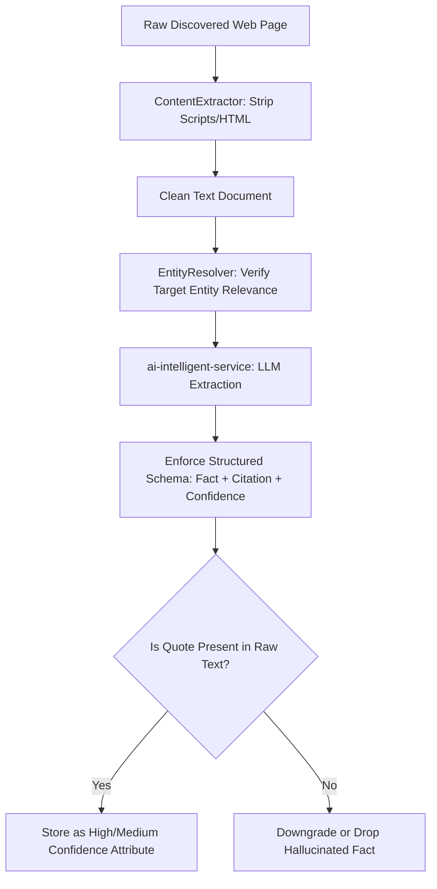

# Concept 06: Evidence-Grounded AI Fact Extraction and Provenance

In data enrichment applications, unstructured text must be converted into structured, verified facts. Hallucinated facts from generative models undermine the reliability of the entire platform. Our system enforces **evidence-grounded fact extraction** with verifiable provenance citations.

---

## 1. Grounded Extraction Architecture



---

## 2. Structured Fact Schema

Every extracted fact must satisfy the `ExtractedFact` schema:

```java
public record ExtractedFact(
        @NotBlank String attributeName,
        @NotBlank String attributeValue,
        String sourceUrl,
        String evidenceSnippet,
        String confidence
) {}
```

- **`attributeName`**: Normalized attribute key (e.g., `headquarters`, `repository`, `foundedYear`, `primaryTechnology`).
- **`attributeValue`**: The extracted fact value.
- **`sourceUrl`**: Canonical URL of the web document where the fact was discovered.
- **`evidenceSnippet`**: The exact verbatim textual snippet or quote from the source supporting the fact.
- **`confidence`**: `HIGH` (exact official citation), `MEDIUM` (reputable secondary source), or `LOW` (unverified search snippet).

---

## 3. Resilience and Fallback Behavior

Generative AI endpoints can fail due to API quotas, network glitches, or downtime. The `ai-intelligent-service` employs resilient fallback behavior:
- If Gemini API is unreachable or `GEMINI_API_KEY` is not provided, the service falls back to a deterministic rule-based heuristic extractor.
- This ensures downstream consumers and the research pipeline always receive valid, structured fact lists rather than crashing with unhandled exceptions.
