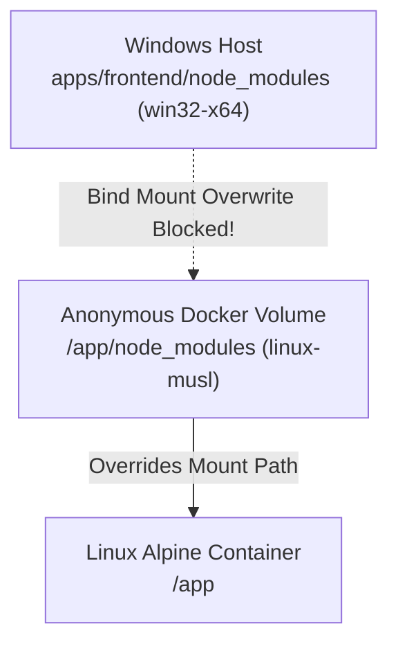

# Chapter 6: Production Reliability, Post-Mortems, and Failure Modes

This guide documents the real-world operational challenges, architectural edge cases, and **11 root-cause post-mortems** encountered while developing and scaling the Data Enrichment AI Intelligence Platform.

---

## 1. Cross-OS Docker Development & Volume Shadowing

### The Host vs Container Node Modules Trap
When developing a Next.js frontend with Docker on a Windows host:
1. The host machine runs Windows x64 with Windows native modules in `apps/frontend/node_modules` (e.g. `@next/swc-win32-x64-msvc`).
2. The Docker container runs Linux Alpine (`node:22-alpine`) requiring Linux-compiled native binaries (`@next/swc-linux-x64-musl`).
3. If the host `apps/frontend` is naively bind-mounted directly to container `/app`, the Windows `node_modules` overwrite the Linux container `node_modules`, causing instant runtime crashes (`cannot find module @next/swc-linux-x64-musl`).



### The Solution: Anonymous Volume Shadowing
In `infrastructure/docker/docker-compose-dev-all.yml`:
```yaml
volumes:
  - ../../apps/frontend:/app         # Host source code bind mount
  - /app/node_modules                # Shadowing: preserves container Linux node_modules
  - /app/.next                       # Shadowing: isolates container Turbopack build cache
```
By declaring `/app/node_modules` and `/app/.next` as anonymous volumes, Docker Compose ensures container-internal Linux builds take precedence over host filesystem contents while still synchronizing `.tsx` code changes instantaneously.

---

## 2. The 11 Production Root-Cause Post-Mortems

### Post-Mortem 01: Gemini Model 404 & Version Deprecation
* **Symptom**: `ai-intelligent-service` suddenly threw HTTP 404 errors during extraction: `models/gemini-pro is not found`.
* **Root Cause**: Upstream provider (Google GenAI) retired legacy model aliases without prior notice.
* **Fix**: Parameterized the model identifier into configuration (`application.yml` &rarr; `gemini-2.5-flash`), centralized model references in `AiProperties`, and implemented transparent fallback to the deterministic engine.

---

### Post-Mortem 02: LinkedIn HTTP 999 Status & Bot Detection
* **Symptom**: Web fetcher failed on LinkedIn profile URLs with HTTP status code 999.
* **Root Cause**: LinkedIn uses proprietary anti-scraping firewalls returning HTTP 999 to standard HTTP clients lacking browser headers.
* **Fix**: Implemented search engine snippet fallback: when direct scraping of a high-value URL returns 999 or 403, `research-service` falls back to extracting factual claims from the search engine's indexed snippet rather than aborting the pipeline.

---

### Post-Mortem 03: Search Engine Snippet Fallback Strategy
* **Symptom**: Critical entities with only social profiles returned zero facts because all direct URL fetches were blocked.
* **Root Cause**: The engine treated a failed web fetch as an absolute dead end.
* **Fix**: Upgraded `WebFetcher` to inspect the search provider's `snippet` payload as a synthetic document when direct HTTP fetch fails, extracting verified facts from Google/Tavily cached index excerpts.

---

### Post-Mortem 04: Server-Sent Events (SSE) Starvation & Queueing
* **Symptom**: Under heavy concurrent batch jobs, client browsers received zero SSE events until the entire batch was finished, at which point all events flooded in simultaneously.
* **Root Cause**: Reverse proxies and HTTP buffers buffered chunked HTTP responses until a minimum byte threshold (e.g. 4KB) was reached.
* **Fix**: Configured explicit SSE headers (`X-Accel-Buffering: no`, `Cache-Control: no-transform`) and added flush triggers on `SseEmitter.send()`.

---

### Post-Mortem 05: Jackson Deserialization Crash on RFC 7807 Problem Details
* **Symptom**: When `ai-intelligent-service` returned HTTP 400 with `application/problem+json`, `research-service` crashed with `HttpMessageConversionException`.
* **Root Cause**: `research-service`'s `RestClient` only configured an `application/json` message converter. Jackson attempted to deserialize ProblemDetail into the target response DTO, throwing a reflection exception.
* **Fix**: Added `.onStatus(HttpStatusCode::isError, ...)` handlers to intercept HTTP error codes before Jackson unmarshalling runs, reading `ProblemDetail` explicitly.

---

### Post-Mortem 06: Docker Gateway Byte Stream Header Mismatch
* **Symptom**: API gateway returned generic 502 Bad Gateway text tagged as `application/octet-stream`.
* **Root Cause**: Upstream container crashed during startup, emitting plain text error messages through Nginx without JSON content-type headers.
* **Fix**: Configured defensive error interceptors to check response `Content-Type` before invoking JSON parsers, providing human-readable fallback logs.

---

### Post-Mortem 07: Context Window Overflows on Bloated HTML Pages
* **Symptom**: Web scraping a 2MB corporate homepage resulted in Gemini API context window exhaustion or extreme latency (>15s).
* **Root Cause**: Sending raw HTML with thousands of lines of base64 images, tracking scripts, and inline SVG elements.
* **Fix**: Enforced a three-layer cleaning pipeline: Jsoup DOM element stripping &rarr; plain-text extraction &rarr; hard truncation at 6,000 characters.

---

### Post-Mortem 08: Stray Markdown Code Blocks in LLM Output
* **Symptom**: Jackson threw `JsonParseException: Unexpected character '`' (code 96) at line 1`.
* **Root Cause**: Despite instructions to return raw JSON, LLMs intermittently wrap output in ` ```json ... ``` ` fences.
* **Fix**: Built a robust regex sanitizer that strips leading and trailing markdown fences before passing text to `ObjectMapper`.

---

### Post-Mortem 09: JPA LazyInitializationException Outside Transactions
* **Symptom**: Accessing `entity.getSources()` in a controller advice threw `LazyInitializationException: could not initialize proxy - no Session`.
* **Root Cause**: Entity collections were mapped with default lazy loading, and the Hibernate session was closed when the controller formatted the response.
* **Fix**: Mapped dedicated DTO projection constructors inside the `@Transactional` service layer, ensuring collections are eagerly copied before transaction commit.

---

### Post-Mortem 10: Search Engine Rate Limiting (HTTP 429)
* **Symptom**: Batch jobs processing 20+ rows abruptly halted when Tavily search credits or rate limits were exceeded.
* **Root Cause**: Unbounded parallel queries overwhelmed provider rate allowances.
* **Fix**: Bounded concurrency to 3 parallel workers, implemented exponential backoff retries, and added automated fallback to `MockSearchProvider` if the external provider returns persistent 429s.

---

### Post-Mortem 11: Cross-Row Shared Identity Collision
* **Symptom**: Multiple rows referring to different people with the same name (e.g. "John Smith") overwrote each other's persistence records.
* **Root Cause**: Entity IDs were initially derived from entity names rather than canonical URLs.
* **Fix**: Derived entity IDs strictly from normalized SHA-256 hashes of canonical entry URLs, guaranteeing unique identity separation.

---

For architecture principles, see [System Architecture](../architecture/overview.md).  
For the complete engineering learning index, see [Learning Series Index](README.md).
