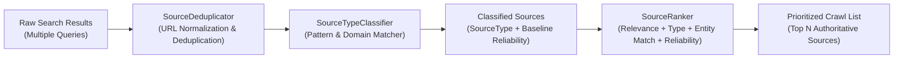

# Concept 06: Source Ranking, Deduplication & Reliability Scoring

When querying external search providers across multiple strategies, a research engine receives hundreds of raw search hits. Many URLs are duplicates (varying only by `http` vs `https`, trailing slashes, or tracking query parameters like `utm_source`), and their authoritative reliability spans a wide spectrum—from primary corporate filings and verified LinkedIn profiles down to unverified forum comments and clickbait scraper blogs.

This guide explains how V2 classifies source domains, normalizes and deduplicates URLs, and prioritizes authoritative sources using multi-factor ranking.

---

## 1. The Problem

1. **Duplicate Fetching**: A search query might return `https://example.com/team`, `http://example.com/team/`, and `https://example.com/team?ref=feed`. Fetching all three wastes HTTP calls, rate limits, and processing time.
2. **Untrusted Sources**: An unverified forum post claiming an executive works somewhere carries the same weight as their verified LinkedIn or company leadership page in naive scrapers.
3. **Noisy Result Order**: Search provider APIs often return results ordered strictly by keyword match rather than entity authority.

---

## 2. Core Architecture

The discovery pipeline processes search results through classification, normalization, deduplication, and multi-factor ranking:



---

## 3. Source Classification & Baseline Reliability

The engine maps source domains to strongly-typed categories (`SourceType`) and baseline reliability tiers (`SourceReliability`):

```java
public enum SourceReliability {
    HIGH(1.0),      // Authoritative official databases, registries, primary profiles
    MEDIUM(0.7),    // Reputable news, established blogs, secondary profiles
    LOW(0.4),       // Aggregators, forums, unverified content
    UNKNOWN(0.5);   // Unclassified web domains
}
```

### Classification Heuristics
`SourceTypeClassifier` assigns categories based on domain matching:
* **PROFESSIONAL_NETWORK** (`HIGH`): `linkedin.com`
* **CODE_REPOSITORY** (`HIGH`): `github.com`, `gitlab.com`
* **COMPANY_REGISTRY** (`HIGH`): `sec.gov`, `crunchbase.com`
* **COMPANY_OFFICIAL** (`HIGH`): Exact match with entity's known domain
* **NEWS_MEDIA** (`MEDIUM`): `techcrunch.com`, `bloomberg.com`, `reuters.com`
* **ACADEMIC** (`HIGH`): `.edu` TLDs, `scholar.google.com`
* **GENERAL_WEB** (`UNKNOWN`): Standard third-party domains

---

## 4. URL Normalization & Deduplication

`SourceDeduplicator` normalizes incoming URLs before any downstream processing:
1. Strips tracking query parameters (`utm_*`, `ref`, `fbclid`).
2. Converts scheme and host to lowercase (`HTTPS://EXAMPLE.COM` $\rightarrow$ `https://example.com`).
3. Strips URL fragments (`#section`).
4. Eliminates trailing slashes on root and directory paths.
5. Employs a `LinkedHashSet` to preserve the first occurrence order while discarding exact duplicates.

---

## 5. Multi-Factor Source Ranking

`SourceRanker` scores each candidate source using a weighted formula:

$$\text{Final Score} = (0.35 \times \text{Provider Relevance}) + (0.30 \times \text{Source Type Weight}) + (0.20 \times \text{Entity Name Match}) + (0.15 \times \text{Reliability Weight})$$

* **Provider Relevance (0.35)**: Score from the underlying search engine.
* **Source Type Weight (0.30)**: Boosts primary profiles (`PROFESSIONAL_NETWORK`, `CODE_REPOSITORY`) over aggregators.
* **Entity Match (0.20)**: Confirms the page title or snippet contains the exact entity name.
* **Reliability Weight (0.15)**: The domain's historical confidence score.

The top $N$ ranked sources are then scheduled for scraping, guaranteeing that subsequent evidence extraction operates on the highest-signal content available.
