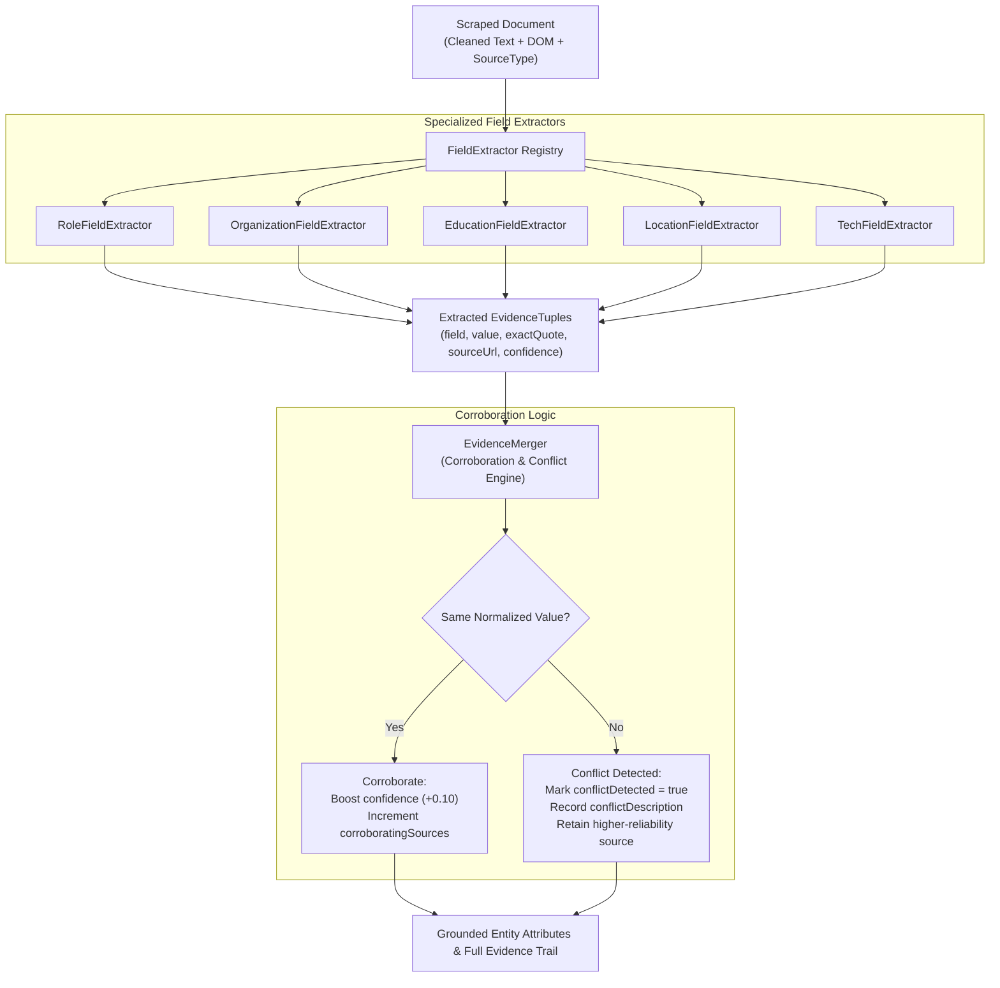

# Concept 07: Evidence Corroboration & Non-Destructive Conflict Detection

When enriching sparse entity records across multiple external sources, different websites often present contradictory information. For example, a person's personal blog might list their employer as "Startup X", while their LinkedIn profile says "TechCorp", and an older conference bio says "Acme Labs".

Naive systems simply overwrite earlier attributes with whichever source was crawled last. This destroys provenance, hides genuine career transitions, and produces erratic output.

This guide explains the architecture of **Field Extractors**, **Multi-Source Corroboration**, and **Non-Destructive Conflict Detection** in V2.

---

## 1. The Problem

1. **Last-Write-Wins Fragility**: Overwriting existing facts when a newer document contains a different value makes enrichment non-deterministic and order-dependent.
2. **Loss of Provenance**: Users cannot verify why an attribute was populated or whether it came from an official profile versus an outdated article.
3. **Ghost Conflicts**: Treating minor syntactic variations (e.g., "Google LLC" vs "Google") as conflicts creates false alerts.
4. **Monolithic Extractors**: Putting all regexes and DOM traversal logic for all fields into one giant 1000-line class violates the Single Responsibility Principle.

---

## 2. Core Architecture

The extraction pipeline decouples field extraction into cohesive, specialized extractors, and routes their findings through a corroboration and conflict-detection merger:



---

## 3. Cohesive Field Extractors

Rather than maintaining a monolithic extractor, V2 defines a pluggable `FieldExtractor` interface:

```java
public interface FieldExtractor {
    List<EvidenceTuple> extract(String text, Document document, String sourceUrl, SourceType sourceType);
    boolean supportsField(String fieldName);
    int priority();
}
```

Each extractor encapsulates domain-specific logic for its field:
* **`RoleFieldExtractor`**: Detects current executive, managerial, and engineering roles using title dictionaries and semantic boundary checks.
* **`OrganizationFieldExtractor`**: Identifies company affiliations, handling employment phrases ("works at", "founder of", "@Company").
* **`EducationFieldExtractor`**: Identifies degrees (B.S., M.S., Ph.D., MBA) and academic institutions.
* **`LocationFieldExtractor`**: Identifies cities, states, and geographic regions.
* **`TechFieldExtractor`**: Detects programming languages, frameworks, and tools.

---

## 4. Grounded Evidence Tuples

Every extracted claim is captured as an immutable `EvidenceTuple`:
```java
public record EvidenceTuple(
    String field,
    String value,
    String exactQuote,
    String sourceUrl,
    double confidence,
    boolean conflictDetected,
    String conflictDescription,
    SourceType sourceType,
    String extractionMethod
) {}
```
No fact exists without an `exactQuote`—a verbatim excerpt from the source text proving the claim.

---

## 5. Multi-Source Corroboration & Conflict Detection

When multiple sources claim facts for the same entity and attribute, `EvidenceMerger` applies non-destructive reconciliation:

### Corroboration
If source $B$ agrees with existing source $A$ (under normalized string comparison):
* The attribute is confirmed.
* Confidence is boosted (e.g., $+0.10$, capped at $1.0$).
* Both sources are preserved in the evidence log.

### Conflict Detection
If source $B$ claims "Stripe" while source $A$ claims "Google":
1. The conflict flag is enabled: `conflictDetected = true`.
2. A human-readable conflict description is appended:
   ```
   "Conflict on 'organization': Source 'https://stripe.com/team' asserted 'Stripe', while existing source 'https://google.com/about' asserted 'Google'"
   ```
3. The attribute value from the source with higher reliability or fresher timestamp is kept as the active candidate, but the alternative claim is preserved in the evidence list.
4. Confidence is adjusted downward to reflect conflicting evidence, signaling to the consumer that manual review or deeper verification is recommended.
