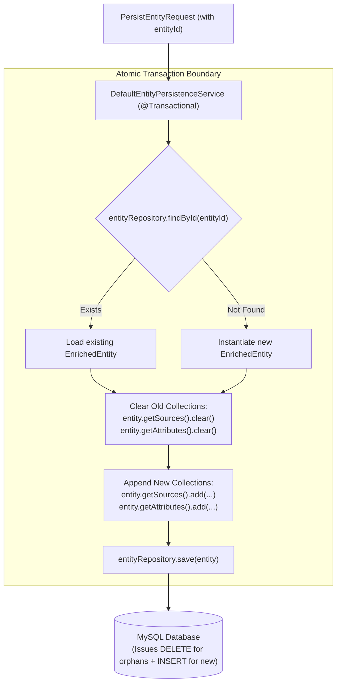

# Concept 07: Transactional Persistence, Flyway & Idempotent Upserts

In data enrichment platforms, the research pipeline runs repeatedly over the same entities as new information becomes available. If database writes are not strictly idempotent and transactional, you quickly end up with duplicate rows, orphaned child records, and corrupted schemas.

This guide explains how `dataset-service` ensures database safety, zero schema drift, and idempotent entity updates.

---

## 1. What Is It?

* **Flyway Schema Migrations**: Keeping SQL database schema definitions in versioned scripts in Git (`V1__initial_schema.sql`) rather than letting an ORM guess table structures at runtime.
* **Idempotency**: An operation that produces the exact same result whether executed once or ten times (`f(f(x)) = f(x)`).
* **Orphan Removal**: An ORM feature where removing child objects from a parent's collection automatically deletes the corresponding rows from the database.

---

## 2. Why Do We Use It Here?

`dataset-service` owns the relational schema and MySQL database.

If we relied on default Spring Data JPA behaviors:
1. Using `hibernate.ddl-auto: update` in production causes unindexed queries, silent column type mismatches, and potential data loss during deployments.
2. Re-running research for an entity would either insert duplicate rows or fail with unique constraint violations.
3. If run #1 extracted 5 sources and run #2 found 3 sources, the 2 outdated sources would linger in the database forever as "ghost" records.

---

## 3. How Does It Work in THIS Project?



---

## 4. Relevant Architecture & Code

### A. Strict Schema Evolution in `dataset-service` `application.yaml`

```yaml
spring:
  jpa:
    hibernate:
      ddl-auto: validate # Hibernate validates; it NEVER alters production tables
    open-in-view: false
  flyway:
    enabled: true
    baseline-on-migrate: true
    locations: classpath:db/migration # Applies V1__initial_schema.sql in Git
```

* **Why this code**:
  - Hibernate validates that Java entity classes match the database schema.
  - Flyway executes explicit SQL migration files in order (`V1__initial_schema.sql`).
  - We deliberately do not use `ddl-auto: update` because production schema changes must be auditable and version-controlled.

### B. The Initial Migration in `V1__initial_schema.sql`

```sql
CREATE TABLE entities (
    entity_id VARCHAR(64) PRIMARY KEY,
    display_name VARCHAR(255) NOT NULL,
    entity_type VARCHAR(50) NOT NULL,
    canonical_url VARCHAR(1024) NOT NULL,
    created_at TIMESTAMP NOT NULL,
    updated_at TIMESTAMP NOT NULL,
    INDEX idx_entities_type (entity_type),
    INDEX idx_entities_updated (updated_at)
) ENGINE=InnoDB DEFAULT CHARSET=utf8mb4;
```

### C. Deterministic Identity via Canonicalization in [`DefaultEntityNormalizer.java`](file:///P:/Agentic%20AI/Enrichment%20Platform/data-enrichment-ai-intelligence/apps/backend/research-service/src/main/java/com/subdual/research_service/normalization/DefaultEntityNormalizer.java#L101-L109)

```java
// Strips tracking tags (utm_*, gclid), standardizes port/slashes, and hashes with SHA-256
public String computeEntityId(String canonicalUrl) {
    MessageDigest digest = MessageDigest.getInstance("SHA-256");
    byte[] hash = digest.digest(canonicalUrl.getBytes(StandardCharsets.UTF_8));
    return HexFormat.of().formatHex(hash);
}
```

* **Why this code**: The entity ID is not an auto-incrementing integer (`1, 2, 3`). It is a deterministic 64-character SHA-256 hash of the canonical URL or URN. If the user researches `https://spring.io/projects/spring-boot?utm_source=twitter` today and `https://spring.io/projects/spring-boot` tomorrow, both map to the exact same `entityId`.

### D. Atomic Orphan Removal in [`DefaultEntityPersistenceService.java`](file:///P:/Agentic%20AI/Enrichment%20Platform/data-enrichment-ai-intelligence/apps/backend/dataset-service/src/main/java/com/subdual/dataset_service/service/DefaultEntityPersistenceService.java#L43-L78)

```java
@Transactional
public EntityDetailResponse persistOrUpdate(PersistEntityRequest request) {
    EnrichedEntity entity = entityRepository.findById(request.entityId())
            .orElseGet(() -> EnrichedEntity.builder().entityId(request.entityId()).build());

    entity.setDisplayName(request.displayName());
    entity.setCanonicalUrl(request.canonicalUrl());

    // 1. Clear old child collections
    entity.getSources().clear();
    entity.getAttributes().clear();

    // 2. Append fresh items
    if (request.sources() != null) {
        request.sources().forEach(s -> entity.getSources().add(mapSource(entity, s)));
    }
    if (request.attributes() != null) {
        request.attributes().forEach((k, a) -> entity.getAttributes().add(mapAttribute(entity, k, a)));
    }

    // 3. Save triggers automatic orphan deletion and new inserts
    EnrichedEntity saved = entityRepository.save(entity);
    return toDetailResponse(saved);
}
```

* **Why this code**: Because `@OneToMany(orphanRemoval = true, cascade = CascadeType.ALL)` is configured on `EnrichedEntity`, clearing the list tells Hibernate to issue `DELETE` statements for stale records and `INSERT` statements for new ones in a single atomic transaction.

---

## 5. Production & Interview Lessons

1. **Hibernate `ddl-auto: update` is for Prototypes, Flyway is for Production**:
   In engineering interviews, always specify that schema migrations are managed via version-controlled migration tools (Flyway or Liquibase), with Hibernate set to `validate`. Auto-updating schemas in production leads to silent schema corruption.
2. **Deterministic Natural Keys vs. Surrogate Auto-Increment Keys**:
   When designing distributed ingestion pipelines, deriving a deterministic primary key (like SHA-256 of canonical URL) guarantees idempotency without needing distributed locks (Redis Redlock or DB locks).
3. **The Power of `orphanRemoval = true`**:
   Without `orphanRemoval = true`, calling `clear()` and saving would leave old sources and attributes in the database with null foreign keys. With orphan removal, stale research data is automatically purged.
