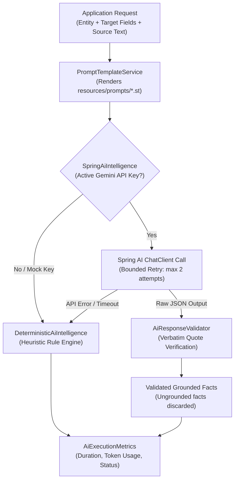

# Concept 08: Spring AI Prompt Templates, Validation & Execution Telemetry

Embedding LLM prompts as raw multi-line strings inside Java service classes leads to unmaintainable code. Prompts cannot be versioned independently, testing prompt modifications requires recompilation, model token costs and execution latencies are invisible, and LLM hallucinations bypass software validation layers.

This guide explains how V2 externalizes prompt engineering into dedicated template files, implements response validation against ground-truth source text, and tracks execution telemetry.

---

## 1. The Problem

1. **Hardcoded Prompts**: String concatenations like `"Extract the role for " + name + " from " + text` spread across classes make prompt engineering fragile and untestable.
2. **Invisible Telemetry**: Without tracking token counts, latency, retry counts, and fallback triggers, production LLM workloads become impossible to cost-optimize or debug.
3. **Catastrophic Outages**: If the remote AI API (e.g., Google Gemini, OpenAI) times out or hits a rate limit, the entire enrichment batch fails unless an automatic fallback mechanism is in place.
4. **Hallucinated Attributes**: Models often infer or fabricate details not present in the scraped text (e.g., guessing an executive's degree).

---

## 2. Core Architecture

The Spring AI layer externalizes templates, validates responses against source text, and falls back to deterministic rule engines under failure:



---

## 3. Externalized Prompt Templates (`.st`)

Prompt templates reside under `src/main/resources/prompts/` using standard StringTemplate syntax:
* `requirement-interpretation.st`: Translates unstructured user requests into structured target fields.
* `field-extraction.st`: Directs the model to extract grounded JSON facts with verbatim exact quotes.
* `input-cleansing.st`: Normalizes noisy spreadsheet inputs.

### Example: Grounded Extraction Template (`field-extraction.st`)
```text
You are a precise data extraction engine.
Given the following source text for entity "{entityName}" (type: {entityType}):

SOURCE TEXT:
{sourceText}

Extract the requested target fields: {targetFields}.

CRITICAL RULES:
1. For every extracted field, you MUST provide an "exactQuote" taken verbatim from the SOURCE TEXT.
2. If the field is not mentioned in the source text, omit it entirely.
3. Output ONLY a valid JSON object matching the requested schema.
```

`PromptTemplateService` renders these templates dynamically using classpath resource loaders.

---

## 4. Grounding Validation (`AiResponseValidator`)

To enforce a strict **zero-hallucination** policy, all facts returned by the LLM pass through programmatic validation before being accepted:

```java
public Map<String, ExtractedFact> validateExtractedFacts(
        Map<String, ExtractedFact> rawFacts,
        List<String> targetFields,
        String sourceText
) {
    // 1. Verify value is non-blank
    // 2. Verify target field was actually requested
    // 3. Verify exactQuote exists verbatim within sourceText (case-insensitive)
    // 4. If ungrounded, drop the fact to prevent hallucination
}
```

If the LLM returns an attribute whose `exactQuote` cannot be located in `sourceText`, the fact is discarded.

---

## 5. Bounded Retries & Execution Telemetry

`SpringAiIntelligence` records operational telemetry for every invocation via `AiExecutionMetrics`:

```java
public record AiExecutionMetrics(
    String provider,         // "google-gemini", "deterministic-fallback"
    String model,            // "gemini-2.5-flash"
    long durationMs,         // Execution time in milliseconds
    int promptTokens,        // Token count
    int completionTokens,    // Completion token count
    int retryCount,          // Number of retry attempts made
    String status            // "SUCCESS", "FALLBACK", "FAILED"
) {}
```

If a remote AI call fails due to network or rate limiting:
1. The engine attempts up to 2 exponential backoff retries.
2. If all retries fail, it seamlessly delegates to `DeterministicAiIntelligence`.
3. The pipeline never crashes or returns an HTTP 500 to the caller; instead, deterministic facts are returned with telemetry status set to `"FALLBACK"`.
