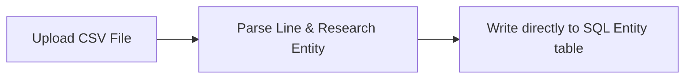
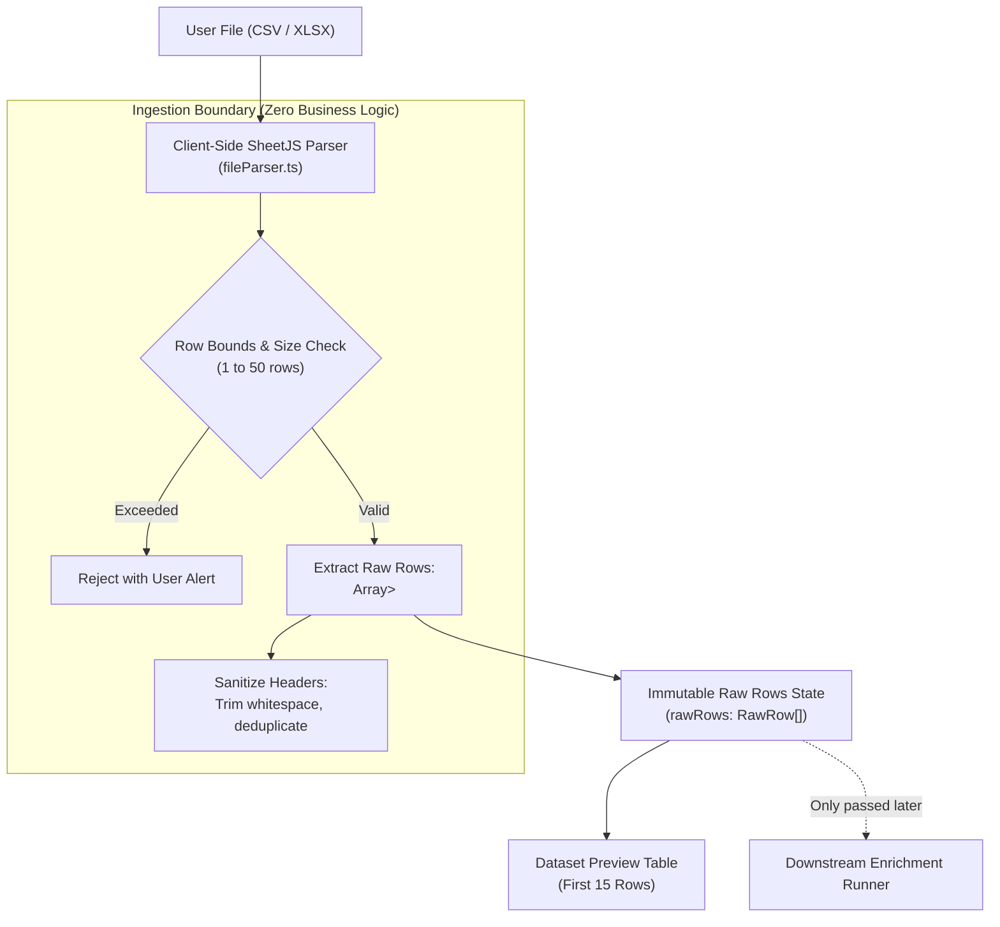

# Concept 15: Dataset Ingestion & Raw Data Boundaries

Ingesting real-world data is inherently messy. Spreadsheets contain missing cells, inconsistent headers, unexpected column types, and malformed rows. If an enrichment platform attempts to clean, normalize, or research records *during* the file ingestion phase, errors cascade, raw user data is corrupted, and debugging becomes nearly impossible.

This guide explains the architectural principle of **Ingestion Boundaries**: isolating file parsing, preserving raw user data immutably, and strictly separating dataset ingestion from downstream enrichment logic.

---

## Why This Exists

In enterprise workflows, users upload files originating from diverse CRMs, applicant trackers, and custom scrapers.
* A CSV might have 3 columns or 45 columns.
* A row might be missing an email address, have trailing commas, or include line breaks inside quotation marks.
* Users expect that their original spreadsheet columns (e.g. `Internal_Lead_ID`, `Sales_Notes`, `Upload_Batch`) will remain completely intact when the enriched dataset is exported.

If the ingestion layer immediately attempts to cast fields into strict Java entity classes or run web research, a single malformed row crashes the entire upload, and any non-standard user columns are permanently lost.

---

## Problem

A naive implementation typically conflates ingestion with processing:



This causes severe architectural failure modes:
1. **Data Loss**: Non-standard columns that do not map to the backend's known schema are silently discarded.
2. **Coupled Latency**: Parsing a 500-row file blocks on external network calls (web search, scraping, LLMs) for minutes before the user even receives confirmation that the file was parsed.
3. **No Preview or Validation**: The user cannot verify if their columns were interpreted correctly before initiating expensive API calls.
4. **All-or-Nothing Failure**: A syntax error on row 487 fails the entire file, discarding the 486 valid rows preceding it.

---

## Core Idea

The core idea is **Ingestion Decoupling and Raw Data Preservation**:

1. **Ingest As-Is (`RawDataset` / `RawRow`)**: Ingestion treats every uploaded row as an immutable key-value map (`Map<String, String>`). The parser does not validate business logic; it only validates file syntax and structural integrity.
2. **Strict Separation of Phases**:
   $$\text{File Ingestion} \not\equiv \text{Schema Profiling} \not\equiv \text{Entity Research}$$
   Ingestion is a pure I/O and parsing phase that completes in milliseconds.
3. **Additive Enrichment**: Downstream enrichment never overwrites raw user keys. It appends new, distinct attribute keys (`Enriched_<field>`), guaranteeing complete data preservation upon export.

---

## How It Works



1. **Syntax Parsing**: The file parser decodes binary Excel sheets (`.xlsx`, `.xls`) or plain text (`.csv`) into raw string matrices.
2. **Header Sanitization**: Column names are trimmed of surrounding whitespace and invisible characters. If duplicate headers exist (e.g. two columns named `Email`), they are disambiguated.
3. **Empty Row Pruning**: Rows where every single cell is blank or whitespace are pruned.
4. **Raw State Holding**: The resulting row list is stored in component state as an array of `RawRow` records, completely detached from any backend entity model.

---

## Where It Appears in This Project

### 1. Client-Side Parser in [`fileParser.ts`](file:///p:/Agentic%20AI/Enrichment%20Platform/data-enrichment-ai-intelligence/apps/frontend/lib/fileParser.ts)

The ingestion engine uses SheetJS to parse CSV and XLSX files directly in the browser before any network transmission occurs:

```typescript
export async function parseDatasetFile(file: File): Promise<ParsedDataset> {
  // 1. Guard against empty files
  if (file.size === 0) throw new Error('Selected file is empty.');

  const buffer = await file.arrayBuffer();
  const workbook = XLSX.read(buffer, { type: 'array' });
  const firstSheet = workbook.Sheets[workbook.SheetNames[0]];

  // 2. Parse as header-keyed JSON objects
  const rawData = XLSX.utils.sheet_to_json<Record<string, any>>(firstSheet, { defval: '' });
  if (rawData.length === 0) throw new Error('File contains no data rows.');

  // 3. Safety capping for prototype protection
  const cappedRows = rawData.slice(0, 50);

  // 4. Transform into clean RawRow representations
  const rows: RawRow[] = cappedRows.map((r) => {
    const cleanRow: RawRow = {};
    for (const [k, v] of Object.entries(r)) {
      cleanRow[k.trim()] = String(v ?? '').trim();
    }
    return cleanRow;
  });

  return { fileName: file.name, totalRows: rawData.length, columns: Object.keys(rows[0]), rows };
}
```

### 2. Backend Raw Row Envelope in [`RowEnrichmentResult.java`](file:///p:/Agentic%20AI/Enrichment%20Platform/data-enrichment-ai-intelligence/apps/backend/dataset-service/src/main/java/com/subdual/dataset_service/dto/RowEnrichmentResult.java)

When `dataset-service` receives a row for batch processing, the original row is preserved inside `rawRow`:

```java
public record RowEnrichmentResult(
        String rowId,
        int rowIndex,
        Map<String, String> rawRow,     // Original input preserved 100% intact
        String status,
        String displayName,
        String canonicalUrl,
        String entityType,
        Map<String, EntityAttributeDto> attributes,
        List<String> unresolvedFields,
        List<String> conflicts,
        double overallConfidence,
        List<EntitySourceDto> sources,
        String errorMessage
) {}
```

---

## Design Decisions

| Decision | Justification |
| :--- | :--- |
| **Browser-Side Ingestion Over Multipart Upload** | Parsing files in the client eliminates server-side multipart memory vulnerabilities, temporary file cleanup, and server upload bandwidth. The server only receives structured JSON payloads. |
| **Generic `Map<String, String>` Over Strongly-Typed Java Classes** | Enables the platform to ingest arbitrary spreadsheets with 5, 20, or 100 custom business columns without requiring schema migrations or DTO changes for every user layout. |
| **Preserving Empty Cells as `""` (Empty String) Over `null`** | Avoids `NullPointerException`s in JavaScript/TypeScript string functions and ensures tabular UI components render stable table cells. |

---

## Common Mistakes

1. **Modifying the Input Object During Extraction**:
   Writing `rawRow.put("Title", normalizedTitle)` destroys the user's original data. Always write derived values to a separate collection (`attributes`).
2. **Failing to Handle Malformed Delimiters**:
   Assuming all CSVs use commas `,`. Real-world CSVs from European Excel versions frequently use semicolons `;` or tabs `\t`.
3. **Throwing Unhandled Exceptions on Empty Rows**:
   Crashing the entire dataset upload because row 14 has no data. Robust ingestion skips or flags empty rows cleanly.

---

## Practical Mental Model

Think of file ingestion as an **airlock** into your system:
* The airlock's only job is to let the cargo in, inspect that the containers aren't broken, and place them on the staging floor.
* The airlock does **not** unbox the cargo, paint it, or decide what it is worth.
* If a container is damaged (malformed row), the airlock flags that specific container, leaving the remaining shipment untouched.

---

## Implementation Status

* **CURRENT IMPLEMENTATION**: Browser-side parsing via SheetJS ([`fileParser.ts`](file:///p:/Agentic%20AI/Enrichment%20Platform/data-enrichment-ai-intelligence/apps/frontend/lib/fileParser.ts)), 50-row prototype safety cap, `RawRow` map preservation throughout the batch lifecycle, non-destructive export appending `Enriched_*` columns.
* **ARCHITECTURAL DIRECTION**: Server-side streaming ingestion for datasets exceeding 1,000 rows, background file staging to S3/blob storage, and resumable file uploads.
* **FUTURE POSSIBILITY**: Multi-sheet workbook selection, automatic delimiter detection (CSV/TSV/semicolon), and character encoding detection (UTF-8 vs Latin-1).

---

## Related Concepts

* **Previous:** [Concept 14: Observability, MDC Correlation Tracing & ProblemDetail Diagnostics](14-observability-mdc-tracing-and-diagnostics.md)
* **Next:** [Concept 16: Dataset Schema Detection & Data Profiling](16-dataset-schema-detection-and-profiling.md)
