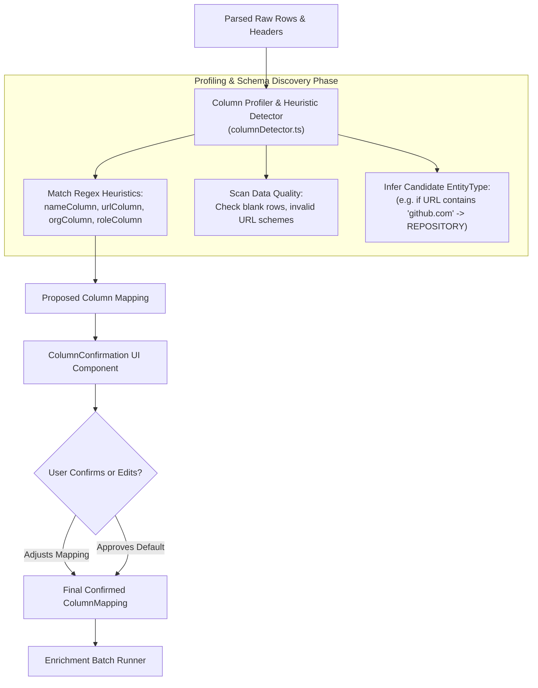

# Concept 16: Dataset Schema Detection & Data Profiling

Once raw tabular data passes the ingestion boundary, the system faces an unknown schema. An uploaded spreadsheet might name its primary contact column `Full Name`, `Contact`, `Lead`, `Person`, or `name`. Another column might contain LinkedIn URLs, company homepages, or arbitrary text.

If an enrichment system blindly guesses or requires manual column configuration for every upload, user friction skyrockets. Conversely, if it begins research without evaluating data quality, it wastes API calls researching rows with missing names or invalid URLs.

This guide explains how this platform performs **heuristic schema detection**, **data profiling**, and **quality gatekeeping** before a single enrichment call is dispatched.

---

## Why This Exists

Enrichment engines require specific **Identity Anchors** to initiate web discovery:
* A `PERSON` entity requires at least a name (e.g. "Linus Torvalds") or a profile URL (e.g. LinkedIn).
* An `ORGANIZATION` entity requires a company name (e.g. "Stripe") or a website URL (e.g. "https://stripe.com").
* A `REPOSITORY` entity requires a GitHub or GitLab repository link.

If the system does not profile the dataset beforehand:
1. It cannot identify which columns contain the required identity anchors.
2. It cannot warn the user that 40% of their rows have blank names or malformed URLs before spending money on search APIs.
3. It cannot suggest an appropriate default entity type (`PERSON` vs `ORGANIZATION` vs `REPOSITORY`).

---

## Problem

A naive implementation typically adopts one of two extremes:
* **Strict Schema Mandate**: Forcing the user to rename their columns to match an internal schema (`name`, `url`, `org`, `role`). If the user uploads a sheet with `Company_Name`, the system rejects the entire file.
* **Blind Downstream Execution**: Passing the unprofiled sheet straight to the research worker. If row 1 has `FullName: "Alice"` and row 2 has `FullName: ""`, the worker fails midway through the batch, reporting opaque errors after incurring search and scraping costs.

---

## Core Idea

The core idea is **Pre-Enrichment Schema Discovery and Profiling**:

1. **Heuristic Identity Anchor Mapping**: The engine evaluates column headers against ranked regex heuristics to detect candidate columns for `name`, `url`, `organization`, `role`, and `entityType`.
2. **Data Profiling & Quality Signals**: The engine analyzes the dataset's rows to determine:
   * Total row and column counts.
   * Sparsity / fill rate per column (e.g. `website` is 90% populated; `role` is only 20% populated).
   * Presence of valid identity anchors (verifying that at least one anchor is present per row).
3. **User Confirmation Step**: Automated heuristics suggest mappings, but the human user retains final authority to confirm or reassign columns before batch execution starts.

---

## How It Works



1. **Pattern Matching**: Headers are tested against ranked regex arrays. For example, `NAME_PATTERNS` prioritizes exact matches like `/^full_?name$/i` before falling back to substring matches like `/name/i`.
2. **Quality Gatekeeping**: In [`ColumnConfirmation.tsx`](file:///p:/Agentic%20AI/Enrichment%20Platform/data-enrichment-ai-intelligence/apps/frontend/components/enrichment/ColumnConfirmation.tsx), the form validates that at least one anchor (`nameColumn` or `urlColumn`) is mapped. If both are unmapped, the **"Start Enrichment"** button is disabled with an explanatory tooltip.
3. **EntityType Disambiguation**: The user selects or confirms the target entity type (`PERSON`, `ORGANIZATION`, `PRODUCT`, `REPOSITORY`, `WEBSITE`, `OTHER`), establishing the domain context for the research pipeline.

---

## Where It Appears in This Project

### 1. Heuristic Detector in [`columnDetector.ts`](file:///p:/Agentic%20AI/Enrichment%20Platform/data-enrichment-ai-intelligence/apps/frontend/lib/columnDetector.ts)

```typescript
const NAME_PATTERNS = [
  /^(full_?name|name|person_?name|contact|employee)$/i,
  /name/i,
];

const URL_PATTERNS = [
  /^(url|website|link|profile_?url|linkedin|linkedin_?url|github_?url|repo_?url)$/i,
  /url|link|profile/i,
];

const ORG_PATTERNS = [
  /^(company|organization|org|company_?name|employer)$/i,
  /company|org/i,
];

const ROLE_PATTERNS = [
  /^(role|title|job_?title|position|designation)$/i,
  /role|title|position/i,
];

export function detectColumns(headers: string[]): ColumnMapping {
  return {
    nameColumn: findBestMatch(headers, NAME_PATTERNS),
    urlColumn: findBestMatch(headers, URL_PATTERNS),
    organizationColumn: findBestMatch(headers, ORG_PATTERNS),
    roleColumn: findBestMatch(headers, ROLE_PATTERNS),
    entityTypeColumn: findBestMatch(headers, ENTITY_TYPE_PATTERNS),
  };
}
```

### 2. Backend Extraction of Mapped Anchors in [`DefaultDatasetEnrichmentService.java`](file:///p:/Agentic%20AI/Enrichment%20Platform/data-enrichment-ai-intelligence/apps/backend/dataset-service/src/main/java/com/subdual/dataset_service/service/DefaultDatasetEnrichmentService.java#L185-L208)

During batch row execution, the service safely extracts mapped values while verifying identity presence:

```java
private RowEnrichmentResult processSingleRow(
        String rowId, int rowIndex, Map<String, String> rawRow,
        Map<String, String> mapping, String defaultEntityType,
        String requirement, List<String> targetFields) {

    String name = extractMappedValue(rawRow, mapping, "nameColumn");
    String url = extractMappedValue(rawRow, mapping, "urlColumn");
    String org = extractMappedValue(rawRow, mapping, "organizationColumn");
    String role = extractMappedValue(rawRow, mapping, "roleColumn");

    // Quality gate: require at least one valid identifier
    if ((name == null || name.isBlank()) && (url == null || url.isBlank())) {
        return new RowEnrichmentResult(
                rowId, rowIndex, rawRow, "FAILED",
                "Missing Identifier", "", defaultEntityType,
                Map.of(), targetFields, List.of(), 0.0, List.of(),
                "Row missing required name or url identifier"
        );
    }
    // ... proceed to research ...
}
```

---

## Design Decisions

| Decision | Justification |
| :--- | :--- |
| **Separating Heuristic Detection from Confirmation** | Automatic heuristics are often 90% accurate, but false positives happen (e.g. mapping `User_Name` to entity name instead of login handle). A lightweight confirmation step prevents costly misdirected research. |
| **Column-Level Heuristics Over Cell-by-Cell Type Sniffing** | Examining column header names is fast ($O(C)$ where $C$ is column count) and avoids inspecting thousands of cells during initial upload. |
| **Preserving Unmapped Columns as Metadata** | Columns not mapped to identity anchors (e.g. `Budget`, `Notes`) are not dropped; they are preserved in `rawRow` and carried through to the final export. |

---

## Common Mistakes

1. **Greedy Substring Matching on Headers**:
   Using `header.includes("name")` matches `File_Name`, `Domain_Name`, and `Company_Name` as the entity's personal name. Always use prioritized exact regexes before substring matching.
2. **Assuming Identity Exists in Every Row**:
   Assuming that because `nameColumn` was mapped, every single row contains a non-blank name. Individual rows frequently have missing cells; the pipeline must validate anchors per row.
3. **Hardcoding Column Mappings into the Backend**:
   Expecting the frontend to send fixed keys (`name`, `url`) forces the frontend to rename columns. Passing a dynamic `columnMapping` dictionary preserves original names.

---

## Practical Mental Model

Think of schema detection and profiling as **medical triage**:
* Triage checks vital signs (name, URL, row count) before admitting the patient to surgery (web research and LLM synthesis).
* If a patient has missing vitals (no name and no URL), triage flags them immediately rather than sending them into an expensive operating room.

---

## Implementation Status

* **CURRENT IMPLEMENTATION**: Client-side regex heuristic detector ([`columnDetector.ts`](file:///p:/Agentic%20AI/Enrichment%20Platform/data-enrichment-ai-intelligence/apps/frontend/lib/columnDetector.ts)), user confirmation UI ([`ColumnConfirmation.tsx`](file:///p:/Agentic%20AI/Enrichment%20Platform/data-enrichment-ai-intelligence/apps/frontend/components/enrichment/ColumnConfirmation.tsx)), backend per-row anchor validation.
* **ARCHITECTURAL DIRECTION**: Comprehensive statistical profiling report (displaying null percentages, cardinality, and data distribution per column).
* **FUTURE POSSIBILITY**: Machine-learning based column classification and semantic type inference using localized embeddings or lightweight LLM profiling.

---

## Related Concepts

* **Previous:** [Concept 15: Dataset Ingestion & Raw Data Boundaries](15-dataset-ingestion-and-raw-data-boundaries.md)
* **Next:** [Concept 17: User-Directed Enrichment & Adaptive Research](17-user-directed-enrichment-and-adaptive-research.md)
