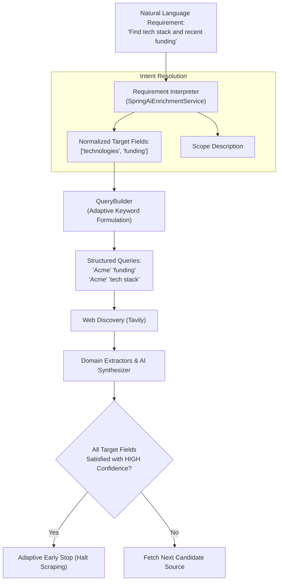

# Concept 17: User-Directed Enrichment & Adaptive Research

Traditional data enrichment tools operate on static, hardcoded schemas. If you enrich a company, you get `revenue` and `headcount`; if you enrich a person, you get `title` and `company`. But real-world users have custom, nuanced research goals:
* A venture capital associate wants: *"Find latest funding round, lead investors, and key engineering hires."*
* A sales representative wants: *"Find CRM tools currently used and whether they are hiring for DevOps."*
* A recruiter wants: *"Find open-source repository contributions and university degree."*

This guide explains how this platform implements **User-Directed Enrichment**: translating natural-language user intent into structured field targets, dynamically steering search queries, and adaptively researching missing fields.

---

## Why This Exists

If a platform only supports static schemas:
1. It gathers irrelevant data that users never requested, inflating token and scraping bills.
2. It fails to discover the specific niche facts users actually need.
3. Adding support for a new data point requires changing database columns and Java extraction regexes across the codebase.

By treating user requirements as **dynamic runtime data**, the exact same enrichment engine powers sales research, venture analysis, and talent sourcing without code modifications.

---

## Problem

A naive implementation typically has two major failure modes:
* **The "Dump Prompt to LLM" Trap**: Passing the raw user prompt directly into web search queries (e.g. searching Google for `"Find latest funding round, lead investors, and key engineering hires for Acme Corp"`). Search engines fail on long conversational sentences, returning irrelevant SEO blog posts.
* **Rigid All-or-Nothing Schemas**: If the user leaves the requirement blank, the system has no concept of what to enrich and either returns an empty record or fails with a validation error.

---

## Core Idea

The core idea is **Decoupling User Intent from Execution Strategy**:



1. **Natural Language Normalization**: Freeform user text is parsed into typed, canonical camelCase identifiers (e.g. `techStack` $\rightarrow$ `technologies`, `who invested` $\rightarrow$ `funding`).
2. **Adaptive Query Formulation**: Search queries are augmented dynamically using both entity identity anchors and target field keywords.
3. **Adaptive Early Stopping**: The web discovery loop monitors field coverage. When all user-requested fields are corroborated with `HIGH` confidence, discovery halts immediately, saving latency and token costs.
4. **Authoritative Default Fallback**: If the user provides no requirement, the system automatically assigns authoritative domain defaults based on the entity type (`PERSON`, `ORGANIZATION`, `REPOSITORY`).

---

## How It Works

### 1. Dual-Path Intent Resolution

When a job begins, [`SpringAiEnrichmentService.java`](file:///p:/Agentic%20AI/Enrichment%20Platform/data-enrichment-ai-intelligence/apps/backend/ai-intelligent-service/src/main/java/com/subdual/ai_intelligent_service/service/SpringAiEnrichmentService.java#L49-L68) evaluates the user requirement:

* **Case A: Custom Requirement Provided**:
  The system uses Spring AI to parse the natural language requirement via `REQUIREMENT_INTERPRETATION_PROMPT` in [`PromptTemplates.java`](file:///p:/Agentic%20AI/Enrichment%20Platform/data-enrichment-ai-intelligence/apps/backend/ai-intelligent-service/src/main/java/com/subdual/ai_intelligent_service/prompt/PromptTemplates.java#L7-L29):
  ```json
  {
    "requestedFields": ["currentOrganization", "currentRole", "skills"],
    "scopeDescription": "Targeting employment and technical competencies"
  }
  ```
* **Case B: No Requirement (Blank/Omitted)**:
  The system invokes `buildDefaultScope(entityType)`:
  * `PERSON` $\rightarrow$ `["currentOrganization", "currentRole", "education", "skills", "location"]`
  * `ORGANIZATION` $\rightarrow$ `["description", "industry", "headquarters", "products", "employeeCount"]`
  * `PRODUCT` $\rightarrow$ `["description", "vendor", "features", "pricing", "license"]`
  * `REPOSITORY` $\rightarrow$ `["description", "owner", "license", "language", "stars"]`

### 2. Adaptive Search Query Formulation in [`QueryBuilder.java`](file:///p:/Agentic%20AI/Enrichment%20Platform/data-enrichment-ai-intelligence/apps/backend/research-service/src/main/java/com/subdual/research_service/discovery/QueryBuilder.java)

The engine builds targeted queries combining the entity's identity anchors with target field keywords:

```java
public List<String> buildQueries(ResearchTarget target, List<String> targetFields, String userRequirement) {
    List<String> queries = new ArrayList<>();
    String baseIdentity = "\"" + target.displayName() + "\"";

    // 1. Primary identity query
    if (target.canonicalUrl() != null && !target.canonicalUrl().isBlank()) {
        queries.add(baseIdentity + " " + extractDomain(target.canonicalUrl()));
    } else {
        queries.add(baseIdentity);
    }

    // 2. Targeted field queries if requested
    if (targetFields != null && !targetFields.isEmpty()) {
        for (String field : targetFields) {
            queries.add(baseIdentity + " " + field);
        }
    }

    return queries;
}
```

---

## Where It Appears in This Project

### 1. Frontend Requirement Chips & Input in [`ColumnConfirmation.tsx`](file:///p:/Agentic%20AI/Enrichment%20Platform/data-enrichment-ai-intelligence/apps/frontend/components/enrichment/ColumnConfirmation.tsx)

The user can type a custom requirement or click pre-built suggestion chips:
* *"Find current company, job title, and location"*
* *"Find tech stack, skills, and university"*
* *"Find company headquarters and founded year"*

### 2. Adaptive Early Stopping in [`ResearchOrchestrator.java`](file:///p:/Agentic%20AI/Enrichment%20Platform/data-enrichment-ai-intelligence/apps/backend/research-service/src/main/java/com/subdual/research_service/research/ResearchOrchestrator.java)

During web evidence collection, the pipeline checks whether all user target fields are covered:

```java
if (requestedFields != null && !requestedFields.isEmpty()) {
    boolean allCovered = requestedFields.stream().allMatch(field -> {
        EvidenceTuple tuple = attributes.get(field);
        return tuple != null && tuple.confidence() == ConfidenceTier.HIGH;
    });

    if (allCovered) {
        log.info("[Pipeline: ADAPTIVE_STOP] All requested target fields covered. Stopping early.");
        break; // Cease further HTTP scraping
    }
}
```

---

## Design Decisions

| Decision | Justification |
| :--- | :--- |
| **Separating Intent Interpretation from Extraction** | Interpreting requirements once at the start of a batch creates a clear target specification. Passing the unparsed English sentence to every web scraper introduces inconsistency. |
| **Early Stopping on High Confidence** | Scraping external web pages is the slowest stage in the pipeline (1–3 seconds per URL). Halting once all fields are verified cuts batch latency by up to 75%. |
| **Explicit Unresolved Field Auditing** | If a requested field cannot be found, the system explicitly returns it in `unresolvedFields` instead of omitting it, providing complete transparency to the user. |

---

## Common Mistakes

1. **Permitting Arbitrary Hallucination for Missing Fields**:
   When a user asks for `funding` and no web source mentions funding, an LLM often hallucinates a plausible venture round. Anti-hallucination rules must mandate placing the field into `unresolvedFields`.
2. **Ignoring Entity Type Context During Interpretation**:
   Interpreting `"Find owner"` for a person makes no sense; interpreting it for a `REPOSITORY` maps to GitHub organization/author. Always pass `entityType` into requirement interpretation.
3. **Re-Interpreting Identical Prompts for Every Row**:
   In a 100-row batch, calling the LLM 100 times to interpret the same string `"Find role and company"` wastes money. Interpret once at the job level, then pass the resolved `targetFields` to each row.

---

## Practical Mental Model

Think of user-directed enrichment as a **bespoke research brief**:
* A research analyst does not read the entire library.
* Given a brief with specific questions, the analyst searches index cards for those exact terms, stops reading as soon as the answers are verified, and explicitly notes which questions could not be answered.

---

## Implementation Status

* **CURRENT IMPLEMENTATION**: Natural language requirement interpretation via Spring AI or deterministic keywords ([`SpringAiEnrichmentService.java`](file:///p:/Agentic%20AI/Enrichment%20Platform/data-enrichment-ai-intelligence/apps/backend/ai-intelligent-service/src/main/java/com/subdual/ai_intelligent_service/service/SpringAiEnrichmentService.java)), entity-type default scopes, adaptive early stopping in `ResearchOrchestrator`.
* **ARCHITECTURAL DIRECTION**: Reusable enrichment profiles stored in MySQL, allowing users to save and reuse complex requirement templates.
* **FUTURE POSSIBILITY**: Multi-query iterative search expansion (generating new search queries dynamically based on clues found in initial sources).

---

## Related Concepts

* **Previous:** [Concept 16: Dataset Schema Detection & Data Profiling](16-dataset-schema-detection-and-profiling.md)
* **Next:** [Concept 18: Dataset Enrichment Orchestration](18-dataset-enrichment-orchestration.md)
