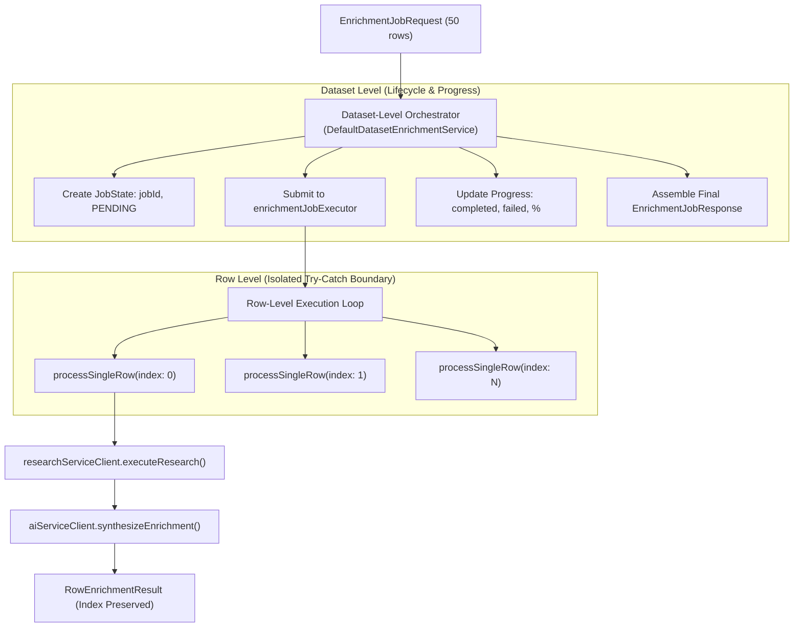

# Concept 18: Dataset Enrichment Orchestration

Enriching a dataset is fundamentally an **orchestration problem**. A dataset contains dozens or hundreds of rows. Each row must be evaluated, researched, corroborated, and synthesized independently.

If orchestration logic is mixed with scraping code, database entities, or LLM prompt formatting, the entire pipeline becomes fragile. A failure on row 12 crashes rows 13 through 50; progress cannot be tracked; and provider details leak into business controllers.

This guide explains the architectural separation between **Dataset-Level Orchestration** and **Row-Level Execution**, focusing on lifecycle management, row-level error isolation, and deterministic output structure.

---

## Why This Exists

In a batch enrichment workflow:
* The user needs immediate non-blocking job creation (`202 Accepted` with a `jobId`).
* The UI needs live, reactive progress updates (`completedRows`, `failedRows`, `progress` percentage).
* Individual rows face network timeouts, anti-bot scraping blocks, or missing entity anchors.
* The system must ensure that a failure on one row is strictly isolated—marked as `FAILED` or `PARTIAL` with diagnostic reasons—while the remaining batch proceeds unhindered.

---

## Problem

A naive implementation typically suffers from:
* **Cascading Batch Failure**: Wrapping the entire batch loop in a single `try-catch` block. If row 37 encounters an unexpected JSON parsing error or network reset, the loop terminates, discarding rows 38 to 100.
* **Leaking Extraction Details into the Orchestrator**: The batch coordinator directly parses HTML tags, constructs Tavily HTTP headers, or formats Gemini prompt strings. Changing an HTML selector forces changes in the batch job manager.
* **Loss of Row Provenance**: Returning an output array where row indices no longer match the input rows, making it impossible to align enriched results back to the user's original spreadsheet.

---

## Core Idea

The core idea is **Two-Tier Hierarchical Orchestration with Fault Isolation**:



1. **Dataset-Level Responsibilities**:
   * Creates tracking identifier (`jobId`) and initializes `JobState`.
   * Manages lifecycle transitions: `PENDING` $\rightarrow$ `PROCESSING` $\rightarrow$ `COMPLETED` (or `FAILED`).
   * Tracks batch progress counters: `totalRows`, `completedRows`, `failedRows`, `progress` (0–100%).
2. **Row-Level Responsibilities**:
   * Extracts identity anchors from the row using the confirmed column mapping.
   * Dispatches independent requests to `research-service` and `ai-intelligent-service`.
   * Isolates exceptions: a failure on an individual row generates a `RowEnrichmentResult` with status `FAILED` and an `errorMessage`, allowing the loop to continue.
   * Preserves exact row index (`rowIndex`) so results perfectly correlate with the input spreadsheet.

---

## How It Works

### 1. The Isolated Row Processing Loop in [`DefaultDatasetEnrichmentService.java`](file:///p:/Agentic%20AI/Enrichment%20Platform/data-enrichment-ai-intelligence/apps/backend/dataset-service/src/main/java/com/subdual/dataset_service/service/DefaultDatasetEnrichmentService.java#L118-L161)

```java
List<Map<String, String>> rows = request.rows() != null ? request.rows() : List.of();
for (int i = 0; i < rows.size(); i++) {
    Map<String, String> row = rows.get(i);
    String rowId = state.jobId + "-row-" + i;

    try {
        // Individual row processing isolated in try-catch
        RowEnrichmentResult result = processSingleRow(
                rowId, i, row, request.columnMapping(),
                request.defaultEntityType(), request.userRequirement(), targetFields
        );
        state.rowResults.add(result);

        if ("FAILED".equalsIgnoreCase(result.status())) {
            state.failedRows++;
        } else {
            state.completedRows++;
        }
    } catch (Exception ex) {
        // Strict fault isolation: record row failure, do NOT abort batch
        log.error("Failed enriching row {} in job {}: {}", i, state.jobId, ex.getMessage());
        state.failedRows++;
        state.rowResults.add(new RowEnrichmentResult(
                rowId, i, row, "FAILED", "Unknown", "",
                request.defaultEntityType(), Map.of(), targetFields,
                List.of(), 0.0, List.of(), ex.getMessage()
        ));
    }

    // Reactive progress calculation
    state.progress = (int) Math.round(((double) (i + 1) / Math.max(1, state.totalRows)) * 100);
}
```

### 2. The Deterministic Row Output Envelope

Every row, whether successful, partial, or failed, produces a standardized [`RowEnrichmentResult`](file:///p:/Agentic%20AI/Enrichment%20Platform/data-enrichment-ai-intelligence/apps/backend/dataset-service/src/main/java/com/subdual/dataset_service/dto/RowEnrichmentResult.java):
* `rowId`: Unique identifier (`{jobId}-row-{index}`).
* `rowIndex`: Zero-based integer index corresponding to the original file row.
* `rawRow`: The unaltered user-uploaded key-value map.
* `status`: Deterministic enum string (`COMPLETED`, `PARTIAL`, `FAILED`).
* `attributes`: Map of verified extracted facts with confidence scores and evidence quotes.
* `unresolvedFields`: Explicit list of target fields that could not be verified.
* `conflicts`: Disagreements discovered across sources.
* `sources`: URLs, relevance scores, and domains discovered.
* `errorMessage`: Diagnostic error string if failed, else `null`.

---

## Where It Appears in This Project

* **Batch Job Controller**: [`EnrichmentJobController.java`](file:///p:/Agentic%20AI/Enrichment%20Platform/data-enrichment-ai-intelligence/apps/backend/dataset-service/src/main/java/com/subdual/dataset_service/controller/EnrichmentJobController.java) exposes `POST /api/v1/enrichment/jobs` (submits batch) and `GET /api/v1/enrichment/jobs/{jobId}` (polls status).
* **Batch Orchestrator**: [`DefaultDatasetEnrichmentService.java`](file:///p:/Agentic%20AI/Enrichment%20Platform/data-enrichment-ai-intelligence/apps/backend/dataset-service/src/main/java/com/subdual/dataset_service/service/DefaultDatasetEnrichmentService.java) coordinates execution across bounded executor threads.
* **Frontend Reactive Polling**: [`page.tsx`](file:///p:/Agentic%20AI/Enrichment%20Platform/data-enrichment-ai-intelligence/apps/frontend/app/page.tsx) polls job status every 1.5 seconds, updating the progress bar and streaming completed rows into the UI table.

---

## Design Decisions

| Decision | Justification |
| :--- | :--- |
| **Row-Level Error Isolation** | If 1 row out of 50 fails due to an anti-bot block on a specific website, the user still receives 49 fully enriched rows. Failing the entire batch is unacceptable for enterprise users. |
| **Index-Preserving Output Structure** | Preserving `rowIndex` guarantees that the exported dataset aligns 1-to-1 with the user's input spreadsheet, even if some rows completed out of order. |
| **Separation from Provider Logic** | `DefaultDatasetEnrichmentService` never makes HTTP calls to Tavily or Google Gemini directly. It delegates to `researchServiceClient` and `aiServiceClient`, maintaining pure orchestration responsibilities. |

---

## Common Mistakes

1. **Letting a Single Checked Exception Bubble Out**:
   Throwing a runtime exception out of the row processing method aborts the `ExecutorService` task, leaving the batch job stuck in `PROCESSING` forever. Always catch exceptions at the row boundary.
2. **Mutating Shared State Across Threads**:
   If rows are processed concurrently, appending to a non-thread-safe `ArrayList` causes race conditions and lost data. Use `Collections.synchronizedList(...)` or concurrent structures.
3. **Omitting the Original Raw Row in the Result**:
   Returning only the enriched fields forces the client to manually re-join original input columns with enriched results. Carrying `rawRow` alongside enriched attributes makes the result self-contained.

---

## Practical Mental Model

Think of the dataset orchestrator as a **factory foreman**:
* The foreman receives a crate of 50 parts (the dataset).
* The foreman hands each part to a specialist workstation (row execution) with specific instructions.
* If one part is cracked (missing name/URL), the workstation tags it with a red defect tag (status: `FAILED`) and sets it aside; the remaining 49 parts are processed normally.
* When all parts are inspected, the foreman marks the crate as complete and hands it back to the customer.

---

## Implementation Status

* **CURRENT IMPLEMENTATION**: In-memory `ConcurrentHashMap` for `JobState`, sequential row loop within a dedicated `ExecutorService` thread, per-row error isolation, reactive polling API.
* **ARCHITECTURAL DIRECTION**: Database-backed job states (`enrichment_job_tasks` table in MySQL) to ensure batch jobs survive application restarts; row-level concurrent worker pool with backpressure.
* **FUTURE POSSIBILITY**: Distributed job distribution via Redis Streams or Celery-style workers; webhook push notifications upon batch completion.

---

## Related Concepts

* **Previous:** [Concept 17: User-Directed Enrichment & Adaptive Research](17-user-directed-enrichment-and-adaptive-research.md)
* **Next:** [Concept 19: Spring AI Abstraction & Structured AI Workflows](19-spring-ai-abstraction-and-structured-ai-workflows.md)
