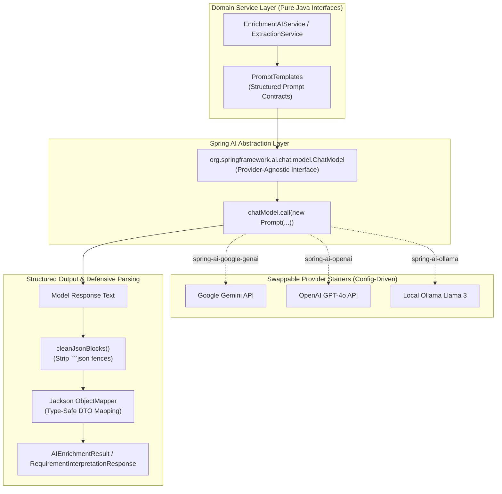

# Concept 19: Spring AI Abstraction & Structured AI Workflows

Many developers view Large Language Models simply as external web APIs: you make an HTTP POST request with a string, and you get back a string. In enterprise Java systems, this naive approach leads to disastrous architectural coupling: proprietary vendor SDKs bleed into business logic, JSON parsing fails randomly, and application code cannot be tested offline without paid API credentials.

**Spring AI** is not merely an HTTP client for LLMs. It is an **architectural abstraction layer** that brings enterprise software engineering principles—portability, dependency injection, structured output mapping, and provider decoupling—to generative AI applications.

This guide explains how `ai-intelligent-service` uses Spring AI to build maintainable, provider-agnostic, and structured AI workflows.

---

## Why This Exists

In our platform, we need generative AI for cognitive synthesis:
1. Translating ambiguous natural-language user requests into typed field identifiers.
2. Reading disparate, noisy web text snippets and synthesizing clean, verified facts.

However:
* We cannot tie our application's fate to a single model provider (e.g. OpenAI vs Google Gemini vs Anthropic vs local Ollama).
* We cannot allow probabilistic AI outputs to crash downstream relational databases or type-safe Java services.
* We must strictly demarcate what belongs to deterministic Java code versus what belongs to probabilistic AI models.

---

## Problem

A naive implementation typically suffers from:
* **Direct Vendor SDK Coupling**: Directly importing Google's `com.google.genai.*` or OpenAI's client libraries into domain services. Switching models requires rewriting controllers, DTOs, and test suites.
* **The "Stringly-Typed" Mess**: Treating LLM interactions as raw text in, raw text out. Business logic is littered with regexes trying to parse markdown fences, strip conversational pleasantries ("Sure, here is your answer!"), and extract fields.
* **Over-Delegation to AI**: Asking the LLM to do things that Java does better, faster, and cheaper—such as trimming whitespace, validating URL formats, counting rows, or matching exact string equality.

---

## Core Idea

The core idea is **Spring AI as an Enterprise Portability and Structure Abstraction**:



1. **The `ChatModel` Contract**: Application code never interacts with Google, OpenAI, or Anthropic classes. It interacts solely with Spring AI's `ChatModel` interface.
2. **Provider Swappability via Configuration**: Switching from Google Gemini to Azure OpenAI is a configuration change in `pom.xml` and `application.yaml`. Zero Java source files change.
3. **Structured Output Enforcement**: Prompts mandate strict JSON schemas. Responses pass through sanitization gates that strip markdown artifacts and deserialize directly into typed Java records.
4. **Boundary of Responsibility**:
   * **Deterministic Java**: URL parsing, domain extraction, regex anchor detection, noise tag stripping, database transactions, and quote substring validation.
   * **Spring AI LLM**: Semantic requirement interpretation, nuance resolution, and narrative synthesis from multiple evidence snippets.

---

## How It Works

### 1. The Clean Service Interface

The domain depends strictly on a technology-agnostic interface ([`EnrichmentAIService.java`](file:///p:/Agentic%20AI/Enrichment%20Platform/data-enrichment-ai-intelligence/apps/backend/ai-intelligent-service/src/main/java/com/subdual/ai_intelligent_service/service/EnrichmentAIService.java)):

```java
public interface EnrichmentAIService {
    RequirementInterpretationResponse interpretRequirement(RequirementInterpretationRequest request);
    InputCleansingResponse cleanInput(InputCleansingRequest request);
    AIEnrichmentResult synthesizeEnrichment(EnrichmentSynthesisRequest request);
}
```

The rest of the application (controllers, clients, background workers) has zero knowledge of Spring AI, prompts, or model parameters.

### 2. Spring AI Dependency Injection with Graceful Fallback

In [`SpringAiEnrichmentService.java`](file:///p:/Agentic%20AI/Enrichment%20Platform/data-enrichment-ai-intelligence/apps/backend/ai-intelligent-service/src/main/java/com/subdual/ai_intelligent_service/service/SpringAiEnrichmentService.java#L34-L46), `ChatModel` is injected as an `Optional`:

```java
@Service
@Slf4j
public class SpringAiEnrichmentService implements EnrichmentAIService {

    private final ChatModel chatModel;
    private final AiProperties properties;
    private final String geminiApiKey;

    public SpringAiEnrichmentService(
            Optional<ChatModel> chatModel,
            AiProperties properties,
            @Value("${spring.ai.google.genai.api-key:mock-key}") String geminiApiKey
    ) {
        this.chatModel = chatModel != null ? chatModel.orElse(null) : null;
        this.properties = properties;
        this.geminiApiKey = geminiApiKey;
    }
}
```

If no API key is provided, the Google GenAI starter bean does not initialize, but the Spring Boot application boots cleanly. The service detects `chatModel == null` and routes seamlessly to deterministic heuristic extraction.

### 3. Defensive Structured Output Parsing

LLMs occasionally wrap JSON in markdown formatting blocks. The service guarantees safe deserialization:

```java
private RequirementInterpretationResponse parseRequirementResponse(String responseText) {
    try {
        String cleaned = cleanJsonBlocks(responseText);
        JsonNode root = MAPPER.readTree(cleaned);
        List<String> fields = new ArrayList<>();
        if (root.has("requestedFields") && root.get("requestedFields").isArray()) {
            root.get("requestedFields").forEach(n -> fields.add(n.asText()));
        }
        String scope = root.has("scopeDescription") ? root.get("scopeDescription").asText() : "Interpreted scope";
        return new RequirementInterpretationResponse(fields, scope, false);
    } catch (Exception e) {
        log.warn("Failed to parse requirement interpretation response: {}", e.getMessage());
        return new RequirementInterpretationResponse(List.of(), "Fallback scope", true);
    }
}
```

---

## Where It Appears in This Project

* **Configuration**: `pom.xml` imports `spring-ai-starter-model-google-genai`.
* **Prompt Definitions**: [`PromptTemplates.java`](file:///p:/Agentic%20AI/Enrichment%20Platform/data-enrichment-ai-intelligence/apps/backend/ai-intelligent-service/src/main/java/com/subdual/ai_intelligent_service/prompt/PromptTemplates.java) contains production-grade prompt templates specifying JSON schemas and anti-hallucination rules.
* **Spring AI Service**: [`SpringAiEnrichmentService.java`](file:///p:/Agentic%20AI/Enrichment%20Platform/data-enrichment-ai-intelligence/apps/backend/ai-intelligent-service/src/main/java/com/subdual/ai_intelligent_service/service/SpringAiEnrichmentService.java) executes model calls and maps results to strongly typed DTOs.
* **Zero-Hallucination Extraction**: [`SpringAiExtractionService.java`](file:///p:/Agentic%20AI/Enrichment%20Platform/data-enrichment-ai-intelligence/apps/backend/ai-intelligent-service/src/main/java/com/subdual/ai_intelligent_service/service/SpringAiExtractionService.java) verifies that extracted quotes exist verbatim in source text.

---

## Design Decisions

| Decision | Justification |
| :--- | :--- |
| **Spring AI Abstraction Over Proprietary SDKs** | Prevents vendor lock-in. Changing from Gemini to Anthropic or local Llama requires zero changes to business logic or controllers. |
| **Optional Bean Injection Over Mandatory Wireup** | Enables offline unit testing, CI/CD builds, and local development without requiring paid cloud API credentials. |
| **Manual Jackson Tree Traversal Over Spring AI BeanOutputConverter** | LLMs occasionally omit non-essential fields or return slightly varied JSON formats. Manual Jackson node inspection allows graceful defaulting rather than throwing unhandled deserialization exceptions. |

---

## Common Mistakes

1. **Treating Spring AI as Just an HTTP Client**:
   Bypassing Spring AI's configuration and abstraction layer to write manual `RestTemplate` calls against raw model endpoints re-introduces proprietary coupling and loses Spring's automated retry, logging, and token management features.
2. **Asking the LLM to Clean Simple Strings**:
   Sending an LLM a prompt to "trim whitespace and remove commas" wastes latency, network I/O, and money. Simple cleaning should always be handled by deterministic Java methods (`String.trim()`, regexes).
3. **Hardcoding System Prompts in Java Code**:
   Scattering prompts across methods makes them difficult to audit and iterate. Centralize all prompts in dedicated template classes.

---

## Practical Mental Model

Think of Spring AI as **JDBC for Large Language Models**:
* JDBC provides a standard interface (`Connection`, `Statement`, `ResultSet`) regardless of whether your database is MySQL, PostgreSQL, or Oracle.
* Spring AI provides a standard interface (`ChatModel`, `Prompt`, `ChatResponse`) regardless of whether your model is Gemini, GPT-4, Claude, or local Ollama.
* You write your business logic against the standard interface, not the vendor driver.

---

## Implementation Status

* **CURRENT IMPLEMENTATION**: `spring-ai-starter-model-google-genai` integration, `ChatModel` interface usage, strict prompt templates, dual-mode deterministic fallback.
* **ARCHITECTURAL DIRECTION**: Adoption of Spring AI's modern `ChatClient` fluent API with built-in advisors for token metrics and prompt logging.
* **FUTURE POSSIBILITY**: Structured multi-model routing (e.g. routing fast classification to a lightweight 8B model and complex synthesis to a frontier reasoning model).

---

## Related Concepts

* **Previous:** [Concept 18: Dataset Enrichment Orchestration](18-dataset-enrichment-orchestration.md)
* **Next:** [Concept 20: Deterministic & AI Hybrid Pipelines](20-deterministic-and-ai-hybrid-pipelines.md)
