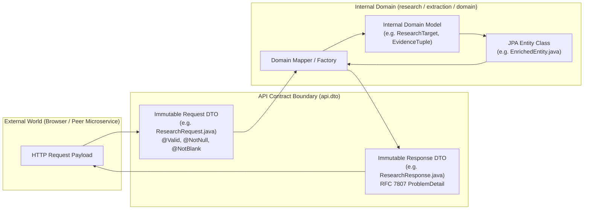

# Concept 22: Contract-First API Evolution

In rapidly evolving platforms, the boundary between an internal implementation detail and a public API contract is easily blurred. A developer adds a temporary debugging field to an entity class, and Jackson automatically serializes it to JSON; a client begins depending on that field; and suddenly an internal refactoring becomes a breaking API change.

A **Contract-First API Architecture** treats HTTP interfaces as immutable public agreements. It enforces rigid separation between internal domain models and external Data Transfer Objects (DTOs), guarantees backward compatibility through explicit URL versioning (`/api/v1`), and prevents internal implementation details from leaking to clients.

This guide explains how this platform designs, enforces, and evolves its API contracts across four communicating services.

---

## Why This Exists

Our platform exposes APIs consumed by both frontend browsers and peer microservices:
* `POST /api/v1/enrichment/jobs` (Batch job creation)
* `GET /api/v1/enrichment/jobs/{jobId}` (Reactive polling)
* `POST /api/v1/research` (Direct entity research)
* `POST /api/v1/entities` (Relational persistence)
* `POST /api/v1/ai/synthesize` (Cognitive fact synthesis)

If internal database entities or web scraper classes are exposed directly:
1. Hibernate proxies cause `LazyInitializationException` or infinite JSON recursion during serialization.
2. Internal schema changes (e.g. splitting `EvidenceExtractor` into `EvidenceMerger`) break external clients.
3. API consumers receive cryptic Java internal error messages instead of actionable, standardized problem details.

---

## Problem

A naive implementation typically suffers from:
* **The "Entity as DTO" Anti-Pattern**: Annotating JPA entity classes with `@RestController` inputs/outputs (`public ResponseEntity<EnrichedEntity> save(@RequestBody EnrichedEntity entity)`). Database column renames instantly break frontend code.
* **Unversioned URLs**: Exposing endpoints as `/api/research`. When requirements change (e.g. adding required `entityType` or changing confidence from integer to enum), existing clients fail.
* **Implicit Breaking Changes**: Removing a response field or changing a field's type from a string to an array without notice.

---

## Core Idea

The core idea is **Strict Contract Encapsulation and Additive Evolution**:



1. **Explicit DTO Packages**: Every microservice separates its public contract (`api/dto`) from its internal domain logic (`domain`, `model`, `pipeline`).
2. **Path-Based API Versioning**: All endpoints include explicit major versions in their URL path (`/api/v1/...`).
3. **The Additive-Only Evolution Rule**:
   * Adding an optional request field is non-breaking.
   * Adding a new response field is non-breaking.
   * Removing, renaming, or changing the type of an existing field is a breaking change that requires a new API version (`/api/v2`).
4. **Validation at the Gate**: Bean Validation annotations (`@Valid`, `@NotBlank`, `@Size`) intercept malformed requests at the controller boundary, rejecting them with `400 Bad Request` before domain code executes.

---

## How It Works

### 1. Dedicated DTOs with Validation Annotations

In `research-service`, [`ResearchRequest.java`](file:///p:/Agentic%20AI/Enrichment%20Platform/data-enrichment-ai-intelligence/apps/backend/research-service/src/main/java/com/subdual/research_service/api/dto/ResearchRequest.java) defines the strict public contract:

```java
public record ResearchRequest(
        String url,
        String entityType,
        String name,
        String organization,
        String role,
        List<String> targetFields,
        String userRequirement
) {}
```

In [`ResearchRequestValidator.java`](file:///p:/Agentic%20AI/Enrichment%20Platform/data-enrichment-ai-intelligence/apps/backend/research-service/src/main/java/com/subdual/research_service/common/validation/ResearchRequestValidator.java), business invariants are enforced before touching any service:

```java
public static void validate(ResearchRequest request) {
    if (request == null) {
        throw new BusinessRuleException("Request body cannot be null");
    }
    boolean hasUrl = request.url() != null && !request.url().isBlank();
    boolean hasName = request.name() != null && !request.name().isBlank();
    if (!hasUrl && !hasName) {
        throw new BusinessRuleException("Either 'url' or 'name' must be provided for research");
    }
}
```

### 2. Decoupling JPA Entities from Response DTOs

In `dataset-service`, [`EntityController.java`](file:///p:/Agentic%20AI/Enrichment%20Platform/data-enrichment-ai-intelligence/apps/backend/dataset-service/src/main/java/com/subdual/dataset_service/controller/EntityController.java) accepts [`PersistEntityRequest`](file:///p:/Agentic%20AI/Enrichment%20Platform/data-enrichment-ai-intelligence/apps/backend/dataset-service/src/main/java/com/subdual/dataset_service/dto/PersistEntityRequest.java) and returns [`EntityDetailResponse`](file:///p:/Agentic%20AI/Enrichment%20Platform/data-enrichment-ai-intelligence/apps/backend/dataset-service/src/main/java/com/subdual/dataset_service/dto/EntityDetailResponse.java). It never exposes the underlying [`EnrichedEntity`](file:///p:/Agentic%20AI/Enrichment%20Platform/data-enrichment-ai-intelligence/apps/backend/dataset-service/src/main/java/com/subdual/dataset_service/domain/EnrichedEntity.java) JPA model.

```java
@PostMapping(consumes = MediaType.APPLICATION_JSON_VALUE, produces = MediaType.APPLICATION_JSON_VALUE)
public ResponseEntity<EntityDetailResponse> persistEntity(@Valid @RequestBody PersistEntityRequest request) {
    EntityDetailResponse response = persistenceService.persistOrUpdate(request);
    return ResponseEntity.status(HttpStatus.CREATED).body(response);
}
```

The internal database columns (`created_at`, relational foreign keys) remain encapsulated inside `dataset-service`.

---

## Where It Appears in This Project

* **Versioned Base Paths**:
  * `research-service`: `/api/v1/research`
  * `dataset-service`: `/api/v1/enrichment/jobs`, `/api/v1/entities`
  * `ai-intelligent-service`: `/api/v1/ai/requirement`, `/api/v1/ai/synthesize`
* **TypeScript Client Sync**: [`apps/frontend/lib/api.ts`](file:///p:/Agentic%20AI/Enrichment%20Platform/data-enrichment-ai-intelligence/apps/frontend/lib/api.ts) mirrors Java DTO records with exact TypeScript interfaces (`ResearchRequest`, `RowEnrichmentResult`, `ColumnMapping`).
* **Postman Integration Suite**: `postman/` maintains collections strictly exercising the `/api/v1` contracts.

---

## Design Decisions

| Decision | Justification |
| :--- | :--- |
| **Java Records for DTOs** | Java 16+ `record`s are immutable, concise, and provide built-in `equals`, `hashCode`, and `toString`. Immutability prevents accidental mutation during request processing. |
| **Path-Based Versioning (`/api/v1`) Over Header Versioning** | Path-based versioning is visible in server access logs, easily testable in browsers, and straightforward to route via API gateways or reverse proxies. |
| **RFC 7807 ProblemDetail for Errors** | Standardizing on RFC 7807 (`type`, `title`, `status`, `detail`, `instance`) allows all clients to parse errors with a single universal error handler. |

---

## Common Mistakes

1. **Returning JPA Entities from Controller Methods**:
   Causes `LazyInitializationException` when Jackson attempts to serialize uninitialized `@ManyToOne` or `@OneToMany` relationships outside an active Hibernate session.
2. **Adding Required Fields to Existing Endpoints**:
   Making a previously optional field mandatory breaks all existing clients. New mandatory fields require a new API version or sensible fallback defaults.
3. **Using Generic Maps as Public API Responses**:
   Returning `Map<String, Object>` prevents client code generation, breaks OpenAPI documentation, and makes API contracts invisible. Always use strongly typed DTO records.

---

## Practical Mental Model

Think of an API contract as a **legal treaty**:
* You cannot unilaterally change the terms of a signed treaty (breaking changes).
* If you need fundamentally new terms, you draft Treaty 2.0 (`/api/v2`).
* Inside your own country (internal service code), you can reorganize your government however you wish, provided your international treaty commitments (`api/dto`) are honored.

---

## Implementation Status

* **CURRENT IMPLEMENTATION**: Complete `/api/v1` URL versioning across all 3 backend services, immutable Java records for DTOs, Bean Validation, and RFC 7807 ProblemDetail error responses.
* **ARCHITECTURAL DIRECTION**: Adoption of OpenAPI 3.0 / Swagger annotations to generate TypeScript client types automatically during CI builds.
* **FUTURE POSSIBILITY**: Version deprecation headers (`Sunset: Wed, 11 Nov 2026 00:00:00 GMT`) when phasing out V1 endpoints.

---

## Related Concepts

* **Previous:** [Concept 21: Microservice Boundaries & Orchestration](21-microservice-boundaries-and-orchestration.md)
* **Next:** [Concept 23: Observability for Distributed AI Workflows](23-observability-for-distributed-ai-workflows.md)
