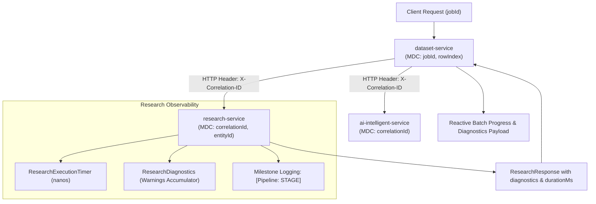

# Concept 23: Observability for Distributed AI Workflows

In a distributed, AI-driven data enrichment platform, debugging cannot rely on reading linear log files on a single server. A single user request initiates a cascading multi-service workflow:
$$\text{dataset-service} \longrightarrow \text{ai-service (requirement)} \longrightarrow \text{research-service (web search \& scraping)} \longrightarrow \text{ai-service (synthesis)} \longrightarrow \text{MySQL}$$

When a row takes 14 seconds to enrich, where was the time spent? Was Tavily slow? Did a web domain trigger an anti-bot HTTP 999 response? Did Google Gemini experience rate-limiting? Did database persistence block on a row lock?

This guide explains how this platform implements **Distributed AI Observability**: unifying cross-service correlation IDs, capturing granular phase latency, recording operational warnings in-band, and debugging asynchronous AI pipelines.

---

## Why This Exists

Traditional web services fail or succeed quickly (10–100ms). Distributed AI enrichment workflows are fundamentally different:
1. **High Latency Variance**: A single row can take 800ms (cached or few sources) or 12,000ms (scraping 5 slow sites with complex LLM synthesis).
2. **Probabilistic and External Failures**: External websites block scrapers; search engine API quotas exhaust; and LLM providers return rate-limit errors.
3. **Multi-Threaded Asynchrony**: Batches run on background worker threads where standard HTTP request contexts do not propagate automatically.

Without structured observability, operations teams cannot identify bottlenecks, audit token costs, or diagnose why specific facts failed to extract.

---

## Problem

A naive implementation typically has:
* **The "Black Box" Pipeline**: The user clicks "Enrich", waits 45 seconds, and receives `{ "status": "PARTIAL" }` with missing fields. Neither the user nor the engineering team knows which web sources were visited, which ones failed, or what the LLM returned.
* **Uncorrelated Multi-Service Logs**: Inspecting logs across Docker containers requires matching timestamps manually because `dataset-service`, `research-service`, and `ai-intelligent-service` generate separate, unlinked log streams.
* **Ignoring Token and Latency Metrics**: Failing to track model inference latency versus web scraping latency. When costs or latency spike, teams guess blindly at the culprit.

---

## Core Idea

The core idea is **Multi-Layered Correlation and In-Band Diagnostic Observability**:



1. **Correlation Tokens (MDC)**: Every task injects identifiers (`jobId`, `entityId`, `correlationId`) into SLF4J's Mapped Diagnostic Context. All log events across threads automatically include these tokens.
2. **In-Band Diagnostic Accumulators**: Rather than dropping warnings or throwing fatal exceptions, non-fatal operational anomalies (e.g. anti-bot blocks, skipped domains) are collected in a thread-safe `ResearchDiagnostics` object and returned directly in the response payload.
3. **Phase-Level Execution Timing**: High-precision monotonic timers (`ResearchExecutionTimer`) measure elapsed time per phase (discovery, web fetching, extraction, synthesis).
4. **Structured Milestone Logging**: Clear, machine-parseable log prefixes (`[Pipeline: NORMALIZED]`, `[Pipeline: DISCOVERY]`, `[Pipeline: ADAPTIVE_STOP]`) provide instant visibility into pipeline progression.

---

## How It Works

### 1. In-Band Operational Warnings in [`ResearchDiagnostics.java`](file:///p:/Agentic%20AI/Enrichment%20Platform/data-enrichment-ai-intelligence/apps/backend/research-service/src/main/java/com/subdual/research_service/research/pipeline/ResearchDiagnostics.java)

When external fetchers encounter HTTP blocks, they record explicit warnings:

```java
public class ResearchDiagnostics {
    private final List<String> warnings = new ArrayList<>();

    public synchronized void addWarning(String warning) {
        if (warning != null && !warning.isBlank()) warnings.add(warning.trim());
    }

    public void recordPrimaryInaccessible(String domain, String statusDetail) {
        addWarning("Primary source (" + domain + ") could not be directly fetched (" + statusDetail 
                + "); continuing research using corroborating public sources.");
    }

    public synchronized List<String> warnings() {
        return Collections.unmodifiableList(new ArrayList<>(warnings));
    }
}
```

In [`DefaultSourceEvidenceService.java`](file:///p:/Agentic%20AI/Enrichment%20Platform/data-enrichment-ai-intelligence/apps/backend/research-service/src/main/java/com/subdual/research_service/extraction/DefaultSourceEvidenceService.java#L98-L105):

```java
if (fetched == null || !fetched.success()) {
    log.info("Primary target source ({}) could not be directly fetched (HTTP {}); continuing with corroborating sources.",
            domain, fetched != null ? fetched.statusCode() : "timeout");
    diagnostics.recordPrimaryInaccessible(domain, "HTTP " + (fetched != null ? fetched.statusCode() : 0));
}
```

### 2. Monotonic Execution Timing in [`ResearchExecutionTimer.java`](file:///p:/Agentic%20AI/Enrichment%20Platform/data-enrichment-ai-intelligence/apps/backend/research-service/src/main/java/com/subdual/research_service/research/pipeline/ResearchExecutionTimer.java)

Wall-clock time (`System.currentTimeMillis()`) can shift due to NTP synchronization. Monotonic timers guarantee high-precision elapsed duration:

```java
public class ResearchExecutionTimer {
    private final long startNanos;

    public ResearchExecutionTimer() {
        this.startNanos = System.nanoTime();
    }

    public static ResearchExecutionTimer start() {
        return new ResearchExecutionTimer();
    }

    public long elapsedMillis() {
        return (System.nanoTime() - startNanos) / 1_000_000L;
    }
}
```

### 3. MDC Thread Correlation in [`ResearchOrchestrator.java`](file:///p:/Agentic%20AI/Enrichment%20Platform/data-enrichment-ai-intelligence/apps/backend/research-service/src/main/java/com/subdual/research_service/research/ResearchOrchestrator.java#L58-L77)

```java
MDC.put("entityId", target.entityId());
try {
    log.info("[Pipeline: NORMALIZED] EntityId='{}', CanonicalUrl='{}', DisplayName='{}', Type='{}'",
            target.entityId(), target.canonicalUrl(), target.displayName(), target.type());
    // ... run pipeline ...
    log.info("[Pipeline: COMPLETED] Research finished for entityId: '{}' in {}ms (sources: {}, attributes: {}, warnings: {})",
            target.entityId(), timer.elapsedMillis(), sources.size(), attributes.size(), diagnostics.warningCount());
} finally {
    MDC.remove("entityId"); // Mandatory cleanup
}
```

---

## Where It Appears in This Project

* **Orchestrator Logging**: [`ResearchOrchestrator.java`](file:///p:/Agentic%20AI/Enrichment%20Platform/data-enrichment-ai-intelligence/apps/backend/research-service/src/main/java/com/subdual/research_service/research/ResearchOrchestrator.java) logs stage milestones.
* **Background Job Tracking**: [`InMemoryResearchJobService.java`](file:///p:/Agentic%20AI/Enrichment%20Platform/data-enrichment-ai-intelligence/apps/backend/research-service/src/main/java/com/subdual/research_service/research/job/InMemoryResearchJobService.java) injects `jobId` into MDC.
* **Batch Duration Tracking**: [`DefaultDatasetEnrichmentService.java`](file:///p:/Agentic%20AI/Enrichment%20Platform/data-enrichment-ai-intelligence/apps/backend/dataset-service/src/main/java/com/subdual/dataset_service/service/DefaultDatasetEnrichmentService.java) calculates `durationMs` and percentage progress per batch.
* **Spring Actuator**: Every backend service exposes `/actuator/health` and `/actuator/info` for container liveness probes.

---

## Design Decisions

| Decision | Justification |
| :--- | :--- |
| **In-Band Diagnostics Over Error Codes** | When a web scraper is blocked, it is not an application failure; it is an operational condition. Returning warnings in the response payload informs the client without triggering 5xx alert alarms. |
| **SLF4J MDC Over Parameter Passing** | MDC uses thread-local variables. Any helper class, logging utility, or sub-method can log with context without polluting method signatures with `String jobId`. |
| **Monotonic `System.nanoTime()` Over Epoch Milliseconds** | Prevents negative duration bugs when servers synchronize clocks via NTP during long-running batch jobs. |

---

## Common Mistakes

1. **Failing to Remove MDC Keys in a `finally` Block**:
   Thread pools reuse threads. Omitting `MDC.remove(...)` means subsequent, unrelated requests log with the previous job's ID, corrupting log analytics.
2. **Logging Full HTML Document Bodies at INFO Level**:
   Logging 50KB scraped HTML pages floods log storage, exhausts disk space, and obscures actual business log messages. Log document lengths and URLs at INFO; save full text for DEBUG.
3. **Swallowing External Service Exceptions Without Logging**:
   Catching an HTTP timeout and returning `null` with no log statement leaves engineers with zero clues when debugging production outages.

---

## Practical Mental Model

Think of distributed observability as **flight telemetry in aviation**:
* You don't just check if the airplane arrived at the destination.
* You record altitude, airspeed, fuel burn, engine temperature, and autopilot disengagements at every second.
* If a flight is delayed by turbulence (rate limits or slow scrapers), the flight recorder explains exactly which storm cell caused the detour.

---

## Implementation Status

* **CURRENT IMPLEMENTATION**: MDC tracking in `research-service`, pipeline milestone logging, `ResearchDiagnostics` in-band warning accumulation, `ResearchExecutionTimer` monotonic timing, Actuator health endpoints.
* **ARCHITECTURAL DIRECTION**: Propagating `X-Correlation-ID`, `X-Job-ID`, and `X-Row-ID` across all cross-service HTTP client headers; logging token usage metrics (prompt/completion tokens).
* **FUTURE POSSIBILITY**: Exporting distributed traces via OpenTelemetry and Jaeger; Micrometer timer meters scraped by Prometheus and visualized in Grafana dashboards.

---

## Related Concepts

* **Previous:** [Concept 22: Contract-First API Evolution](22-contract-first-api-evolution.md)
* **Next:** [Concept 24: Versioned Architecture & V1 to V2 Evolution](24-versioned-architecture-and-v1-to-v2-evolution.md)
