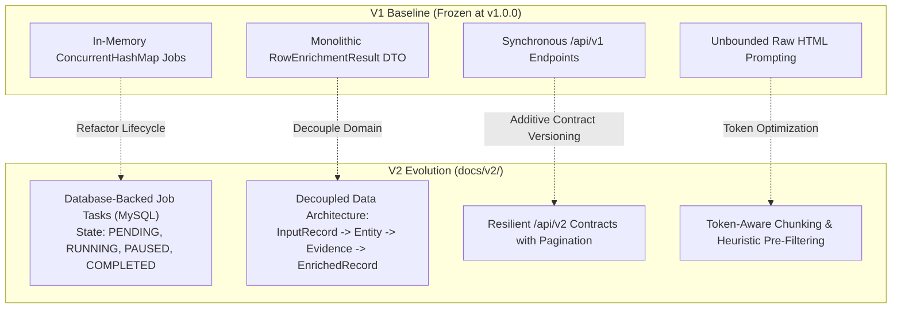

# Concept 24: Versioned Architecture & V1 to V2 Evolution

Building a software prototype is about proving feasibility: can we ingest a spreadsheet, scrape websites, extract facts with LLMs, and save the result to a database? In version 1 (V1), the answer was an emphatic **yes**.

However, as prototypes transition to enterprise production platforms, structural limitations emerge: in-memory state vanishes on server restart; synchronous pipelines saturate under batch load; and monolithic response objects become difficult to query.

Rather than throwing away working code and starting a high-risk "rewrite from scratch," mature engineering teams execute a **disciplined architectural evolution**.

This guide explains how this platform plans and structures its evolution from **V1 Prototype** to **V2 Production Architecture** (`docs/v2/`), preserving core guarantees while migrating data models, job lifecycles, and API contracts safely.

---

## Why This Exists

V1 achieved critical milestones:
* 3-microservice topology (`dataset-service`, `research-service`, `ai-intelligent-service`).
* Zero-hallucination evidence grounding with verbatim source quotes.
* Non-destructive spreadsheet export appending `Enriched_*` columns.
* MySQL relational schema with Flyway migrations.

However, real-world batch usage exposed architectural friction:
1. **Ephemeral State**: Storing batch jobs in an in-memory `ConcurrentHashMap` means restarting a container kills all active batches and erases historical job progress.
2. **Memory Pressure**: Processing 5,000 rows in memory simultaneously exhausts the JVM heap.
3. **Monolithic Data Models**: The `RowEnrichmentResult` record conflated input fields, research evidence, AI synthesis, and export status into a single object, making partial updates difficult.

---

## Problem

A naive approach to system evolution typically falls into the **"Second-System Effect"**:
* **The "Total Rewrite" Trap**: Abandoning the V1 codebase and starting V2 in a new repository. Teams spend six months rewriting working features (Flyway scripts, Jsoup cleaners, regexes) instead of solving the new architectural bottlenecks.
* **Codebase Duplication**: Copying `research-service-v1` to `research-service-v2`. Bugs fixed in one service must now be manually ported to the other, doubling maintenance overhead.
* **Breaking Existing Contracts**: Modifying existing `/api/v1` endpoints in place, breaking existing clients, automated scripts, and Postman test collections.

---

## Core Idea

The core idea is **Evolutionary Refactoring via the V2 Blueprint Matrix**:



The evolution classifies every component into five strategic categories:
1. **Keep As-Is**: Foundational architecture that is proven and correct (the 3-service topology, zero-hallucination requirement, MySQL relational store, 5-stage UI workflow).
2. **Refactor**: In-memory job state $\rightarrow$ database-backed tasks; monolithic result records $\rightarrow$ decoupled domain models.
3. **Extend**: User requirements $\rightarrow$ reusable enrichment profiles; ad-hoc search $\rightarrow$ requirement-weighted query strategies.
4. **Replace**: Ephemeral threads $\rightarrow$ bounded task queue with pause/resume and backpressure.
5. **New Capability**: Granular Prometheus metrics, per-field confidence thresholds, and webhook notifications.

---

## How It Works

### 1. From In-Memory Map to Database-Backed Tasks

In V1, job state is stored in [`DefaultDatasetEnrichmentService.java`](file:///p:/Agentic%20AI/Enrichment%20Platform/data-enrichment-ai-intelligence/apps/backend/dataset-service/src/main/java/com/subdual/dataset_service/service/DefaultDatasetEnrichmentService.java#L38):

```java
// V1: Ephemeral in-memory state (lost on restart)
private final Map<String, JobState> activeJobs = new ConcurrentHashMap<>();
```

In V2 ([`docs/v2/architecture.md`](file:///p:/Agentic%20AI/Enrichment%20Platform/data-enrichment-ai-intelligence/docs/v2/architecture.md)), this evolves into durable relational tables managed by Flyway:

```sql
-- V2: Durable relational job lifecycle
CREATE TABLE enrichment_jobs (
    job_id VARCHAR(64) PRIMARY KEY,
    dataset_name VARCHAR(255) NOT NULL,
    status VARCHAR(30) NOT NULL, -- PENDING, RUNNING, PAUSED, COMPLETED, FAILED, CANCELLED
    total_rows INT NOT NULL,
    completed_rows INT DEFAULT 0,
    failed_rows INT DEFAULT 0,
    created_at TIMESTAMP NOT NULL,
    completed_at TIMESTAMP NULL
);

CREATE TABLE enrichment_job_tasks (
    task_id VARCHAR(64) PRIMARY KEY,
    job_id VARCHAR(64) NOT NULL,
    row_index INT NOT NULL,
    status VARCHAR(30) NOT NULL, -- QUEUED, RUNNING, COMPLETED, FAILED
    raw_payload JSON NOT NULL,
    result_payload JSON NULL,
    error_message TEXT NULL,
    FOREIGN KEY (job_id) REFERENCES enrichment_jobs(job_id)
);
```

If a server restarts midway through a 500-row batch, the V2 orchestrator queries for tasks in `QUEUED` or `RUNNING` status and resumes processing without losing completed work.

### 2. Decoupling the Monolithic Data Model

In V1, a single record [`RowEnrichmentResult.java`](file:///p:/Agentic%20AI/Enrichment%20Platform/data-enrichment-ai-intelligence/apps/backend/dataset-service/src/main/java/com/subdual/dataset_service/dto/RowEnrichmentResult.java) bundled raw inputs, research sources, extracted attributes, and export statuses.

In V2 ([`docs/v2/data-model.md`](file:///p:/Agentic%20AI/Enrichment%20Platform/data-enrichment-ai-intelligence/docs/v2/data-model.md)), the data model separates into distinct domain lifecycle boundaries:
1. `InputRecord`: Raw spreadsheet row as uploaded.
2. `NormalizedRecord`: Cleaned identity anchors with canonical URL and entity type.
3. `EntityIdentity`: SHA-256 natural key and persistent entity mapping.
4. `EvidenceDocument`: Cleaned HTML text, crawl timestamp, HTTP status, and domain authority.
5. `AttributeAssertion`: Individual extracted fact with verbatim quote and confidence tier.
6. `EnrichedRow`: Final aggregated projection combining input with assertions.

---

## Where It Appears in This Project

* **V2 Architecture Specifications**: `docs/v2/` contains the complete architectural blueprint:
  * `README.md`: Executive summary and comprehensive V1 limitations analysis.
  * `architecture.md`: Durable job orchestration and bounded thread design.
  * `data-model.md`: Decoupled domain models and relational task schemas.
  * `api-evolution.md`: V1 $\rightarrow$ V2 endpoint mapping and pagination specifications.
  * `ai-architecture.md`: Token-aware chunking and heuristic pre-filtering.
  * `reliability.md`: Retry strategies, circuit breakers, and rate-limiting adapters.
* **V1 Frozen Codebase**: The live microservices in `apps/backend/` remain frozen at `v1.0.0`, serving existing contracts while V2 blueprints guide future sprint implementations.

---

## Design Decisions

| Decision | Justification |
| :--- | :--- |
| **Evolution Over Rewriting** | Rewrites discard working, tested code (Flyway migrations, Jsoup cleaning, Spring AI templates). Upgrading specific bottlenecks in place is 5x faster and 10x lower risk. |
| **Relational Task Queue Over Kafka/RabbitMQ** | The platform processes batches of 10 to 5,000 rows. A durable MySQL task table with indexed statuses (`QUEUED`, `RUNNING`) provides complete crash durability without introducing operational message broker infrastructure. |
| **Strict Additive API Versioning** | V1 endpoints (`/api/v1/enrichment/jobs`) remain supported and unchanged. New capabilities (pagination, task pause/resume) are introduced under `/api/v2/...`. |

---

## Common Mistakes

1. **Prematurely Adding Distributed Message Brokers**:
   Introducing Kafka, Zookeeper, and Schema Registry for batches of 500 rows adds immense operational overhead. Relational task tables in MySQL handle thousands of jobs per second with ACID guarantees.
2. **Breaking V1 Contracts During V2 Development**:
   Altering existing V1 database tables or DTOs breaks running frontend deployments. V2 schema migrations must be purely additive or isolated in new tables.
3. **Building V2 Before Understanding V1 Limitations**:
   Designing V2 without auditing real production usage results in solving imaginary problems while missing genuine operational bottlenecks.

---

## Practical Mental Model

Think of versioned architecture evolution as **upgrading a passenger train**:
* You do not scrap the tracks, stations, and locomotives all at once.
* You keep the tracks (proven 3-service topology and database).
* You upgrade the passenger cars one by one: replacing wooden seats (in-memory job maps) with modern reclining seats (database-backed task queues).
* Passengers on existing tickets (V1 API consumers) continue their journey without interruption.

---

## Implementation Status

* **CURRENT IMPLEMENTATION**: Complete V1 system active in `apps/backend/` and `apps/frontend/`.
* **ARCHITECTURAL DIRECTION**: V2 Blueprint fully designed, audited, and codified in `docs/v2/`.
* **FUTURE POSSIBILITY**: Phased sprint implementation of V2 database-backed task lifecycle and paginated `/api/v2` endpoints.

---

## Related Concepts

* **Previous:** [Concept 23: Observability for Distributed AI Workflows](23-observability-for-distributed-ai-workflows.md)
* **Next:** [Concept 25: Scalable Dataset Enrichment & Bounded Concurrency](25-scalable-dataset-enrichment.md)
