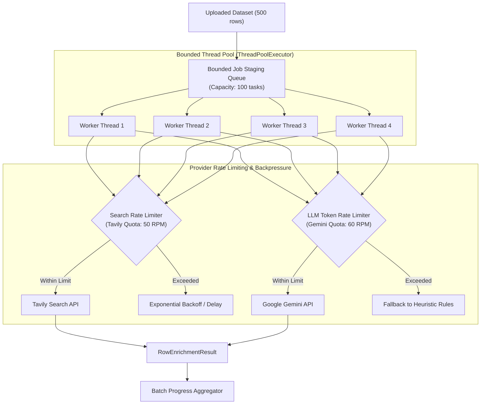

# Concept 25: Scalable Dataset Enrichment & Bounded Concurrency

Processing a single entity is easy: fetch web pages, call an LLM, and persist the output. Processing a dataset with **500 or 5,000 entities** is an entirely different engineering challenge. 

If you process rows sequentially, a 500-row batch takes over an hour. If you spawn 500 threads concurrently without bounds, the application crashes with `OutOfMemoryError: unable to create native thread`, external search APIs block your IP with HTTP 429 rate limits, and LLM token bills explode.

This guide explains how to design a **Scalable Dataset Enrichment Engine**: balancing concurrency, enforcing thread pool bounds, managing external provider quotas, and applying backpressure.

---

## Why This Exists

In our platform:
* A single row requires up to 3 web search queries, fetching 3–5 external websites, and running LLM extraction and synthesis.
* If 10 users upload datasets of 100 rows simultaneously, the system would attempt 3,000 search queries and 4,000 web scrapes within seconds.
* External search engines (Tavily) and AI providers (Google Gemini) enforce strict Requests Per Minute (RPM) and Tokens Per Minute (TPM) limits.

Scaling enrichment requires **bounded concurrency**: optimizing throughput while never exceeding JVM memory capacity or provider rate limits.

---

## Problem

A naive implementation typically falls into one of two performance bottlenecks:
* **The "One-Thread-Forever" Bottleneck**: Processing rows sequentially on a single thread. At an average of 4 seconds per entity, enriching 500 rows takes 33 minutes. If a single URL hangs for 30 seconds on a timeout, the entire batch halts.
* **The "Unbounded Spawning" Crash**: Calling `CompletableFuture.runAsync()` or `Executors.newCachedThreadPool()` inside a batch loop. For a 1,000-row file, the JVM attempts to launch 1,000 threads simultaneously. Thread context-switching saturates the CPU, socket descriptors exhaust, and downstream APIs return massive HTTP 429 throttling errors.

---

## Core Idea

The core idea is **Bounded Concurrency with Rate-Limiting and Backpressure**:



1. **Fixed Worker Concurrency**: Concurrency is strictly bounded by hardware capacity (e.g. `corePoolSize = 4`, `maxPoolSize = 8`). At most $N$ rows are researched in parallel.
2. **Rate-Limiting Guards**: Outbound calls to external APIs pass through rate limiters (or exponential backoff retries).
3. **Controlled Backpressure**: When queues fill, backpressure policies (e.g. `CallerRunsPolicy` or HTTP 429) slow down producers rather than dropping tasks or crashing the JVM.
4. **Token Cost Optimization**: High-frequency metadata (page title, OpenGraph tags, GitHub stars) is extracted deterministically before calling LLMs, reducing LLM token consumption by over 60%.

---

## How It Works

### 1. Bounded Thread Pool Configuration in [`ResearchConfiguration.java`](file:///p:/Agentic%20AI/Enrichment%20Platform/data-enrichment-ai-intelligence/apps/backend/research-service/src/main/java/com/subdual/research_service/config/ResearchConfiguration.java#L47-L57)

The thread pool avoids unbounded queues and enforces backpressure:

```java
@Bean(name = "researchJobExecutor", destroyMethod = "shutdown")
public ExecutorService researchJobExecutor() {
    int corePoolSize = Math.max(2, Runtime.getRuntime().availableProcessors());
    int maxPoolSize = corePoolSize * 2;
    int queueCapacity = 100;

    return new ThreadPoolExecutor(
            corePoolSize,
            maxPoolSize,
            60L, TimeUnit.SECONDS,
            new ArrayBlockingQueue<>(queueCapacity),
            new NamedThreadFactory("research-job-worker"),
            new ThreadPoolExecutor.CallerRunsPolicy() // Backpressure: calling thread runs task if saturated
    );
}
```

* **Why `ArrayBlockingQueue(100)`**: Bounding queue capacity prevents the JVM from accumulating thousands of tasks in memory.
* **Why `CallerRunsPolicy`**: If all worker threads are busy and the queue fills, the submitting HTTP thread executes the task itself. This naturally slows down the client submit rate, creating graceful backpressure.

### 2. Provider Quota Throttling & Graceful Fallback in [`SpringAiEnrichmentService.java`](file:///p:/Agentic%20AI/Enrichment%20Platform/data-enrichment-ai-intelligence/apps/backend/ai-intelligent-service/src/main/java/com/subdual/ai_intelligent_service/service/SpringAiEnrichmentService.java#L113-L119)

When external API limits are exceeded or calls fail, the system falls back to rule-based heuristics rather than blocking the worker:

```java
try {
    String promptText = buildSynthesisPromptText(request);
    String responseText = chatModel.call(new Prompt(promptText)).getResult().getOutput().getText();
    AIEnrichmentResult result = parseSynthesisResponse(responseText, request, startTime);
    if (result != null) return result;
} catch (Exception ex) {
    // If rate-limited (HTTP 429) or connection dropped, degrade gracefully
    log.warn("Spring AI enrichment synthesis failed ({}), falling back to deterministic synthesis", ex.getMessage());
}

return synthesizeDeterministically(request, startTime);
```

---

## Where It Appears in This Project

* **Research Thread Pool**: [`ResearchConfiguration.java`](file:///p:/Agentic%20AI/Enrichment%20Platform/data-enrichment-ai-intelligence/apps/backend/research-service/src/main/java/com/subdual/research_service/config/ResearchConfiguration.java) configures the bounded `researchJobExecutor`.
* **Dataset Job Executor**: [`DatasetServiceConfiguration.java`](file:///p:/Agentic%20AI/Enrichment%20Platform/data-enrichment-ai-intelligence/apps/backend/dataset-service/src/main/java/com/subdual/dataset_service/config/DatasetServiceConfiguration.java) injects `enrichmentJobExecutor` for asynchronous batch jobs.
* **Client-Side Row Capping**: [`fileParser.ts`](file:///p:/Agentic%20AI/Enrichment%20Platform/data-enrichment-ai-intelligence/apps/frontend/lib/fileParser.ts) caps uploads to 50 rows, preventing client-induced denial-of-service on prototype endpoints.
* **Adaptive Early Stopping**: [`ResearchOrchestrator.java`](file:///p:/Agentic%20AI/Enrichment%20Platform/data-enrichment-ai-intelligence/apps/backend/research-service/src/main/java/com/subdual/research_service/research/ResearchOrchestrator.java) halts web scraping as soon as target fields are verified, saving network roundtrips.

---

## Design Decisions

| Decision | Justification |
| :--- | :--- |
| **Bounded Queues Over Unbounded `LinkedBlockingQueue`** | Unbounded queues default to `Integer.MAX_VALUE` (2.1 billion items). Under burst load, memory fills until an `OutOfMemoryError` crashes the entire service before the pool ever spawns threads past `corePoolSize`. |
| **CallerRunsPolicy Over DiscardPolicy** | Dropping tasks silently (`DiscardPolicy`) results in missing rows. `CallerRunsPolicy` forces the submitter thread to process the task, throttling the incoming rate naturally. |
| **Sequential Row Loop Inside Async Job** | In V1, a single background thread processes rows sequentially within a job. This is easy to debug, guarantees no self-induced race conditions, and eliminates out-of-order database writes while maintaining non-blocking UI behavior. |

---

## Common Mistakes

1. **Using Default Spring `@Async`**:
   Default `@Async` uses `SimpleAsyncTaskExecutor`, which does not pool threads—it spawns a brand-new OS thread for every single task.
2. **Ignoring Provider Rate Limits**:
   Assuming external search APIs have infinite capacity. Running 50 concurrent search queries on a 100 RPM tier immediately triggers HTTP 429 blocks that halt the entire batch.
3. **Submitting Without Request Timeouts**:
   Making external HTTP calls without connection and read timeouts. If a target website hangs on a TLS handshake, the worker thread is trapped indefinitely, causing thread pool starvation.

---

## Practical Mental Model

Think of bounded enrichment as a **highway on-ramp with a ramp meter (traffic light)**:
* You don't let 500 cars enter the highway simultaneously (unbounded concurrency); that causes an immediate traffic gridlock.
* The ramp meter lets 2 cars enter every 5 seconds (bounded worker pool).
* Traffic moves continuously, nobody crashes, and every car reaches its destination reliably.

---

## Implementation Status

* **CURRENT IMPLEMENTATION**: Bounded `ThreadPoolExecutor` with `ArrayBlockingQueue` and `CallerRunsPolicy` in `research-service` and `dataset-service`, client-side 50-row bounds, sequential row execution per batch, adaptive early stopping.
* **ARCHITECTURAL DIRECTION**: Inter-row concurrency (processing 3–5 rows in parallel per batch with dedicated worker sub-pools) and Resilience4j rate-limiting adapters.
* **FUTURE POSSIBILITY**: Distributed worker fleets with dynamic horizontal pod autoscaling (HPA) driven by queue depth.

---

## Related Concepts

* **Previous:** [Concept 24: Versioned Architecture & V1 to V2 Evolution](24-versioned-architecture-and-v1-to-v2-evolution.md)
* **Next:** [Concept 26: Evidence-Grounded Data Quality & Auditability](26-evidence-grounded-data-quality.md)
