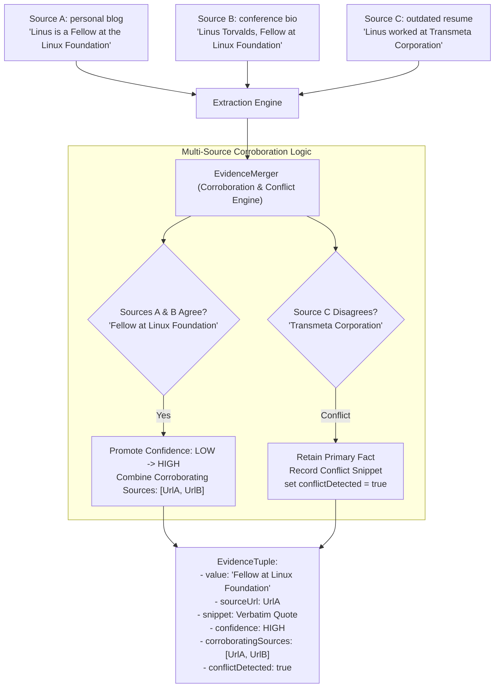

# Concept 26: Evidence-Grounded Data Quality & Auditability

In traditional AI applications, users are given an answer without proof: *"Linus Torvalds works at the Linux Foundation."* In enterprise data enrichment, an assertion without auditable provenance is virtually worthless. 

Enterprise compliance, financial underwriting, sales outreach, and competitive intelligence require verifiable proof:
* Which public URL stated this fact?
* What was the exact verbatim sentence?
* Did multiple independent sources agree, or did two sources contradict each other?
* Was this fact asserted yesterday, or was it scraped from an archived blog post written in 2014?

This guide explains the architecture of **Evidence-Grounded Data Quality**: treating provenance as a first-class citizen, calculating multi-source confidence tiers, and detecting conflicting assertions.

---

## Why This Exists

If an enrichment platform only outputs raw values (`{ "role": "VP of Engineering" }`):
1. **Zero Explainability**: Users cannot tell whether the value was extracted from an authoritative corporate website, guessed by an LLM, or hallucinated from stale training data.
2. **High-Stakes Liability**: In regulated domains, taking action on an unverified fact (e.g. sending a legal notice or offering credit based on an erroneous company status) creates legal exposure.
3. **Undetected Conflicts**: When a person switches jobs, Source A might list their old employer while Source B lists their new employer. Blindly overwriting values hides this contradiction from human reviewers.

---

## Problem

A naive implementation typically has these data quality flaws:
* **The "Black Box Score" Trap**: Generating an arbitrary floating-point number (`confidence: 0.94`) derived from an LLM's self-reported certainty. LLMs frequently assign high confidence to completely hallucinated facts.
* **Overwriting Conflicts Silently**: When a second web page is parsed with a different job title, the code simply executes `attributes.put("role", newRole)`. The user never learns that a conflict existed.
* **Dropping Source Citations**: Discarding the URL and evidence snippet after extraction to save database storage, rendering the resulting dataset permanently unverifiable.

---

## Core Idea

The core idea is **First-Class Evidence Tuples with Multi-Source Corroboration**:



1. **The Evidence Tuple (`EvidenceTuple`)**: Every single extracted attribute is stored as an immutable tuple containing the value, primary source URL, verbatim text snippet, confidence tier, list of corroborating source URLs, and conflict flag.
2. **Corroboration Boosting**:
   * A fact found in a single source starts at `LOW` or `MEDIUM` confidence.
   * When an independent secondary domain corroborates the same fact, confidence is promoted to `HIGH`.
3. **Conflict Detection & Auditability**:
   * When sources disagree, the engine does not silently discard the competing fact. It retains the competing claim in the evidence snippet, flags `conflictDetected = true`, and lowers confidence so human reviewers can inspect the discrepancy.

---

## How It Works

### 1. The Evidence Tuple Structure in [`EvidenceTuple.java`](file:///p:/Agentic%20AI/Enrichment%20Platform/data-enrichment-ai-intelligence/apps/backend/research-service/src/main/java/com/subdual/research_service/api/dto/EvidenceTuple.java)

```java
public record EvidenceTuple(
        String value,
        String sourceUrl,
        String evidenceSnippet,
        ConfidenceTier confidence,
        List<String> corroboratingSources,
        boolean conflictDetected
) {
    public EvidenceTuple(String value, String sourceUrl, String snippet, ConfidenceTier tier) {
        this(value, sourceUrl, snippet, tier, sourceUrl != null ? List.of(sourceUrl) : List.of(), false);
    }
}
```

### 2. Multi-Source Corroboration in [`EvidenceMerger.java`](file:///p:/Agentic%20AI/Enrichment%20Platform/data-enrichment-ai-intelligence/apps/backend/research-service/src/main/java/com/subdual/research_service/extraction/support/EvidenceMerger.java#L37-L85)

When a new source provides an attribute, `EvidenceMerger` tests for agreement or contradiction:

```java
public void mergeAttribute(
        Map<String, EvidenceTuple> attributes,
        String key, String value, String sourceUrl, String snippet, ConfidenceTier tier) {

    EvidenceTuple existing = attributes.get(key);
    if (existing == null) {
        attributes.put(key, new EvidenceTuple(value, sourceUrl, snippet, tier));
        return;
    }

    List<String> sources = buildCorroboratingSources(existing, sourceUrl);
    if (isAgreement(existing.value(), value)) {
        // Agreement: boost confidence tier
        ConfidenceTier current = existing.confidence() != null ? existing.confidence() : ConfidenceTier.LOW;
        ConfidenceTier boostedTier = switch (current) {
            case UNKNOWN, LOW -> ConfidenceTier.MEDIUM;
            case MEDIUM, HIGH -> ConfidenceTier.HIGH;
        };
        attributes.put(key, new EvidenceTuple(
                existing.value(), existing.sourceUrl(), snippet, boostedTier, sources, false
        ));
    } else {
        // Disagreement: resolve precedence, record competing claim, flag conflict
        String conflictSnippet = "Conflict: '" + existing.value() + "' (" + existing.sourceUrl() + ") vs '" 
                + value + "' (" + sourceUrl + ")";
        attributes.put(key, new EvidenceTuple(
                existing.value(), existing.sourceUrl(), conflictSnippet, ConfidenceTier.MEDIUM, sources, true
        ));
    }
}
```

---

## Where It Appears in This Project

* **Evidence Model**: [`EvidenceTuple.java`](file:///p:/Agentic%20AI/Enrichment%20Platform/data-enrichment-ai-intelligence/apps/backend/research-service/src/main/java/com/subdual/research_service/api/dto/EvidenceTuple.java) defines the immutable data container.
* **Corroboration Engine**: [`EvidenceMerger.java`](file:///p:/Agentic%20AI/Enrichment%20Platform/data-enrichment-ai-intelligence/apps/backend/research-service/src/main/java/com/subdual/research_service/extraction/support/EvidenceMerger.java) executes agreement boosting and conflict detection.
* **Relational Schema**: Flyway migration `V1__initial_schema.sql` creates `entity_attributes` with columns for `attribute_value`, `source_url`, `evidence_snippet`, and `confidence_tier`.
* **Frontend Evidence Modal**: [`RecordDetailModal.tsx`](file:///p:/Agentic%20AI/Enrichment%20Platform/data-enrichment-ai-intelligence/apps/frontend/components/results/RecordDetailModal.tsx) allows users to click any enriched row to inspect verbatim evidence quotes, confidence badges, conflict alerts, and source URLs.

---

## Design Decisions

| Decision | Justification |
| :--- | :--- |
| **Categorical Confidence Tiers Over Continuous Floats** | Continuous floats (`0.874`) give a false sense of precision. Four distinct tiers (`HIGH`, `MEDIUM`, `LOW`, `UNKNOWN`) provide unambiguous operational meaning for downstream filters and human review. |
| **Verbatim Quotes as Mandatory Invariant** | Discarding evidence text makes post-enrichment auditing impossible. Capturing the verbatim sentence allows human operators to verify the fact in 2 seconds without visiting the external website. |
| **Retaining Competing Claims in Conflict Snippets** | When sources disagree, picking one and erasing the other conceals uncertainty. Recording both values allows users to make informed domain decisions. |

---

## Common Mistakes

1. **Using LLM Self-Reported Confidence**:
   Asking an LLM: *"Rate your confidence from 1 to 10."* Models are consistently overconfident and routinely give a 10/10 to fabricated facts. Confidence must be derived programmatically from source authority and multi-source corroboration.
2. **Dropping Source URLs Upon Export**:
   Exporting only `Enriched_role` without `Enriched_role_Source` or `Enriched_role_Confidence` strips the audit trail.
3. **Treating Minor String Variations as Conflicts**:
   Flagging a conflict because Source A says `"Google LLC"` and Source B says `"Google"`. Clean corroboration logic must normalize case, punctuation, and legal entity suffixes before declaring a conflict.

---

## Practical Mental Model

Think of evidence-grounded data quality as a **court of law**:
* An assertion is not accepted merely because a witness (the LLM) spoke it.
* The court demands physical exhibits (the source URL) and verbatim testimony (the evidence quote).
* If two independent credible witnesses give the exact same testimony (corroboration), the case is proven beyond reasonable doubt (`HIGH` confidence).
* If two witnesses contradict each other, the judge notes the contradiction rather than flipping a coin.

---

## Implementation Status

* **CURRENT IMPLEMENTATION**: `EvidenceTuple` records, `EvidenceMerger` corroboration and conflict engine, relational persistence of evidence in MySQL, interactive evidence modal in Next.js.
* **ARCHITECTURAL DIRECTION**: Domain authority ratings (weighting official corporate domains higher than blogs) and publication date extraction to distinguish current facts from historical ones.
* **FUTURE POSSIBILITY**: Cryptographic content hashing of scraped HTML snapshots to provide tamper-proof provenance verification.

---

## Related Concepts

* **Previous:** [Concept 25: Scalable Dataset Enrichment & Bounded Concurrency](25-scalable-dataset-enrichment.md)
* **Next:** [Concept 27: Frontend Workflow for Data Enrichment](27-frontend-workflow-for-data-enrichment.md)
