# Concept 27: Frontend Workflow for Data Enrichment

In data-intensive AI platforms, the frontend is not just a cosmetic display layer. It is an **interactive workflow coordinator** that bridges messy human input (unstructured spreadsheets, natural language requirements) and rigid backend microservices.

If the frontend attempts to perform business logic—such as scraping websites, inferring entity relationships, or computing confidence scores—the application suffers from security risks, code duplication, and tight coupling. Conversely, if the frontend is merely a dumb form that dumps files to the server without preview or validation, user experience degrades into frustrating trial-and-error.

This guide explains the architectural design of the **5-Stage Progressive Frontend Workflow** implemented in `apps/frontend`, focusing on state management, validation boundaries, non-destructive export, and the strict separation between UI guidance and backend domain logic.

---

## Why This Exists

A user enriching a dataset faces uncertainty at every step:
1. *Did my spreadsheet parse correctly? Are the rows aligned?* (Needs Tabular Preview)
2. *Does the system know which column is the person's name versus company?* (Needs Column Confirmation)
3. *What specific facts do I want to discover?* (Needs Requirement Guidance)
4. *How long will this take, and did any rows fail?* (Needs Reactive Progress Tracking)
5. *Where did this extracted job title come from? Can I trust it?* (Needs Evidence Modal)
6. *Can I download the results without losing my original columns?* (Needs Non-Destructive Export)

Addressing these questions requires an explicit, state-machine driven user workflow.

---

## Problem

A naive frontend implementation typically suffers from:
* **The "One Giant Page" Anti-Pattern**: Rendering file upload, column mapping, progress bars, and results on a single cluttered page with hundreds of interdependent boolean flags (`isLoading`, `hasParsed`, `isEnriching`, `isDone`).
* **Frontend Business Logic Leaks**: Calculating confidence scores or guessing entity types directly in React components. If scoring rules change, both backend Java code and frontend TypeScript code must be updated in sync.
* **Loss of Batch Progress**: If the user's browser tab reloads or experiences network jitter during a 2-minute batch, the entire state is lost unless backed by state machine transitions and server polling.

---

## Core Idea

The core idea is a **5-Stage Progressive Workflow State Machine**:

```mermaid
stateDiagram-v2
    [*] --> UPLOAD: User lands on page
    UPLOAD --> PREVIEW: File parsed via SheetJS (fileParser.ts)
    PREVIEW --> MAP_COLUMNS: User confirms row preview & columns detected
    MAP_COLUMNS --> RUNNING: User confirms mappings & requirement; clicks Start
    RUNNING --> RESULTS: Batch completes or cancels
    RESULTS --> UPLOAD: User resets to upload another dataset
```



1. **Explicit Workflow State (`WorkflowStep`)**: The UI state is governed by an explicit union type: `'UPLOAD' | 'PREVIEW' | 'MAP_COLUMNS' | 'RUNNING' | 'RESULTS'`. Only one stage is active at a time, eliminating UI glitches and invalid transitions.
2. **Zero Business Logic in UI**: The frontend never scrapes websites, parses HTML, or computes confidence tiers. It acts strictly as a protocol adapter: translating user actions into typed REST payloads and rendering backend evidence transparently.
3. **Non-Destructive Bidirectional Pipeline**: Original spreadsheet rows enter at Stage 1, pass through Stages 2–4 untouched, and are reassembled with `Enriched_*` columns at Stage 5 for export.

---

## How It Works

### 1. The Explicit Workflow State Machine in [`page.tsx`](file:///p:/Agentic%20AI/Enrichment%20Platform/data-enrichment-ai-intelligence/apps/frontend/app/page.tsx#L36-L65)

```typescript
type WorkflowStep = 'UPLOAD' | 'PREVIEW' | 'MAP_COLUMNS' | 'RUNNING' | 'RESULTS';

export default function Home() {
  const [step, setStep] = useState<WorkflowStep>('UPLOAD');
  const [rawRows, setRawRows] = useState<RawRow[]>([]);
  const [columns, setColumns] = useState<string[]>([]);
  const [mapping, setMapping] = useState<ColumnMapping>({});
  const [datasetEntityType, setDatasetEntityType] = useState<EntityType>('PERSON');
  const [userRequirement, setUserRequirement] = useState('');
  const [records, setRecords] = useState<EnrichedRecord[]>([]);
  const [progress, setProgress] = useState<EnrichmentProgressState>({
    total: 0, completed: 0, processing: 0, failed: 0, remaining: 0, isFinished: false
  });
  // ...
}
```

### 2. Stage-by-Stage Component Responsibilities

| Stage | Component | Responsibility |
| :--- | :--- | :--- |
| **1. UPLOAD** | [`DatasetUpload.tsx`](file:///p:/Agentic%20AI/Enrichment%20Platform/data-enrichment-ai-intelligence/apps/frontend/components/upload/DatasetUpload.tsx) | Drag-and-drop file dropzone; "Load Sample Dataset" button for zero-effort prototype testing. |
| **2. PREVIEW** | [`DatasetPreview.tsx`](file:///p:/Agentic%20AI/Enrichment%20Platform/data-enrichment-ai-intelligence/apps/frontend/components/upload/DatasetPreview.tsx) | Tabular preview of the first 15 parsed rows; displays total row count and column count; validates non-empty dataset. |
| **3. MAP_COLUMNS** | [`ColumnConfirmation.tsx`](file:///p:/Agentic%20AI/Enrichment%20Platform/data-enrichment-ai-intelligence/apps/frontend/components/enrichment/ColumnConfirmation.tsx) | Displays heuristic column suggestions (`name`, `url`, `role`, `org`); provides requirement suggestion chips; enforces identity anchor presence. |
| **4. RUNNING** | [`EnrichmentProgress.tsx`](file:///p:/Agentic%20AI/Enrichment%20Platform/data-enrichment-ai-intelligence/apps/frontend/components/enrichment/EnrichmentProgress.tsx) | Reactive progress bar (0–100%); live counters for `Completed`, `Failed`, and `Remaining`; non-blocking "Cancel/Stop" abort button. |
| **5. RESULTS** | [`EnrichedDatasetTable.tsx`](file:///p:/Agentic%20AI/Enrichment%20Platform/data-enrichment-ai-intelligence/apps/frontend/components/results/EnrichedDatasetTable.tsx)<br/>[`RecordDetailModal.tsx`](file:///p:/Agentic%20AI/Enrichment%20Platform/data-enrichment-ai-intelligence/apps/frontend/components/results/RecordDetailModal.tsx)<br/>[`DatasetExport.tsx`](file:///p:/Agentic%20AI/Enrichment%20Platform/data-enrichment-ai-intelligence/apps/frontend/components/results/DatasetExport.tsx) | Paginated/scrollable enriched dataset table; filter pills (`All`, `Completed`, `Partial`, `Failed`); inspection modal with verbatim evidence quotes; one-click CSV and XLSX export. |

### 3. Non-Destructive Export in [`exporter.ts`](file:///p:/Agentic%20AI/Enrichment%20Platform/data-enrichment-ai-intelligence/apps/frontend/lib/exporter.ts)

When generating `.csv` or `.xlsx` files, original columns are placed first, followed by metadata and enriched attributes:

```typescript
export function generateExportData(records: EnrichedRecord[]): Record<string, any>[] {
  return records.map((rec) => {
    // 1. Original user columns intact
    const row: Record<string, any> = { ...rec.rawRow };

    // 2. Status & canonical metadata
    row['Enrichment_Status'] = rec.status;
    row['Enrichment_Entity_Id'] = rec.entityId || '';
    row['Canonical_Url'] = rec.canonicalUrl || '';

    // 3. Extracted attributes with explicit prefix
    for (const [key, attr] of Object.entries(rec.attributes)) {
      row[`Enriched_${key}`] = attr.value;
      row[`Enriched_${key}_Confidence`] = attr.confidence;
    }

    if (rec.errorMessage) {
      row['Enrichment_Error'] = rec.errorMessage;
    }

    return row;
  });
}
```

---

## Where It Appears in This Project

* **Top-Level Coordinator**: [`apps/frontend/app/page.tsx`](file:///p:/Agentic%20AI/Enrichment%20Platform/data-enrichment-ai-intelligence/apps/frontend/app/page.tsx) drives stage transitions and tab switching (`batch`, `single`, `catalog`).
* **Modular Stage Components**:
  * `components/upload/` (Upload & Preview)
  * `components/enrichment/` (Column Confirmation & Progress)
  * `components/results/` (Table, Evidence Modal, Export)
* **Typed API Layer**: [`apps/frontend/lib/api.ts`](file:///p:/Agentic%20AI/Enrichment%20Platform/data-enrichment-ai-intelligence/apps/frontend/lib/api.ts) encapsulates all HTTP calls, headers, and error parsing.

---

## Design Decisions

| Decision | Justification |
| :--- | :--- |
| **Progressive Stage Machine Over Single-Page Form** | Breaks a complex 6-step cognitive task into bite-sized, sequential decisions. Users focus on column mapping before thinking about progress or results. |
| **Lightweight Tooling (Zero Heavy UI Component Libraries)** | Built purely with Tailwind CSS, native HTML5 dialogs, and SheetJS. Eliminates hundreds of megabytes of component library dependencies and avoids version mismatch issues. |
| **Client-Side File Parsing Before Network Calls** | Parsing CSV/XLSX directly in the browser lets users preview and fix column mappings before any network bandwidth or API costs are incurred. |

---

## Common Mistakes

1. **Overwriting User Headers with Enriched Headers**:
   If the user has a column named `company` and the engine exports an enriched column named `company`, the user's original data is destroyed. Always prefix enriched columns (`Enriched_company`).
2. **Hardcoding Backend URLs Inside React Components**:
   Calling `fetch("http://localhost:9743/api/v1/jobs")` directly inside a button click handler prevents configuring staging/production URLs. Always route calls through a centralized client module ([`lib/api.ts`](file:///p:/Agentic%20AI/Enrichment%20Platform/data-enrichment-ai-intelligence/apps/frontend/lib/api.ts)).
3. **Blocking UI Rendering on Long-Running Operations**:
   Making synchronous fetch calls that freeze the browser UI for 30 seconds. Long operations must be dispatched asynchronously with live reactive progress bars.

---

## Practical Mental Model

Think of the frontend as an **interactive airline check-in kiosk**:
* Screen 1: Scan your passport (Upload file).
* Screen 2: Review your flight details (Preview tabular data).
* Screen 3: Choose your seat and baggage preferences (Confirm column mappings and requirements).
* Screen 4: Printing your boarding pass (Progress bar while backend batches execute).
* Screen 5: Collect boarding pass and baggage tags (Inspect evidence and export dataset).
* The kiosk doesn't fly the airplane (backend research); it ensures the passenger is boarded accurately.

---

## Implementation Status

* **CURRENT IMPLEMENTATION**: Full 5-stage workflow active in `apps/frontend/app/page.tsx`, SheetJS client parsing, column detection heuristics, interactive evidence modal, CSV/XLSX export.
* **ARCHITECTURAL DIRECTION**: Pagination and virtualized table scrolling for datasets with 1,000+ rows; job pause/resume controls connected to V2 backend endpoints.
* **FUTURE POSSIBILITY**: Multi-dataset management dashboard with saved column mapping templates and historical batch analytics.

---

## Related Concepts

* **Previous:** [Concept 26: Evidence-Grounded Data Quality & Auditability](26-evidence-grounded-data-quality.md)
