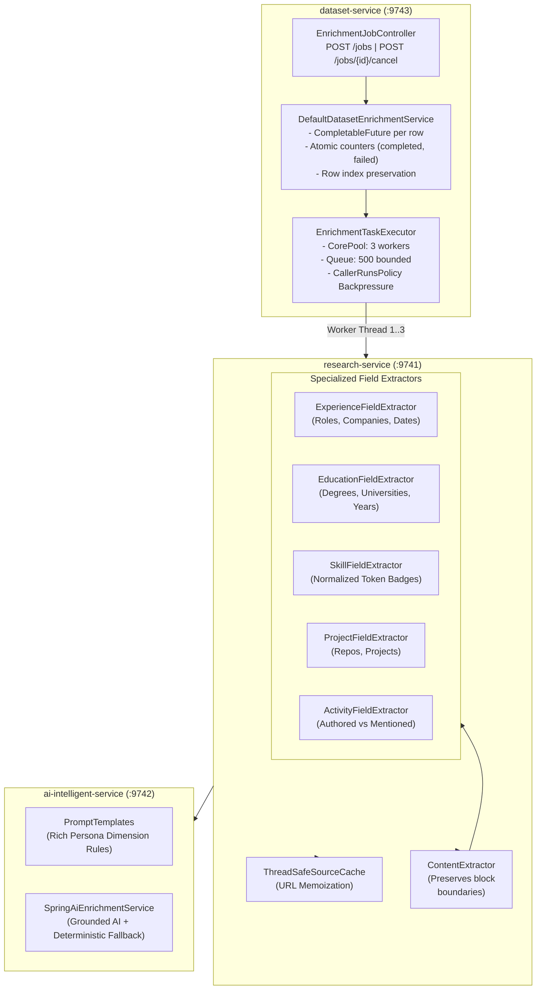

# Concept 28: Bounded Concurrency and Rich Profile Synthesis

In automated data enrichment systems, two major challenges inevitably arise once a basic prototype works end-to-end:
1. **Sequential Processing Bottlenecks**: Processing dataset records one-by-one results in linear latency growth ($O(N)$). Enriching a modest file of 50 records can easily exceed several minutes.
2. **Shallow Attribute Extraction**: Extracting only high-level fields (e.g., name, current title, and site description) leaves the resulting profile thin and uninformative, missing the rich professional footprint present across verified web sources (career history, degrees, normalized skills, notable projects, and publications).

This guide explains how the platform solves both challenges while strictly adhering to bounded resource constraints, zero-hallucination guardrails, and loose microservice coupling.

---

## Why This Exists

When evolving from a single-record prototype to a dataset enrichment engine:
* **Unbounded Concurrency is Dangerous**: Naively launching an unbounded number of threads (or calling `parallelStream()`) exhausts HTTP connection pools, triggers aggressive rate-limiting or IP bans from target domains, and causes OutOfMemory (OOM) errors under heavy load.
* **Overly Broad LLM Extraction Hallucinates**: Asking an LLM to "extract everything about this person" without grounded evidence extraction leads to fabricated dates, imaginary titles, and hallucinated degrees.

To build a reliable enterprise platform, concurrency must be **bounded, observable, and isolated**, and attribute extraction must be **evidence-first, structured, and corroborated**.

---

## Problem

### 1. Sequential vs Unbounded Concurrency
* **Sequential Loop (`for row : rows`)**: Under sequential processing, if each entity requires 2 seconds (for DNS lookup, HTTP fetching, HTML parsing, and AI synthesis), a 100-row file takes over 3 minutes.
* **Unbounded Execution (`rows.parallelStream()` or `new Thread()`)**: In contrast, running all rows simultaneously without limits overwhelms downstream microservices, starves the operating system of file descriptors, and triggers upstream anti-bot defenses (e.g., HTTP 429 / HTTP 999).

### 2. Shallow Person Profiles
Real professional profiles on LinkedIn, GitHub, and corporate directories contain multidimensional data:
* Career progression (past roles, company names, and date ranges)
* Academic credentials (institutions, degree titles, and graduation years)
* Technical competencies (languages, cloud platforms, frameworks)
* Portfolio artifacts (repositories, open-source projects)
* Public engagement (authored blog posts, keynote speeches, community articles)

Extracting only `title` and `company` leaves users with incomplete data that fails to power downstream CRM, recruiting, or analytics workflows.

---

## Core Architecture



---

## How It Works

### 1. Bounded Concurrency & Backpressure (`EnrichmentTaskExecutor.java`)

Instead of unbounded thread creation, the platform utilizes a dedicated Spring `ThreadPoolTaskExecutor` configured with bounded bounds:

```java
@Configuration
public class EnrichmentTaskExecutor {

    @Bean(name = "enrichmentJobExecutor")
    public ThreadPoolTaskExecutor enrichmentJobExecutor(EnrichmentProperties properties) {
        ThreadPoolTaskExecutor executor = new ThreadPoolTaskExecutor();
        executor.setCorePoolSize(properties.concurrency().workers());       // Default: 3
        executor.setMaxPoolSize(properties.concurrency().maxWorkers());     // Default: 6
        executor.setQueueCapacity(properties.concurrency().queueCapacity()); // Default: 500
        executor.setThreadNamePrefix("dataset-enrichment-worker-");
        executor.setRejectedExecutionHandler(new ThreadPoolExecutor.CallerRunsPolicy());
        executor.setWaitForTasksToCompleteOnShutdown(true);
        executor.setAwaitTerminationSeconds(30);
        executor.initialize();
        return executor;
    }
}
```

#### Key Engineering Highlights:
1. **Bounded Worker Pool**: Concurrency defaults to 3 workers (configurable via `enrichment.concurrency.workers`). This guarantees that downstream external HTTP servers are never bombarded.
2. **Bounded Queue & `CallerRunsPolicy`**: If more than 500 rows are queued, the submitting thread executes the task itself, applying natural backpressure to prevent queue exhaustion and OOM.
3. **Dedicated Thread Naming**: Worker threads are named `dataset-enrichment-worker-N`, enabling transparent diagnostic tracing in logs and APM monitors.
4. **Graceful Shutdown**: When the service stops, worker threads are given up to 30 seconds to finish currently active rows rather than corrupting in-flight records.

---

### 2. Row-Level Failure Isolation & Job Cancellation

In `DefaultDatasetEnrichmentService.java`, each row is encapsulated in an asynchronous `CompletableFuture` submitted to the executor:

```java
List<CompletableFuture<RowEnrichmentResult>> futures = new ArrayList<>();
for (int i = 0; i < total; i++) {
    final int rowIndex = i;
    final Map<String, String> row = rows.get(i);

    CompletableFuture<RowEnrichmentResult> future = CompletableFuture.supplyAsync(() -> {
        if (cancelledJobs.contains(jobId)) {
            return RowEnrichmentResult.builder()
                    .rowIndex(rowIndex)
                    .status(RowEnrichmentStatus.FAILED)
                    .errorMessage("Job was cancelled by operator")
                    .build();
        }
        return processRow(jobId, rowIndex, row, request);
    }, executor);

    futures.add(future);
}
```

* **Per-Entity Error Isolation**: If row 4 throws an unexpected `SocketTimeoutException` or contains an invalid URL, only row 4 is marked `FAILED` with the diagnostic error message. Rows 1, 2, 3, and 5 proceed normally.
* **Deterministic Row Ordering**: When all futures complete (`CompletableFuture.allOf`), results are sorted strictly by original `rowIndex`, ensuring the output dataset exactly preserves the input row sequence.
* **Operator Cancellation**: `POST /api/v1/enrichment/jobs/{jobId}/cancel` records the cancellation in thread-safe memory, preventing queued futures from initiating HTTP requests.

---

### 3. Deep Evidence Extraction (`research-service`)

To extract rich professional profiles without relying solely on slow LLM calls, specialized evidence extractors run concurrently against fetched documents:

#### A. Experience Timeline Extraction (`ExperienceFieldExtractor.java`)
* Detects employment patterns: `"(?i)(?:at|@|for)\\s+([A-Z][a-zA-Z0-9&.,\\s]{2,40})"`
* Captures date ranges: `"(?:20\\d{2}|19\\d{2})\\s*(?:-|–|to)\\s*(?:Present|Current|20\\d{2})"`
* Extracts verbatim snippets and formats a chronological summary:
  `Staff Engineer at Google (2021 - Present) | Senior Developer at Acme Corp (2018 - 2021)`

#### B. Academic Background (`EducationFieldExtractor.java`)
* Matches credential tokens: `B.S.`, `M.S.`, `Ph.D.`, `Bachelor of Science`, `Master of Computer Science`.
* Anchors university institutions and graduation periods with verbatim quote grounding.

#### C. Normalized Skills & Tech (`SkillFieldExtractor.java`)
* Scans for over 100 industry-standard technologies (e.g., `Java`, `TypeScript`, `Docker`, `Kubernetes`, `React`, `PostgreSQL`).
* Normalizes casing and eliminates duplicates (e.g., unifying `nodejs` and `Node.js` into canonical `Node.js`).

#### D. Professional Activity & Mentions (`ActivityFieldExtractor.java`)
* Labels the relationship between the target entity and the content:
  - `AUTHORED`: The person wrote or published the article/post.
  - `MENTIONED`: The person was cited or quoted by a third party.
  - `ACTIVITY`: General participation in conferences or events.

---

### 4. Zero-Hallucination Guardrails & Fallback Synthesis

In `ai-intelligent-service`, the prompt and deterministic synthesizers are strictly governed by anti-hallucination rules:

1. **Evidence-First Rule**: Never fabricate dates, roles, or organizations. If no corroborating snippet exists, return `"UNKNOWN"` and add the attribute to `unresolvedFields`.
2. **Deterministic Fallback Engine**: If the remote LLM is offline or unconfigured (`mock-mode = true`), `SpringAiEnrichmentService` synthesizes deep attributes directly from extracted `FactEvidenceDto` records using field aliases (`experience`, `education`, `skills`, `projects`, `activity`).
3. **Structured JSON Integrity**: `AiOutputNormalizer` recognizes JSON arrays and objects, preventing accidental comma-splitting from corrupting structured timelines.

---

### 5. Frontend Deep Inspection & Export

The Next.js frontend (`apps/frontend`) provides transparent visibility into the newly extracted dimensions:

* **Live Concurrency Telemetry**: The progress bar shows active workers (`Processing with 3 concurrent workers (12/20 rows complete)...`).
* **Multi-Tab Inspection Modal**: Clicking any row opens `EvidenceDetailModal` with dedicated tabs:
  - **Overview**: Current role, company, location, and confidence level.
  - **Experience**: Complete career history timeline with verbatim quotes.
  - **Education**: Degrees, majors, and graduation years.
  - **Skills & Tech**: Interactive badge cloud of normalized technical proficiencies.
  - **Projects & Activity**: Authored works, repositories, and publications.
  - **All Evidence & Sources**: Exhaustive list of discovered URLs and provenance.
* **Non-Destructive CSV/XLSX Export**: `exporter.ts` dynamically flattens every grounded attribute into `Enriched_<attribute>`, `Enriched_<attribute>_Confidence`, and `Enriched_<attribute>_Source` columns alongside the user's original spreadsheet fields.

---

## Verification & Key Takeaways

1. **Bounded Parallelism Prevents Outages**: Concurrency is bounded by configuration (`enrichment.concurrency.workers=3`), ensuring predictability, backpressure safety, and anti-ban friendliness.
2. **Deep Grounding Beats Shallow Scraping**: Structured extractors turn raw web crawls into actionable career timelines and skill graphs while eliminating LLM hallucinations through verbatim quote validation.
3. **Resilient Microservice Contracts**: The 3-service architecture cleanly decouples row batch orchestration (`dataset-service`), web evidence collection (`research-service`), and profile synthesis (`ai-intelligent-service`).
