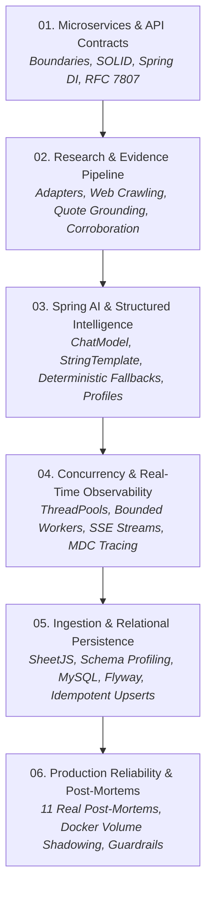

# Engineering Learning Series

Welcome to the **Data Enrichment AI Intelligence Platform** engineering learning curriculum.

This series provides deep, production-grade architectural and implementation guides explaining **why** the platform is engineered the way it is, the trade-offs made, failure modes encountered, and real-world distributed systems patterns.

---

## Curriculum Roadmap

---

## The 6 Core Engineering Guides

### 1. [Microservices & API Contracts](01-microservices-and-api-contracts.md)
* Decomposition of the 3-microservice topology (`dataset-service`, `research-service`, `ai-intelligent-service`).
* Inversion of Control, constructor injection, and interface segregation.
* RFC 7807 `application/problem+json` error contracts and content negotiation.
* Contract-first evolution and DTO boundary isolation.

### 2. [Research & Evidence Pipeline](02-research-and-evidence-pipeline.md)
* Strategy and Adapter patterns in search provider integrations (Tavily + Mock).
* Multi-source discovery, primary source ranking, and URL canonicalization.
* Polite web scraping, boilerplate removal, and strict context truncation.
* Verbatim quote grounding (zero-hallucination verification).
* Multi-source corroboration, agreement confidence boosting, and conflict detection.

### 3. [Spring AI & Structured Intelligence](03-spring-ai-and-structured-intelligence.md)
* Spring AI `ChatModel` abstraction and Google Gemini integration.
* Externalized prompt templates (`.st`) and structured JSON schema extraction.
* Transparent deterministic heuristic fallback engine during AI outages.
* Objective-driven research profiles and multi-dimensional scoring.

### 4. [Concurrency & Real-Time Observability](04-concurrency-and-realtime-observability.md)
* Thread pool sizing, unbounded queue hazards, and `CallerRunsPolicy` backpressure.
* Bounded parallel dataset enrichment (`EnrichmentTaskExecutor`).
* Server-Sent Events (SSE) streaming (`GET /api/v1/enrichment/jobs/{jobId}/events`).
* Bounded event replay buffers for client reconnection and instant evidence inspection.
* Distributed MDC tracing (`correlationId`, `jobId`, `rowId`) across worker threads.

### 5. [Dataset Ingestion & Relational Persistence](05-dataset-ingestion-and-relational-persistence.md)
* Tabular dataset ingestion (CSV/XLSX), browser parsing, and memory safety.
* Schema detection heuristics, type profiling, and column mapping.
* Relational data modeling for entities, sources, and attributes.
* Versioned database migrations via Flyway.
* Transactional persistence, JPA orphan removal, and idempotent snapshot upserts.

### 6. [Production Reliability & Failure Modes](06-production-reliability-and-failure-modes.md)
* Cross-OS Docker development, volume shadowing, and Next.js hot-reloading.
* **11 Root-Cause Post-Mortems**: Gemini 404, LinkedIn HTTP 999 blocking, SSE starvation, Jackson unmarshalling failures, context overflows.
* Graceful degradation, circuit breakers, and production guardrails.

---

For high-level system topology, see [System Architecture](../architecture.md).  
For the end-to-end data lifecycle, see [Enrichment Flow](../enrichment-flow.md).  
For API endpoint documentation, see [API Reference](../api.md).  
For architectural decisions and ADRs, see [Architecture Decisions](../decisions.md).
